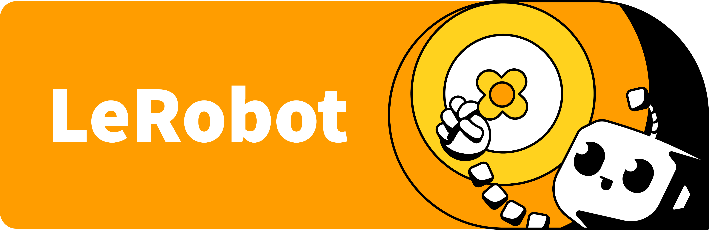
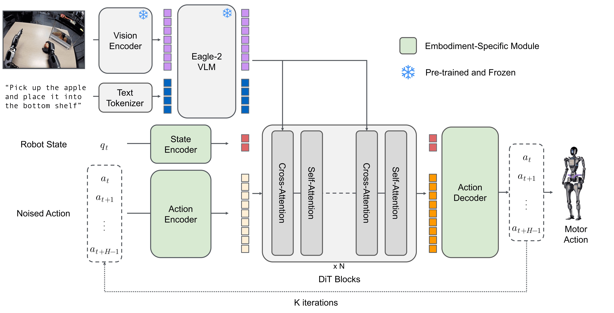
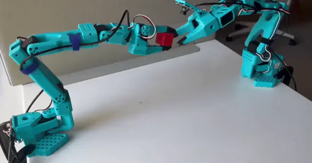

<p align="center">
  
</p>

<div align="center">

[](https://github.com/huggingface/lerobot/actions/workflows/nightly.yml?query=branch%3Amain)
[](https://www.python.org/downloads/)
[](https://github.com/huggingface/lerobot/blob/main/LICENSE)
[](https://pypi.org/project/lerobot/)
[](https://pypi.org/project/lerobot/)
[](https://github.com/huggingface/lerobot/blob/main/CODE_OF_CONDUCT.md)
[](https://discord.gg/q8Dzzpym3f)

</div>

**LeRobot** aims to provide models, datasets, and tools for real-world robotics in PyTorch. The goal is to lower the barrier to entry so that everyone can contribute to and benefit from shared datasets and pretrained models.

🤗 A hardware-agnostic, Python-native interface that standardizes control across diverse platforms, from low-cost arms (SO-100) to humanoids.

🤗 A standardized, scalable LeRobotDataset format (Parquet + MP4 or images) hosted on the Hugging Face Hub, enabling efficient storage, streaming and visualization of massive robotic datasets.

🤗 State-of-the-art policies that have been shown to transfer to the real-world ready for training and deployment.

🤗 Comprehensive support for the open-source ecosystem to democratize physical AI.

## Quick Start

LeRobot can be installed directly from PyPI.

```bash
pip install lerobot
lerobot-info
```

> [!IMPORTANT]
> For detailed installation guide, please see the [Installation Documentation](https://huggingface.co/docs/lerobot/installation).

## Robots & Control

<div align="center">
  
</div>

LeRobot provides a unified `Robot` class interface that decouples control logic from hardware specifics. It supports a wide range of robots and teleoperation devices.

```python
from lerobot.robots.myrobot import MyRobot

# Connect to a robot
robot = MyRobot(config=...)
robot.connect()

# Read observation and send action
obs = robot.get_observation()
action = model.select_action(obs)
robot.send_action(action)
```

**Supported Hardware:** SO100, LeKiwi, Koch, HopeJR, OMX, EarthRover, Reachy2, Gamepads, Keyboards, Phones, OpenARM, Unitree G1.

While these devices are natively integrated into the LeRobot codebase, the library is designed to be extensible. You can easily implement the Robot interface to utilize LeRobot's data collection, training, and visualization tools for your own custom robot.

For detailed hardware setup guides, see the [Hardware Documentation](https://huggingface.co/docs/lerobot/integrate_hardware).

## LeRobot Dataset

To solve the data fragmentation problem in robotics, we utilize the **LeRobotDataset** format.

- **Structure:** Synchronized MP4 videos (or images) for vision and Parquet files for state/action data.
- **HF Hub Integration:** Explore thousands of robotics datasets on the [Hugging Face Hub](https://huggingface.co/lerobot).
- **Tools:** Seamlessly delete episodes, split by indices/fractions, add/remove features, and merge multiple datasets.

```python
from lerobot.datasets.lerobot_dataset import LeRobotDataset

# Load a dataset from the Hub
dataset = LeRobotDataset("lerobot/aloha_mobile_cabinet")

# Access data (automatically handles video decoding)
episode_index=0
print(f"{dataset[episode_index]['action'].shape=}\n")
```

Learn more about it in the [LeRobotDataset Documentation](https://huggingface.co/docs/lerobot/lerobot-dataset-v3)

## SoTA Models

LeRobot implements state-of-the-art policies in pure PyTorch, covering Imitation Learning, Reinforcement Learning, and Vision-Language-Action (VLA) models, with more coming soon. It also provides you with the tools to instrument and inspect your training process.

<p align="center">
  
</p>

Training a policy is as simple as running a script configuration:

```bash
lerobot-train \
  --policy=act \
  --dataset.repo_id=lerobot/aloha_mobile_cabinet
```

| Category                   | Models                                                                                                                                                                                                       |
| -------------------------- | ------------------------------------------------------------------------------------------------------------------------------------------------------------------------------------------------------------ |
| **Imitation Learning**     | [ACT](./docs/source/policy_act_README.md), [Diffusion](./docs/source/policy_diffusion_README.md), [VQ-BeT](./docs/source/policy_vqbet_README.md)                                                             |
| **Reinforcement Learning** | [HIL-SERL](./docs/source/hilserl.mdx), [TDMPC](./docs/source/policy_tdmpc_README.md) & QC-FQL (coming soon)                                                                                                  |
| **VLAs Models**            | [Pi0Fast](./docs/source/pi0fast.mdx), [Pi0.5](./docs/source/pi05.mdx), [GR00T N1.5](./docs/source/policy_groot_README.md), [SmolVLA](./docs/source/policy_smolvla_README.md), [XVLA](./docs/source/xvla.mdx) |

Similarly to the hardware, you can easily implement your own policy & leverage LeRobot's data collection, training, and visualization tools, and share your model to the HF Hub

For detailed policy setup guides, see the [Policy Documentation](https://huggingface.co/docs/lerobot/bring_your_own_policies).

## Inference & Evaluation

Evaluate your policies in simulation or on real hardware using the unified evaluation script. LeRobot supports standard benchmarks like **LIBERO**, **MetaWorld** and more to come.

```bash
# Evaluate a policy on the LIBERO benchmark
lerobot-eval \
  --policy.path=lerobot/pi0_libero_finetuned \
  --env.type=libero \
  --env.task=libero_object \
  --eval.n_episodes=10
```

Learn how to implement your own simulation environment or benchmark and distribute it from the HF Hub by following the [EnvHub Documentation](https://huggingface.co/docs/lerobot/envhub)

## Resources

- **[Documentation](https://huggingface.co/docs/lerobot/index):** The complete guide to tutorials & API.
- **[Chinese Tutorials: LeRobot+SO-ARM101中文教程-同济子豪兄](https://zihao-ai.feishu.cn/wiki/space/7589642043471924447)** Detailed doc for assembling, teleoperate, dataset, train, deploy. Verified by Seed Studio and 5 global hackathon players.
- **[Discord](https://discord.gg/q8Dzzpym3f):** Join the `LeRobot` server to discuss with the community.
- **[X](https://x.com/LeRobotHF):** Follow us on X to stay up-to-date with the latest developments.
- **[Robot Learning Tutorial](https://huggingface.co/spaces/lerobot/robot-learning-tutorial):** A free, hands-on course to learn robot learning using LeRobot.

## Citation

If you use LeRobot in your research, please cite:

```bibtex
@misc{cadene2024lerobot,
    author = {Cadene, Remi and Alibert, Simon and Soare, Alexander and Gallouedec, Quentin and Zouitine, Adil and Palma, Steven and Kooijmans, Pepijn and Aractingi, Michel and Shukor, Mustafa and Aubakirova, Dana and Russi, Martino and Capuano, Francesco and Pascal, Caroline and Choghari, Jade and Moss, Jess and Wolf, Thomas},
    title = {LeRobot: State-of-the-art Machine Learning for Real-World Robotics in Pytorch},
    howpublished = "\url{https://github.com/huggingface/lerobot}",
    year = {2024}
}
```

## Contribute

We welcome contributions from everyone in the community! To get started, please read our [CONTRIBUTING.md](./CONTRIBUTING.md) guide. Whether you're adding a new feature, improving documentation, or fixing a bug, your help and feedback are invaluable. We're incredibly excited about the future of open-source robotics and can't wait to work with you on what's next—thank you for your support!

<p align="center">
  
</p>

<div align="center">
<sub>Built by the <a href="https://huggingface.co/lerobot">LeRobot</a> team at <a href="https://huggingface.co">Hugging Face</a> with ❤️</sub>
</div>
