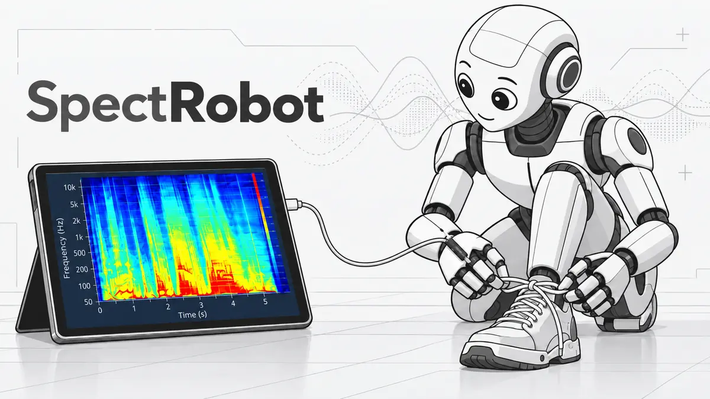
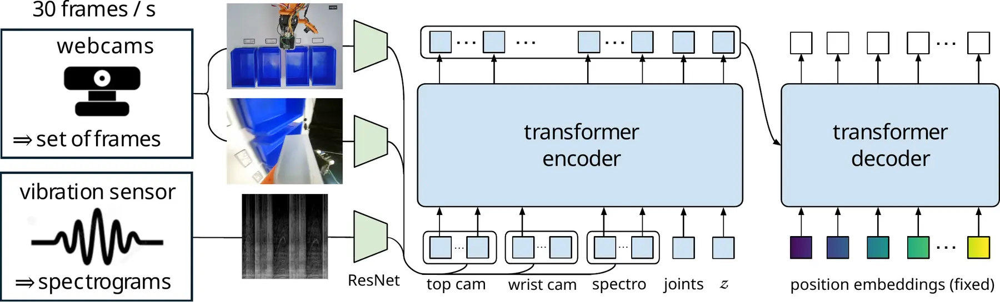

<p align="center"></p>

<p align="center">
  <b>Learning tactile perception from high-bandwidth single-point sensing</b><br>
  Joseph Rigal¹, Emmanuel Virot¹*, Caroline Pascal²<br>
  ¹ Wormsensing, Seyssinet-Pariset, France · ² Hugging Face, Paris, France · * Corresponding author
</p>

<p align="center">
  <a href="https://arxiv.org/abs/2609.24621">📄 Paper</a> ·
  <a href="https://spectrobot-project.github.io">🌐 Project page</a> ·
  <a href="https://huggingface.co/jogarulfop">🤗 Datasets &amp; models</a> ·
  <a href="https://github.com/spectrobot-project">💻 Code</a>
</p>

## Context

Tactile sensing is being used more and more in learning-based robot manipulation, but most approaches rely on spatially distributed sensors (skins, arrays, vision-based tactile pads). **SpectRobot** takes the opposite approach: a **single-point, high-bandwidth vibration sensor** is mounted on the gripper, and its signal is turned into a compact **time-frequency spectrogram**. The spectrogram is just another image, so standard vision encoders and vision learning pipelines (here ACT) can use it without changes. It also carries temporal and frequency information that cameras cannot see.

<p align="center"><br>
<sub>Learning pipeline: top camera, wrist camera and tactile spectrogram are fused by ACT (adapted from T. Z. Zhao et al., 2023).</sub></p>


## What this robot type does

`spectrobot` is a LeRobot robot type (`--robot.type=spectrobot`). It is a normal SO-101 follower arm that also streams **vibration / tactile sensors**. Each sensor's signal is turned into a **spectrogram image** (224×224 RGB, updated at 30 fps) and added to the observation next to the camera images. That means any image policy (ACT, pi05, …) can use it without changes.

The code is in `lespectrobot/src/lerobot/robots/spectrobot/`:

| File | Role |
|---|---|
| `config_spectrobot.py` | CLI parameters (`SpectRoFollowerConfig`, `TactileSensorConfig`) |
| `spectrobot.py` | Acquisition backends (Teensy / openDAQ) + spectrogram rendering |
| `firmware_teensy_ad8688_spi_8ch_20ksps/` | Arduino firmware for the Teensy + ADS8688 ADC board |

Two acquisition back-ends are supported, chosen with `--robot.tactile_data_stream`:

- **`teensy_ADS8688`**: a cheap Teensy 4.x reading an ADS8688 ADC over SPI, streaming over USB serial.
- **`OpenDAQ`**: a DEWESoft IOLITE-X (or any openDAQ device), read through the `opendaq` Python package.

---

## 1. Setup

### Environment
```bash
git clone ...
cd spectrobot
uv venv
uv pip install e .[lerobot]
uv pip install pyserial        # Teensy backend
uv pip install opendaq         # openDAQ backend (only if you use the IOLITE)
```

### USB ports
```bash
lerobot-find-port
ls -l /dev/ttyACM*
```
The Teensy also shows up as a `/dev/ttyACM*`. Unplug and replug each device to see which port belongs to which: leader arm, follower arm, Teensy.

To give your user permanent serial access, run this once and then log out and back in:
```bash
sudo usermod -a -G dialout $USER
```

### Cameras
```bash
lerobot-find-cameras opencv
```

## 2. Describing the sensors (`--robot.tactile_sensors`)

Each sensor is one entry in a dict. **The dict key is the sensor name.** If `observation_key` is not given, the observation is named `tactile_spectrogram_<name>_nfft_<nfft>`.

| Field | Meaning | Used by |
|---|---|---|
| `channel` | Hardware input index (0-based) | both |
| `observation_key` | Name of the image in the dataset / policy input | both |
| `sample_rate_hz` | Real sampling rate of that channel. Sets the frequency axis (0 → fs/2) | both |
| `nfft` | FFT window length (frequency resolution vs. time span) | both |
| `min_db`, `max_db` | dB window mapped to black → white | both |
| `measurement` | `"Voltage"` or `"IEPE"` | **openDAQ only** |
| `range_choice` | Input range in mV: `10000`, `5000`, `1000`, `200` | **openDAQ only** |
| `hpf_choice` | High-pass filter: `0.0`/`0.1` → HPF off (0), `1.0` → HPF 1 | **openDAQ only** |
| `excitation_choice` | IEPE current in mA: `2`, `4`, `6` (only when `measurement: IEPE`) | **openDAQ only** |

If `--robot.tactile_sensors` is not given, defaults are used: `mems_acc`/`dgf_iepe`/`pzt_disk` for Teensy, and `dragonfly`/`dgf_passif`/`pastille_pzt`/`strain_gauge`/`acc_mems` for openDAQ. See `_make_*_default_sensors()` in `spectrobot.py`.

> ⚠️ Keep the **same `observation_key`s** between recording, training and rollout. A trained policy looks for exactly those feature names.

### 2.a With the Teensy (`teensy_ADS8688`)

- The firmware samples **all 8 ADS8688 inputs at 20 kHz each**, in a fixed ±10.24 V range, and sends them interleaved. Use `sample_rate_hz: 20000` for every sensor.
- `--robot.tactile_serial_port` is the **Teensy** port. Its default is `/dev/ttyACM0`, which is often the arm's port, so always set it explicitly.
- Only `channel`, `observation_key`, `sample_rate_hz`, `nfft`, `min_db` and `max_db` have an effect. `measurement`/`range`/`hpf`/`excitation` are ignored because there is nothing on the Teensy side to configure (see §3).
- Typical dB window for this ADC: around `min_db: -110`, `max_db: -40`.

```bash
lerobot-teleoperate \
  --robot.type=spectrobot \
  --robot.port=/dev/ttyACM0 \
  --robot.id=my_awesome_follower_arm \
  --robot.cameras="{ top: {type: opencv, index_or_path: 0, width: 640, height: 480, fps: 30}, wrist: {type: opencv, index_or_path: 2, width: 640, height: 480, fps: 30} }" \
  --robot.tactile_data_stream=teensy_ADS8688 \
  --robot.tactile_serial_port=/dev/ttyACM2 \
  --robot.tactile_sensors="{ \
    mems_acc: {channel: 0, observation_key: tactile_spectrogram_mems_acc_nfft_512, sample_rate_hz: 20000, nfft: 512, min_db: -110.0, max_db: -40.0}, \
    dgf_iepe: {channel: 1, observation_key: tactile_spectrogram_dgf_iepe_nfft_512, sample_rate_hz: 20000, nfft: 512, min_db: -107.0, max_db: -37.0}, \
    pzt_disk: {channel: 2, observation_key: tactile_spectrogram_pzt_disk_nfft_512, sample_rate_hz: 20000, nfft: 512, min_db: -110.0, max_db: -40.0} \
  }" \
  --teleop.type=so101_leader \
  --teleop.port=/dev/ttyACM1 \
  --teleop.id=my_awesome_leader_arm \
  --display_data=true
```

### 2.b With openDAQ (IOLITE-X)

- The first device whose name contains `IOLITE-X` is used. If there is none, the first openDAQ device found is used.
- Every field is applied to the channel's amplifier: measurement mode, range, HPF and IEPE excitation.
- If all sensors have the same `sample_rate_hz`, that rate is written to the device (`SampleRate`). If the rates differ, the device rate is left unchanged. **`sample_rate_hz` must match the real device rate**, or the frequency axis will be wrong.
- IEPE sensors read through the IOLITE have a very different dB level than the Teensy (e.g. `min_db: -70`, `max_db: 40`). Re-tune the dB window when you change hardware.

```bash
lerobot-teleoperate \
  --robot.type=spectrobot \
  --robot.port=/dev/ttyACM1 \
  --robot.id=my_awesome_follower_arm \
  --robot.cameras="{ top: {type: opencv, index_or_path: 0, width: 640, height: 480, fps: 30}, wrist: {type: opencv, index_or_path: 2, width: 640, height: 480, fps: 30} }" \
  --robot.tactile_data_stream=OpenDAQ \
  --robot.tactile_sensors="{ \
    dragonfly1: {channel: 0, observation_key: tactile_spectrogram_dragonfly1_nfft_512, sample_rate_hz: 20000, nfft: 512, min_db: -70.0, max_db: 40.0, measurement: IEPE, range_choice: 10000, hpf_choice: 0.1, excitation_choice: 4}, \
    pzt_disk:   {channel: 1, observation_key: tactile_spectrogram_pzt_disk_nfft_512,   sample_rate_hz: 20000, nfft: 512, min_db: -120.0, max_db: -20.0, measurement: Voltage, range_choice: 10000, hpf_choice: 0.0} \
  }" \
  --teleop.type=so101_leader \
  --teleop.port=/dev/ttyACM0 \
  --teleop.id=my_awesome_leader_arm \
  --display_data=true
```

---

## 3. IEPE vs. Voltage

**Voltage**: the sensor produces a voltage by itself, or is conditioned elsewhere, and the input only measures it. Examples: piezo disk (PZT), passive DGF, MEMS accelerometer with its own supply, strain-gauge amplifier output.

**IEPE** (Integrated Electronics Piezo-Electric, also called ICP): the sensor contains a small amplifier and is powered over its **signal cable** by a **constant current** (typically 2–6 mA, from a supply of about 18–30 V). The signal is a small AC voltage riding on a DC bias of about 8–12 V. The acquisition side must therefore:
1. **provide the excitation current**, and
2. **remove the DC bias**, using AC coupling / a high-pass filter, so that only the vibration signal remains.

In IEPE mode the IOLITE does both: `excitation_choice` sets the current and the AC coupling removes the bias.

### IEPE with the Teensy is **Voltage**

The ADS8688 **cannot** provide excitation current. It only measures voltages. With the Teensy setup, an IEPE sensor is therefore connected to a separate **IEPE conditioning card** (in the paper's low-cost bench, a ZONRI IEPE interface converter). That card sends the excitation current to the sensor, removes the bias, and outputs a clean **voltage**, which the ADS8688 then reads.

So from spectrobot's point of view, **every Teensy channel is a Voltage measurement**, including IEPE sensors. The `measurement`/`excitation_choice`/`hpf_choice` fields are ignored on the Teensy. Excitation current and filtering are set **on the IEPE card**, not in the command line. You can still name the sensor `dgf_iepe` to remember what is physically plugged in.

| | Teensy + ADS8688 | openDAQ / IOLITE |
|---|---|---|
| Voltage sensor | `channel` + dB window | `measurement: Voltage` |
| IEPE sensor | through an external IEPE card, which outputs a voltage, read as **Voltage** | `measurement: IEPE`, `excitation_choice: 2/4/6`, HPF |
| Range | fixed ±10.24 V (firmware) | `range_choice` |
| Sample rate | fixed 20 kHz / channel (firmware) | `sample_rate_hz` (device) |

---

## 4. Parameters that are adjustable in code but already well chosen

These values are hard-coded or have defaults. You *can* change them, but they were chosen to match the hardware and the policies, so **don't touch them without a good reason**. Changing any of them changes the images, so old datasets and policies will no longer match.

| Parameter | Where | Value | Why |
|---|---|---|---|
| Image size | `self._target_size` in `spectrobot.py` | 224×224 | Native input size of the ResNet/ViT vision backbones used by ACT/pi05 |
| Spectrogram fps | `--robot.tactile_fps` | 30 | Same as the cameras and the dataset fps |
| Ring buffer length | `(224-1)*nfft/2 + nfft` | 57 600 samples for nfft 512 | Gives exactly 224 time columns (50 % overlap), so no temporal interpolation. At 20 kHz this is ≈2.9 s of history |
| `nfft` | per sensor | 512 | 257 frequency bins (≈39 Hz resolution at 20 kHz). Good balance between frequency detail and time span |
| Overlap | `_render_spectrogram_frame` | nfft/2 | Standard Hann-window 50 % overlap |
| dB scaling | `10*log10(Sxx + 1e-12)` then clip `[min_db, max_db]` | grayscale → RGB | Compresses the dynamic range. The dB window is the only thing tuned per sensor |
| Baudrate | `TACTILE_BAUDRATE` | 2 000 000 | Enough for 8 ch × 20 kHz × 16 bit ≈ 2.6 Mbit/s over USB (Teensy USB ignores the value anyway) |
| Voltage conversion | `raw_to_volts` | ±10.24 V / 65536 | Matches the ADS8688 range set by the firmware |
| Serial queue | `queue.Queue(maxsize=100)` | 100 packets | Drops the oldest data rather than growing latency |
| Firmware | `.ino` | 8 ch, 20 kHz/ch, SPI 20 MHz, 384 samples/packet | 384 = 48 full 8-channel frames, so a packet never splits a frame |


## 5. Record → Train → Rollout

Use the same `--robot.tactile_*` arguments in every step. The examples below use the Teensy; replace them with the openDAQ block if needed.

### Record
```bash
lerobot-record \
  --robot.type=spectrobot \
  --robot.port=/dev/ttyACM0 \
  --robot.id=my_awesome_follower_arm \
  --robot.cameras="{ top: {type: opencv, index_or_path: 0, width: 640, height: 480, fps: 30}, wrist: {type: opencv, index_or_path: 2, width: 640, height: 480, fps: 30} }" \
  --robot.tactile_data_stream=teensy_ADS8688 \
  --robot.tactile_serial_port=/dev/ttyACM2 \
  --robot.tactile_sensors="{ dgf_iepe: {channel: 1, observation_key: tactile_spectrogram_dgf_iepe_nfft_512, sample_rate_hz: 20000, nfft: 512, min_db: -107.0, max_db: -37.0} }" \
  --teleop.type=so101_leader \
  --teleop.port=/dev/ttyACM1 \
  --teleop.id=my_awesome_leader_arm \
  --dataset.repo_id="${HF_USER}/my_task" \
  --dataset.num_episodes=40 \
  --dataset.single_task="Plug the cable into the electrical outlet" \
  --dataset.episode_time_s=60 \
  --dataset.reset_time_s=11 \
  --display_data=true
```
If the recording crashed, remove the local copy with `rm -rf ~/.cache/huggingface/lerobot/${HF_USER}/my_task`.

### Train
```bash
lerobot-train \
  --dataset.repo_id="${HF_USER}/my_task" \
  --policy.type=act \
  --output_dir=outputs/train/act_my_task \
  --job_name=act_my_task \
  --policy.device=cuda \
  --wandb.enable=true \
  --policy.repo_id="${HF_USER}/policy_act_my_task" \
  --save_freq=50_000 \
  --steps=100_000 \
  --batch_size=8
```
To resume, use `--config_path=outputs/train/act_my_task/checkpoints/last/pretrained_model/train_config.json --resume=true`.

### Rollout
```bash
lerobot-rollout \
  --strategy.type=episodic \
  --policy.path=outputs/train/act_my_task/checkpoints/last/pretrained_model \
  --robot.type=spectrobot \
  --robot.port=/dev/ttyACM0 \
  --robot.id=my_awesome_follower_arm \
  --robot.cameras="{ top: {type: opencv, index_or_path: 0, width: 640, height: 480, fps: 30}, wrist: {type: opencv, index_or_path: 2, width: 640, height: 480, fps: 30} }" \
  --robot.tactile_data_stream=teensy_ADS8688 \
  --robot.tactile_serial_port=/dev/ttyACM2 \
  --robot.tactile_sensors="{ dgf_iepe: {channel: 1, observation_key: tactile_spectrogram_dgf_iepe_nfft_512, sample_rate_hz: 20000, nfft: 512, min_db: -107.0, max_db: -37.0} }" \
  --dataset.repo_id="${HF_USER}/rollout_my_task" \
  --dataset.num_episodes=20 \
  --dataset.single_task="Plug the cable into the electrical outlet" \
  --dataset.push_to_hub=true \
  --display_data=true
```
Other strategies are `--strategy.type=base` (no recording) and `--strategy.type=dagger` (add `--teleop.*` to take over and correct the policy).

### Dataset editing

You may want to record with multiple sensors but train and roll out with only one or a few of them. You can use the `keep_cameras` command below to create a copy of the original dataset that contains only the sensors you need.

```bash
# multi-sensor -> single sensor: keep only the listed cameras, drop every other camera/sensor
lerobot-edit-dataset --repo_id ${HF_USER}/my_task_multitactile --new_repo_id ${HF_USER}/my_task_dgf_iepe \
  --operation.type keep_cameras \
  --operation.camera_names "['top','wrist','tactile_spectrogram_dgf_iepe_nfft_512']" --push_to_hub true
```
Camera names can be the short name (`top`) or the full key (`observation.images.top`); an unknown name raises an error listing the available cameras. The same thing from Python:
```python
from lerobot.datasets import LeRobotDataset, keep_cameras

dataset = LeRobotDataset("<hf_user>/my_task_multitactile")
single = keep_cameras(dataset, ["top", "wrist", "tactile_spectrogram_dgf_iepe_nfft_512"],
                      repo_id="<hf_user>/my_task_dgf_iepe")
single.push_to_hub()
```

---

## 6. Troubleshooting

- **Spectrogram stays black**: the backend failed to start. Look for `Failed to initialize tactile backend` in the log. Common causes are a wrong `tactile_serial_port`, a missing `pyserial`/`opendaq` package, or no openDAQ device found.
- **Saturated white / all black image**: adjust `min_db`/`max_db`.
- **Wrong frequency axis**: `sample_rate_hz` does not match the real acquisition rate.
- **Policy complains about missing features**: the `observation_key`s differ from those used at recording.
- Debug a script: `python -m debugpy --wait-for-client --listen 0.0.0.0:5678 src/lerobot/scripts/lerobot_teleoperate.py <args>`
