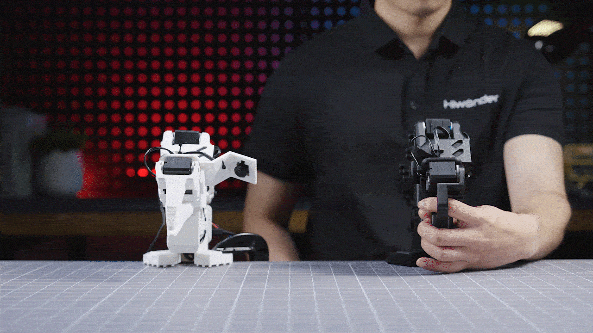
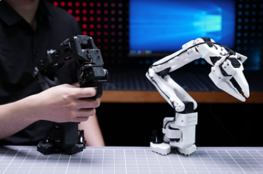

# LeRobot

[English](https://github.com/Hiwonder/LeRobot/blob/main/README.md) | 中文

<p align="center">
  
</p>

## 产品概述

LeRobot 是由 Hugging Face 开发的先进 AI 机器人库，由幻尔科技（Hiwonder）适配用于教育和研究目的。它提供了基于 PyTorch 的真实世界机器人模型、数据集和工具。目标是降低机器人技术的入门门槛，让每个人都能贡献并从共享数据集和预训练模型中受益。

LeRobot 包含已被证明可以迁移到真实世界的最先进方法，重点关注模仿学习和强化学习。它支持多种机器人平台，包括 SO-101、HopeJR、LeKiwi 等。

## 幻尔科技 SO-ARM101

通过端到端的模仿学习流程，您可以使用*主臂*演示任务。记录的轨迹将被转换为训练模型，使*从臂*能够自主复现任务。

<p align="center">
  
</p>

为了支持稳定且可重复的实验，幻尔科技 SO-ARM101 具有以下特点：

1. **完全开源的硬件和软件栈**：可以使用模仿学习和强化学习等技术进行训练，执行物体操作和动作复现等任务。整个系统——从硬件到软件和算法——完全开源。

<p align="center">
  
</p>

2. **30kg 磁编码舵机，高扭矩、低抖动、精确控制**：结合旋转底座和灵活的关节运动，机械臂实现平滑流畅的运动，消除了原始设计中的功率限制和振动问题。

<p align="center">
  
</p>

3. **双摄像头视觉系统，用于真实世界感知和基于视觉的学习**：精确的近距离操作 + 全局环境感知。

<p align="center">
  
</p>

SO-ARM101 为研究示教学习、操作和具身智能提供了一个实用的平台。

## 官方资源

### 幻尔科技官方
- **官方网站**: [https://www.hiwonder.com/](https://www.hiwonder.com/)
- **产品页面**: [https://www.hiwonder.com/products/lerobot-so-101](https://www.hiwonder.com/products/lerobot-so-101)
- **官方文档**: [https://www.hiwonder.com.cn/store/learn/185.html](https://www.hiwonder.com.cn/store/learn/185.html)
- **视频教程**: [https://www.youtube.com/watch?v=oitT8geMat0](https://www.youtube.com/watch?v=oitT8geMat0)
- **技术支持**: support@hiwonder.com

### 原版 LeRobot
- **原始仓库**: [https://github.com/huggingface/lerobot](https://github.com/huggingface/lerobot)
- **文档**: [https://huggingface.co/docs/lerobot](https://huggingface.co/docs/lerobot)
- **Hugging Face Hub**: [https://huggingface.co/lerobot](https://huggingface.co/lerobot)

## 主要功能

### AI 视觉功能
- **目标检测** - 实时目标检测与识别
- **视觉抓取** - 手眼协调精确操作
- **目标跟踪** - 基于 AI 算法的高级目标跟踪
- **AprilTag 识别** - 基于标签的精确定位

### 模仿学习
- **ACT 策略** - 基于 Transformer 的动作分块
- **Diffusion 策略** - 基于扩散的动作生成
- **VQ-BeT** - 向量量化行为 Transformer
- **TDMPC** - 时序差分模型预测控制

### 机器人平台
- **SO-101** - 经济实惠的机械臂（每臂约 €114）
- **HopeJR** - 用于灵巧操作的人形机器人手臂
- **LeKiwi** - 带轮子的移动机器人平台
- **ALOHA** - 双臂遥操作系统

### 编程接口
- **Python SDK** - 完整的 Python 编程接口
- **PyTorch 集成** - 深度学习框架支持
- **Hugging Face Hub** - 数据集和模型共享平台
- **WandB 支持** - 实验跟踪和可视化

## 硬件配置
- **处理器**: 兼容多种平台（树莓派、PC 等）
- **视觉系统**: USB 摄像头、深度摄像头
- **电机系统**: Feetech 舵机、Dynamixel 舵机
- **通信方式**: USB、串口、WiFi

## 项目结构

```
lerobot/
├── src/lerobot/              # 核心库
│   ├── cameras/              # 摄像头驱动和工具
│   ├── configs/              # 配置文件
│   ├── datasets/             # 数据集处理
│   ├── envs/                 # 仿真环境
│   ├── model/                # 神经网络模型
│   ├── motors/               # 电机控制驱动
│   ├── policies/             # 策略实现
│   │   ├── act/              # ACT 策略
│   │   ├── diffusion/        # Diffusion 策略
│   │   ├── tdmpc/            # TDMPC 策略
│   │   └── vqbet/            # VQ-BeT 策略
│   ├── robots/               # 机器人配置
│   ├── scripts/              # 工具脚本
│   ├── teleoperators/        # 遥操作系统
│   └── utils/                # 通用工具
├── examples/                 # 示例脚本
├── tests/                    # 单元测试
├── docs/                     # 文档
└── media/                    # 媒体资源
```

## 安装说明

### 环境配置

创建 Python 3.10 虚拟环境并激活：

```bash
conda create -y -n lerobot python=3.10
conda activate lerobot
```

在环境中安装 ffmpeg：

```bash
conda install ffmpeg -c conda-forge
```

### 安装 LeRobot

克隆仓库并安装：

```bash
git clone https://github.com/Hiwonder/LeRobot.git
cd LeRobot
pip install -e .
```

安装仿真环境：

```bash
pip install -e ".[aloha, pusht]"
```

## 版本信息
- **当前版本**: 基于 LeRobot v0.1.0
- **Python 版本**: 3.10+
- **PyTorch 版本**: 2.2+

### 相关技术
- [PyTorch](https://pytorch.org/) - 深度学习框架
- [Hugging Face](https://huggingface.co/) - AI 模型中心
- [OpenCV](https://opencv.org/) - 计算机视觉库
- [WandB](https://wandb.ai/) - 实验跟踪

---

**注意**: 本仓库改编自原版 [Hugging Face LeRobot](https://github.com/huggingface/lerobot)，用于教育目的。详细教程和文档请参阅 [LeRobot 官方文档](https://huggingface.co/docs/lerobot)。
