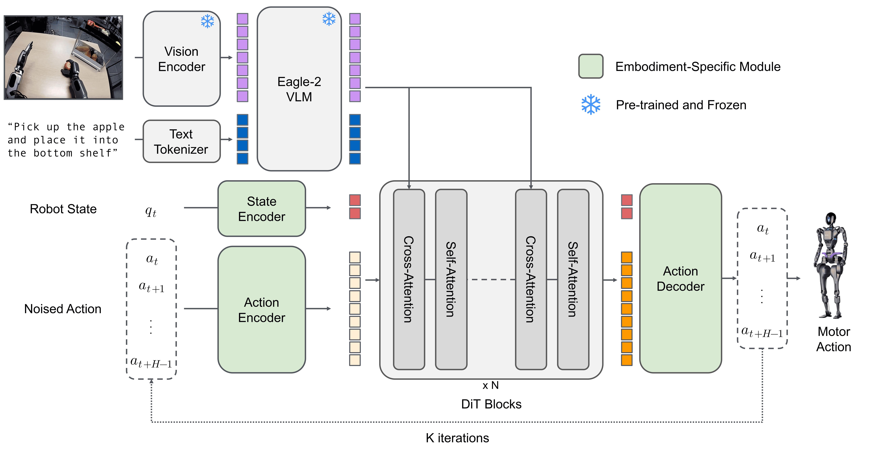

<p align="center">
  
</p>

<div align="center">

[](https://github.com/huggingface/lerobot/actions/workflows/latest_deps_tests.yml?query=branch%3Amain)
[](https://github.com/huggingface/lerobot/actions/workflows/docker_publish.yml?query=branch%3Amain)
[](https://www.python.org/downloads/)
[](https://github.com/huggingface/lerobot/blob/main/LICENSE)
[](https://pypi.org/project/lerobot/)
[](https://pypi.org/project/lerobot/)
[](https://github.com/huggingface/lerobot/blob/main/CODE_OF_CONDUCT.md)
[](https://discord.gg/q8Dzzpym3f)

</div>

**LeRobot** 旨在提供用于真实世界机器人学的 PyTorch 模型、数据集和工具。我们的目标是降低入门门槛，让每个人都能贡献并受益于共享的数据集和预训练模型。

🤗 硬件无关、Python 原生的接口，标准化跨多样平台的控制，从低成本机械臂（SO-100）到人形机器人。

🤗 标准化的可扩展 LeRobotDataset 格式（Parquet + MP4 或图像），托管在 Hugging Face Hub 上，支持高效存储、流式传输和可视化大规模机器人数据集。

🤗 最先进的策略模型，已证明可迁移到真实世界，准备好进行训练和部署。

🤗 全面支持开源生态系统，推动物理 AI 的民主化。

## 快速开始

LeRobot 可以直接从 PyPI 安装。

```bash
pip install lerobot
lerobot-info
```

> [!IMPORTANT]
> 详细的安装指南，请参阅 [安装文档](https://huggingface.co/docs/lerobot/installation)。

## 机器人与控制

<div align="center">
  
</div>

LeRobot 提供统一的 `Robot` 类接口，将控制逻辑与硬件细节解耦。它支持广泛的机器人和遥操作设备。

```python
from lerobot.robots.myrobot import MyRobot

# 连接机器人
robot = MyRobot(config=...)
robot.connect()

# 读取观测值并发送动作
obs = robot.get_observation()
action = model.select_action(obs)
robot.send_action(action)
```

**支持的硬件：** SO100、LeKiwi、Koch、HopeJR、OMX、EarthRover、Reachy2、游戏手柄、键盘、手机、OpenARM、Unitree G1、reBot B601。

虽然这些设备已原生集成到 LeRobot 代码库中，但该库设计为可扩展的。你可以轻松实现 Robot 接口，利用 LeRobot 的数据采集、训练和可视化工具来构建自己的自定义机器人。

详细的硬件设置指南，请参阅 [硬件文档](https://huggingface.co/docs/lerobot/integrate_hardware)。

## LeRobot 数据集

为了解决机器人学中的数据碎片化问题，我们采用 **LeRobotDataset** 格式。

- **结构：** 用于视觉的同步 MP4 视频（或图像）和用于状态/动作数据的 Parquet 文件。
- **HF Hub 集成：** 在 [Hugging Face Hub](https://huggingface.co/lerobot) 上探索数千个机器人数据集。
- **工具：** 无缝删除片段、按索引/比例分割、添加/移除特征、合并多个数据集。

```python
from lerobot.datasets.lerobot_dataset import LeRobotDataset

# 从 Hub 加载数据集
dataset = LeRobotDataset("lerobot/aloha_mobile_cabinet")

# 访问数据（自动处理视频解码）
episode_index=0
print(f"{dataset[episode_index]['action'].shape=}\n")
```

了解更多，请参阅 [LeRobotDataset 文档](https://huggingface.co/docs/lerobot/lerobot-dataset-v3)。

## 最先进的模型

LeRobot 用纯 PyTorch 实现了最先进的策略模型，涵盖模仿学习、强化学习、视觉 - 语言 - 动作（VLA）模型、世界模型和奖励模型，更多模型即将推出。它还提供工具来监测和检查你的训练过程。

<p align="center">
  
</p>

训练策略就像运行脚本配置一样简单：

```bash
lerobot-train \
  --policy.type=act \
  --dataset.repo_id=lerobot/aloha_mobile_cabinet
```

| 类别 | 模型 |
|------|------|
| **模仿学习** | [ACT](./docs/source/policy_act_README.md), [Diffusion](./docs/source/policy_diffusion_README.md), [VQ-BeT](./docs/source/policy_vqbet_README.md), [Multitask DiT Policy](./docs/source/policy_multi_task_dit_README.md) |
| **强化学习** | [HIL-SERL](./docs/source/hilserl.mdx), [TDMPC](./docs/source/policy_tdmpc_README.md) 和 QC-FQL（即将推出） |
| **VLA 模型** | [Pi0](./docs/source/pi0.mdx), [Pi0Fast](./docs/source/pi0fast.mdx), [Pi0.5](./docs/source/pi05.mdx), [GR00T N1.7](./docs/source/policy_groot_README.md), [SmolVLA](./docs/source/policy_smolvla_README.md), [XVLA](./docs/source/xvla.mdx), [EO-1](./docs/source/eo1.mdx), [MolmoAct2](./docs/source/molmoact2.mdx), [WALL-OSS](./docs/source/walloss.mdx), [EVO1](./docs/source/evo1.mdx) |
| **世界模型** | [VLA-JEPA](./docs/source/vla_jepa.mdx), [LingBot-VA](./docs/source/lingbot_va.mdx), [FastWAM](./docs/source/fastwam.mdx) |
| **奖励模型** | [SARM](./docs/source/sarm.mdx), [TOPReward](./docs/source/topreward.mdx), [Robometer](./docs/source/robometer.mdx) |

与硬件类似，你可以轻松实现自己的策略，并利用 LeRobot 的数据采集、训练和可视化工具，将你的模型分享到 HF Hub。

详细的策略设置指南，请参阅 [策略文档](https://huggingface.co/docs/lerobot/bring_your_own_policies)。关于每个策略的 GPU/RAM 要求和预期训练时间，请参阅 [计算硬件指南](https://huggingface.co/docs/lerobot/hardware_guide)。

## 推理与评估

使用统一的评估脚本在仿真或真实硬件上评估你的策略。LeRobot 支持标准基准测试，如 **LIBERO**、**MetaWorld** 等，更多即将推出。

```bash
# 在 LIBERO 基准上评估策略
lerobot-eval \
  --policy.path=lerobot/pi0_libero_finetuned \
  --env.type=libero \
  --env.task=libero_object \
  --eval.n_episodes=10
```

了解如何实现自己的仿真环境或基准测试，并从 HF Hub 分发，请参阅 [EnvHub 文档](https://huggingface.co/docs/lerobot/envhub)。

## 资源

- **[文档](https://huggingface.co/docs/lerobot/index)：** 完整的教程和 API 指南。
- **[中文教程：LeRobot+SO-ARM101 中文教程 - 同济子豪兄](https://zihao-ai.feishu.cn/wiki/space/7589642043471924447)** 详细的组装、遥操作、数据集、训练、部署文档。由 Seed Studio 和 5 位全球黑客松玩家验证。
- **[Discord](https://discord.gg/q8Dzzpym3f)：** 加入 `LeRobot` 服务器与社区讨论。
- **[X](https://x.com/LeRobotHF)：** 在 X 上关注我们，获取最新进展。
- **[机器人学习教程](https://huggingface.co/spaces/lerobot/robot-learning-tutorial)：** 使用 LeRobot 学习机器人学的免费实践课程。
- **[T 恤折叠实验](https://huggingface.co/spaces/lerobot/robot-folding)：** 使用 LeRobot 折叠 T 恤的端到端演示。
- **[LeLab](https://github.com/huggingface/leLab)：** LeRobot 的 Web 界面 — 从浏览器进行遥操作、校准、记录数据集、回放和训练你的 SO 机械臂，无需 CLI。

## 引用

如果你在项目中使用了 LeRobot，请引用 GitHub 仓库以认可持续的开发和贡献者：

```bibtex
@misc{cadene2024lerobot,
    author = {Cadene, Remi and Alibert, Simon and Soare, Alexander and Gallouedec, Quentin and Zouitine, Adil and Palma, Steven and Kooijmans, Pepijn and Aractingi, Michel and Shukor, Mustafa and Aubakirova, Dana and Russi, Martino and Capuano, Francesco and Pascal, Caroline and Choghari, Jade and Meftah, Khalil and Ellerbach, Maxime and Moss, Jess and Wolf, Thomas},
    title = {LeRobot: State-of-the-art Machine Learning for Real-World Robotics in Pytorch},
    howpublished = "\url{https://github.com/huggingface/lerobot}",
    year = {2024}
}
```

如果你引用我们的研究或学术论文，也请引用我们的 ICLR 出版物：

<details>
<summary><b>ICLR 2026 论文</b></summary>

```bibtex
@inproceedings{cadenelerobot,
  title={LeRobot: An Open-Source Library for End-to-End Robot Learning},
  author={Cadene, Remi and Alibert, Simon and Capuano, Francesco and Aractingi, Michel and Zouitine, Adil and Kooijmans, Pepijn and Choghari, Jade and Russi, Martino and Pascal, Caroline and Palma, Steven and Shukor, Mustafa and Moss, Jess and Soare, Alexander and Aubakirova, Dana and Lhoest, Quentin and Gallou\'edec, Quentin and Wolf, Thomas},
  booktitle={The Fourteenth International Conference on Learning Representations},
  year={2026},
  url={https://arxiv.org/abs/2602.22818}
}
```

</details>

## 贡献

我们欢迎来自社区每个人的贡献！开始之前，请阅读我们的 [CONTRIBUTING.md](https://github.com/huggingface/lerobot/blob/main/CONTRIBUTING.md) 指南。无论你是添加新功能、改进文档还是修复 bug，你的帮助和反馈都是无价的。我们对开源机器人学的未来充满期待，迫不及待地想与你一起创造下一个里程碑——感谢你的支持！

<p align="center">
  
</p>

<div align="center">
<sub>由 <a href="https://huggingface.co/lerobot">LeRobot</a> 团队在 <a href="https://huggingface.co">Hugging Face</a> 用 ❤️ 构建</sub>
</div>
