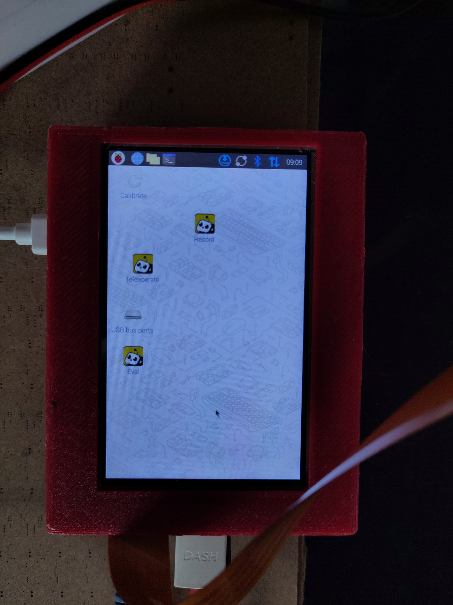

# Introduction

This file describes how to setup and use a Raspberry Pi 5 to control robot arms. The raspberry pi can also be used with a touch screen for a smoother graphical experience instead of using a keyboard for control. Inference is done on a remote server (preferably on the same subnetwork for reduced latency).

<p align="center">
  <picture>
    
  </picture>
  <br/>
  <br/>
</p>

# Hardware requirements

## Raspberry Pi

1. Please use a Raspberry Pi 5 with at least 4GB of RAM. You will also need a NVMe hat (like this [one](https://shop.pimoroni.com/products/nvme-base?variant=41313839448147)) and disk for fast image storage.
2. Do not forget the fan heat dissipator.
3. Be sure to use the official 27W raspberry pi 5 power supply.
4. You can put the raspberry pi and the NVMe base in a [3D printed case](https://www.thingiverse.com/thing:6259491) for better handling.
5. WiFi is enough for software updates but prefer an ethernet connexion for reduced latency in operation

## (Optional) Touch screen

If you prefer to avoid having a keyboard and mouse, you can connect a touch screen. Use at least a 4inch touch screen display such as this [one](https://www.waveshare.com/4inch-hdmi-lcd.htm).

# Installation

## Raspberry Pi

1. Install Raspberry Pi OS Bookworm using a SD-Card. You can then optionally boot from the NVMe SSD drive and remove the SD-Card. Detailed instructions can be found [here](https://www.jeffgeerling.com/blog/2023/nvme-ssd-boot-raspberry-pi-5).
2. Download and install an aarch64 version of Miniconda3
3. Clone lerobot and install raspberry pi extras: ```pip install -e ".[rpi]"```

## Touch screen

1. Connect the touch screen using the GPIO header pins and the HDMI connector
2. Edit ~/.config/libfcm/libfcm.conf and set quick_exec to 1. This will disable execution confirmation when setting up desktop shortcuts for various lerobot scripts.

For the proposed Waveshare 4inch display follow these instructions:

3. Download https://files.waveshare.com/wiki/10.1inch%20HDMI%20LCD/waveshare-ads7846.dtbo to /boot/overlays
4. Update /boot/firmware/config.txt with: dtoverlay=waveshare-ads7846,penirq=25,xmin=150,xmax=3900,ymin=100,ymax=3950,speed=50000

## Camera

You can use a CSI camera such as this [one](https://www.raspberrypi.com/products/camera-module-3/). In that case, you also need to install PiCamera2 dependencies:

```bash
sudo apt install cmake build-essential libcap-dev libatlas-base-dev ffmpeg libopenjp2-7 libcamera-dev libkms++-dev libfmt-dev libdrm-dev
```

To use the CSI camera in your config, you need to set `camera_index` to `csi_cam`

Also, when using miniconda, make sure to use the same gcc version as the system's gcc. This will avoid any binary compatibility issues.

```bash
conda install -c conda-forge gcc=12.2
```

# Operation

## Scripts desktop shortcuts

You can define custom shortcuts to lerobot scripts to be placed on the desktop for quick access.

Here's an example for teleoperation:

1. Create a bash script in your lerobot directory:
```bash
#!/bin/bash

LEROBOT_DIR="/home/pi/lerobot"
cd ${LEROBOT_DIR}

source /home/pi/miniconda3/etc/profile.d/conda.sh
conda activate lerobot
export LEROBOT_GUI=1 # enables GUI
python lerobot/scripts/control_robot.py \
  --robot.type=moss \
  --robot.cameras='{}' \
  --control.type=teleoperate
```

2. Create a ```teleoperate.desktop``` file in your ```~/Desktop``` directory. Make it executable ```chmod +x ~/Desktop/teleoperate.desktop```:

```bash
[Desktop Entry]
Type=Application
Name=Teleoperate
Comment=Teleoperate robot arms
Terminal=true #useful for debug
Exec=/home/pi/lerobot/teleoperate.sh
#Icon=<the_icon_of_your_choice> # you can specify any .png file to be used as an icon for the desktop shortcut.
```

## Remote inference

1. After training a policy, run the remote inference server (use the same local network for better performance):
```bash
#!/bin/bash

LEROBOT_DIR="/opt/lerobot"
cd ${LEROBOT_DIR}

source /opt/miniconda/etc/profile.d/conda.sh
conda activate lerobot
python lerobot/scripts/remote_server.py \
  -v \
  -p ${LEROBOT_DIR}/outputs/train/act/checkpoints/last/pretrained_model
```

2. On the raspberry pi, record episodes while speciying the server's address:
```bash
#!/bin/bash

LEROBOT_DIR="/home/pi/lerobot"
cd ${LEROBOT_DIR}

source /home/pi/miniconda3/etc/profile.d/conda.sh
conda activate lerobot
export HF_USER=$(huggingface-cli whoami | head -n 1)
export LEROBOT_GUI=1
python lerobot/scripts/control_robot.py \
  --robot.type=moss \
  --control.type=record \
  --control.root=datasets/rpi_eval \
  --control.single_task="Raspberry Pi reccording squares 1 eval" \
  --control.push_to_hub=True \
  --control.run_compute_stats=1 \
  --control.fps=15 \
  --control.tags=rpi \
  --control.warmup_time-s=5 \
  --control.episode_time_s=45 \
  --control.reset_time_s=5 \
  --control.num_episodes=10 \
  --control.resume=0 \
  --control.server_address="my_big_gpu_server.local" \
  --control.remote_device="cuda:0" \
  --control.repo_id="${HF_USER}/rpi_eval"
```
