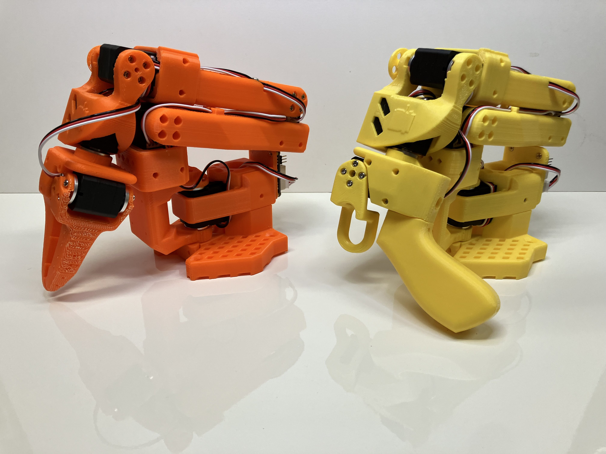

# SO-ARM100
Standard Open Arm 100 - Version 1.3

## Sourcing Parts
Note: The follower and leader arm for this teleoperation setup will have the same off the shelf parts. If you plan on creating the classic teleoperation set up to be used with the `LeRobot` library please buy from the Parts for Two Arms below. Note prices and items may vary depending on geographic location.

/!\ Warning: We only have links for US and EU for now. If you find links for other countries, please create an issue or PR so that we add them to the list.

#### Parts For Two Arms (Standard Teleoperation Setup):
| Part | Amount | Unit Cost (US) | Buy US | Unit Cost (EU) | Buy EU |
|---|---|---|---|---|---|
| STS3215 Servo[1](#myfootnote1) | 12 | $15 | [Alibaba](https://www.alibaba.com/product-detail/6PCS-7-4V-STS3215-Servos-for_1600523509006.html) | 13€ | [Alibaba](https://www.alibaba.com/product-detail/6PCS-7-4V-STS3215-Servos-for_1600523509006.html) |
| Motor Control Board | 2 | $11 | [Amazon](https://www.amazon.com/Waveshare-Integrates-Control-Circuit-Supports/dp/B0CTMM4LWK/) | 12€ | [Amazon](https://www.amazon.fr/-/en/dp/B0CJ6TP3TP/)|
| USB-C Cable 2 pcs | 1 | $7 | [Amazon](https://www.amazon.com/Charging-etguuds-Charger-Braided-Compatible/dp/B0B8NWLLW2/?th=1) | 7€ | [Amazon](https://www.amazon.fr/dp/B07BNF842T/) |
| Power Supply[2](#myfootnote2) | 2 | $10 | [Amazon](https://www.amazon.com/Facmogu-Switching-Transformer-Compatible-5-5x2-1mm/dp/B087LY41PV/) | 13€ | [Amazon](https://www.amazon.fr/-/en/dp/B01HRR9GY4/) |
| Table Clamp 4pcs | 1 | $18 | [Amazon](https://www.amazon.com/WORKPRO-Clamps-Woodworking-One-Handed-Spreader/dp/B0CQYDJWS8/) | 21€ | [Amazon](https://www.amazon.fr/dp/B08HW9VFM8/)|
| Screwdriver Set[3](#myfootnote3) | 1 | $6 | [Amazon](https://www.amazon.com/Precision-Phillips-Screwdriver-Electronics-Computer/dp/B0DB227RTH) | 10€ | [Amazon](https://www.amazon.fr/dp/B08ZXVMVYD/) |
| Total |---| $241 |---| 244€ |---|

#### Parts for One Arm:
| Part | Amount | Unit Cost (US) | Buy US | Unit Cost (EU) | Buy EU |
|---|---|---|---|---|---|
| STS3215 Servo[1](#myfootnote1) | 6 | $14 | [Alibaba](https://www.alibaba.com/product-detail/_1601053797763.html) | 13€ | [Alibaba](https://www.alibaba.com/product-detail/_1601053797763.html) |
| Motor Control Board | 1 | $11 | [Amazon](https://www.amazon.com/Waveshare-Integrates-Control-Circuit-Supports/dp/B0CTMM4LWK/) | 12€ | [Amazon](https://www.amazon.fr/-/en/dp/B0CJ6TP3TP/)|
| USB-C Cable 2 pcs | 1 | $7 | [Amazon](https://www.amazon.com/Charging-etguuds-Charger-Braided-Compatible/dp/B0B8NWLLW2/?th=1) | 7€ | [Amazon](https://www.amazon.fr/dp/B07BNF842T/) |
| Power Supply[2](#myfootnote2) | 1 | $10 | [Amazon](https://www.amazon.com/Facmogu-Switching-Transformer-Compatible-5-5x2-1mm/dp/B087LY41PV/) | 13€ | [Amazon](https://www.amazon.fr/-/en/dp/B01HRR9GY4/) |
| Table Clamp 2pcs | 1 | $9 | [Amazon](https://www.amazon.com/Mr-Pen-Carpenter-Clamp-6inch/dp/B092L925J4/) | 8€ | [Amazon](https://www.amazon.fr/-/en/dp/B08HZ1QRBF/)|
| Screwdriver Set[3](#myfootnote3) | 1 | $6 | [Amazon](https://www.amazon.com/Precision-Phillips-Screwdriver-Electronics-Computer/dp/B0DB227RTH) | 10€ | [Amazon](https://www.amazon.fr/dp/B08ZXVMVYD/) |
| Total |---| $127 |---| 128€ |---|

## Printing the Parts
A variety of 3D printers are acceptable to print the parts necessary of the follower and leader arm. Follow the steps below to ensure a good print.

1. Choose a printer: The STL files provided ready to print on many FDM printers. Below are the tested and suggested settings though others may work.
   1. Material: PLA
   2. Nozzle Diameter and Precision: 0.4mm nozzle diameter at 0.2mm layer height or 0.6mm nozzle at 0.4mm layer height.
   3. Infill Density: 13%
   4. Sample Printers: [Prusa Mini+](https://www.prusa3d.com/product/original-prusa-mini-semi-assembled-3d-printer-4/), [UP Plus 2](https://shop.tiertime.com/product/tiertime-up-plus-2-3d-printer/), [Ender3](https://www.amazon.com/Comgrow-Creality-Ender-Aluminum-220x220x250mm/dp/B07BR3F9N6/).
2. Set up the printer
   1. Setup and Takedown
      1. Ensure that the printer is calibrated and the bed level is correctly set using the printer specific instructions.
      2. Clean the print bed, making sure it is free from dust, or grease. If cleaning the bed using water, or other liquid, dry the bed.
      3. If your printer recommends it, use a standard glue stick and apply a thin, even layer of glue across the print area of the bed. Avoid clumping or uneven application.
      4. Load the printer filament using printer specific instructions.
      5. Ensure the printer settings match the ones suggested above (most printers have multiple settings so choose the ones that most closely match).
      6. Set for supports everywhere but ignore slopes greater than 45 degrees to the horizontal.
      7. There should be no supports in the screw holes with horizontal axes.
3. Check Printer Accuracy
   1.  In `stl_parts_for_printing/Gauges` folder, there are two types of gauges, one to check the size of print against standard 4x2 lego block and one against an STS3215 servo. 
       1.  If you have a STS3215 servo print: 
           1. `stl_files_for_3dprinting/Gauges/Gauge_0.STL`
           2. `stl_files_for_3dprinting/Gauges/Gauge_tight_1.STL`
       2.  If you have a standard lego block print:
           1. `stl_files_for_3dprinting/Gauges/Lego_Size_Test_02_zero.STL`
           2. `stl_files_for_3dprinting/Gauges/Lego_Size_Test_minuspoint1.STL` 
   2.  Test the gauge 0 against your given object (Lego or Servo). The fit should be similar to this [tutorial](https://youtu.be/dss8E3DG2rA).
   3.  If the fit is appropriate, go onto Step 4, otherwise, change your printer settings and try again or create an issue.
4. Print the parts: All the parts for the leader or follower are contained in a single file, correctly orientated for z upwards to minimize supports.
   1. For printer bed sizes of 220mmx220mm (such as the Ender), print:
      1. `stl_files_for_3dprinting/Follower/Print_Follower_SO_ARM100_08_Ender.STL`
      2. `stl_files_for_3dprinting/Leader/Print_Leader_SO_ARM100_08_Ender.STL`
   2. For printer bed sizes of 205mm x 250mm (such as the Prusa/Up), print:
      1. `stl_files_for_3dprinting/Follower/Print_Follower_SO_ARM100_08_UP_Prusa.STL`
      2. `stl_files_for_3dprinting/Leader/Print_Leader_SO_ARM100_08_UP_Prusa.STL`
5. Take Down
   1. After the print is done, use a putty knife to scrape the the parts off the print bed.
   2. Remove any support material from parts.

## Programming
1. For software, any Windows PC can connect over USB to program the servos and run initial tests. To do so download [Feetech Software](https://www.feetechrc.com/software.html). Note: This step is not necessary as motors can be configured using the LeRobot Library, but may be helpful for debugging.
2. The arm is intended for integration with the open source [LeRobot](https://github.com/huggingface/lerobot). To get started, follow the [Getting Started with Real-World Robots Tutorial](https://github.com/huggingface/lerobot/blob/main/examples/7_get_started_with_real_robot.md).

## Assembly
Detailed video instructions are on the [@therobotstudio YouTube channel](https://www.youtube.com/channel/UC7r_cmRhdfrTGcatjX2aIPA).

1. Start with the instructions for programming the servos [here](https://youtu.be/fy6Jqq_QaGo?si=xjr0-Jur2sEGA9kf).
2. Next, assemble the arm: [here](https://youtu.be/QkIgxTCq3MY?si=S0YPFFkKXr_Xbh47).
3. Follow along with the full developement process playlist [here](https://www.youtube.com/playlist?list=PLy7gxZH9jzfR0l8fYH8C1nyEc4pxSBrer).

## Other
Join the project with some of the brightest minds in open AI and robotics development on the [discord server](https://discord.gg/ggrqhPTsMe).

Check out this Handy [URDF viewer](https://gkjohnson.github.io/urdf-loaders/).

## Footnotes
<a name="myfootnote1">1</a>: The STS3215 arm comes in two sizes. The 7.4V has a stall torque of 16.5kg.cm at 6V (and likely slightly less for a 5V power supply). The 12V version has a stall torque of 30kg.cm. While we found the 7.4V to be sufficient, if you would like more powerful motors you can buy the 12V version [here](https://www.alibaba.com/product-detail/6PCS-12V-30KG-STS3215-High-Torque_1601216757543.html). Note if you do this, you will also have to buy a 12V 5A+ power supply instead of a 5V one, but all other components will remain the same.\
<a name="myfootnote2">2</a>: You can also use an adjustable laboratory power supply with leads.\
<a name="myfootnote3">3</a>: You do not need to use this exact screwdriver set, but it is highly recommended to have phillips head screw driver sizes #0 and #1 for easiest screw installation and removal. These are both standard sizes which will likely appear in most small screwdriver sets.\
<a name="myfootnote4">4</a>: You do not need to buy these exact parts, but a glue stick and putty knife are almost always necessary for a good 3D print. The glue prevents parts from sticking to the print bed, and the putty knife helps scrape parts from the print bed. However, feel free to check with your specific printer instructions for if these parts are necessary.
