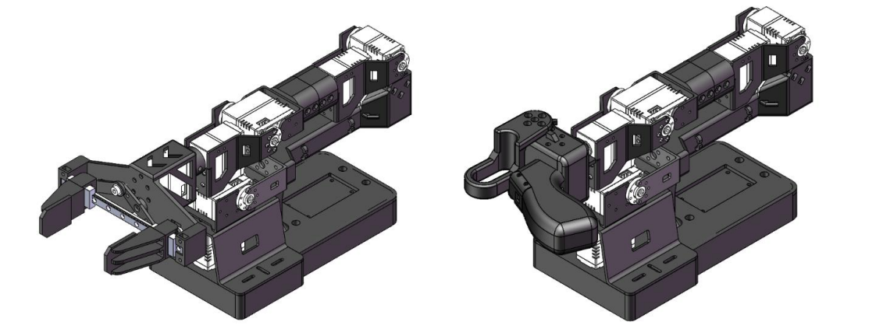

# 如何搭建具身智能LeRobot-starai系列机械臂并完成自定义抓取任务

[LeRobot](https://github.com/huggingface/lerobot/tree/main) 致力于为真实世界的机器人提供 PyTorch 中的模型、数据集和工具。其目标是降低机器人学的入门门槛，使每个人都能通过共享数据集和预训练模型进行贡献和受益。LeRobot 集成了经过验证的前沿方法，专注于模仿学习和强化学习。它提供了一套预训练模型、包含人类收集的示范数据集和仿真环境，使用户无需进行机器人组装即可开始使用。未来几周，计划在当前最具成本效益和性能的机器人上增强对真实世界机器人的支持。

[EN](./README%20-E.md)

##  产品介绍

1. **开源 & 便于二次开发**
   本系列舵机由[华馨京科技](https://fashionrobo.com/)提供，是一套开源、便于二次开发的6+1自由度机器臂解决方案。
2. **支持 LeRobot 平台集成**
   专为与 [LeRobot 平台](https://github.com/huggingface/lerobot) 集成而设计。该平台提供 PyTorch 模型、数据集与工具，面向现实机器人任务的模仿学习（包括数据采集、仿真、训练与部署）。
3. **丰富的学习资源**
   提供全面的开源学习资源，包括环境搭建，安装与调试与自定义夹取任务案例帮助用户快速上手并开发机器人应用。
4. **兼容 Nvidia 平台**
   支持通过 reComputer Mini J4012 Orin NX 16GB 平台进行部署。


## 特点内容

- **零组装**:  即刻上手｜一开箱即踏入AI时代。
- 6+1自由度结构设计，470mm臂展，赋予无限操作可能。
- 配备2颗全金属无刷总线舵机，稳定驱动，轻松承重300g。
- 智能平行夹爪，最大开合66mm，模块化指尖，精准抓取不设限。
- 独家悬停控制系统，指尖一按，Leader Arm稳停于任意姿态。


## 规格参数



| Item                 | Follower Arm \| Viola                             | Leder Arm \|Violin                                |
| -------------------- | ------------------------------------------------- | ------------------------------------------------- |
| Degrees of Freedom   | 6+1                                                 | 6+1                                               |
| Reach                | 470mm                                             | 470mm                                             |
| Span                 | 940mm                                             | 940mm                                             |
| Repeatability        | 2mm                                               | -                                                 |
| Working Payload      | 300g (with 70% Reach)                            | -                                                 |
| Servos               | RX8-U50H-M x2<br/>RA8-U25H-M x4<br/>RA8-U26H-M x1 | RX8-U50H-M x2<br/>RA8-U25H-M x4<br/>RA8-U26H-M x1 |
| Parallel Gripper Ki  | √                                                 | -                                                 |
| Wrist Rotate         | Yes                                               | Yes                                               |
| Hold at any Position | Yes                                               | Yes (with handle button)                          |
| Wrist Camera Mount   | √                                                 | -                                                 |
| Works with LeRobot   | √                                                 | √                                                 |
| Works with ROS 2     | √                                                 | /                                                 |
| Works with MoveIt    | √                                                 | /                                                 |
| Works with Gazebo    | √                                                 | /                                                 |
| Communication Hub    | UC-01                                             | UC-01                                             |
| Power Supply         | 12v/120w                                          | 12v/120w                                          |

有关舵机更多资讯，请访问以下链接。

[RA8-U25H-M](https://fashionrobo.com/actuator-u25/23396/)

[RX18-U100H-M](https://fashionrobo.com/actuator-u100/22853/)

[RX8-U50H-M](https://fashionrobo.com/actuator-u50/136/)


## 初始环境搭建

For Ubuntu X86:

- Ubuntu 22.04
- CUDA 12+
- Python 3.10
- Troch 2.6


## 安装与调试

### 安装LeRobot

需要根据你的 CUDA 版本安装 pytorch 和 torchvision 等环境。

1. 安装 Miniconda： 对于 Jetson：

```bash
wget https://repo.anaconda.com/miniconda/Miniconda3-latest-Linux-aarch64.sh
chmod +x Miniconda3-latest-Linux-aarch64.sh
./Miniconda3-latest-Linux-aarch64.sh
source ~/.bashrc
```

或者，对于 X86 Ubuntu 22.04：

```bash
mkdir -p ~/miniconda3
cd miniconda3
wget https://repo.anaconda.com/miniconda/Miniconda3-latest-Linux-x86_64.sh -O ~/miniconda3/miniconda.sh
bash ~/miniconda3/miniconda.sh -b -u -p ~/miniconda3
rm ~/miniconda3/miniconda.sh
source ~/miniconda3/bin/activate
conda init --all
```

2.创建并激活一个新的 conda 环境用于 LeRobot

```bash
conda create -y -n lerobot python=3.10 && conda activate lerobot
```

3.克隆 LeRobot 仓库：

```bash
https://github.com/servodevelop/lerobot.git
```


4.使用 miniconda 时，在环境中安装 ffmpeg：

```bash
conda install ffmpeg -c conda-forge
```
这通常会为你的平台安装使用 libsvtav1 编码器编译的 ffmpeg 7.X。如果不支持 libsvtav1（可以通过 ffmpeg -encoders 查看支持的编码器），你可以：

- 【适用于所有平台】显式安装 ffmpeg 7.X：

```bash
conda install ffmpeg=7.1.1 -c conda-forge
```

5.安装带有 fashionstar 电机依赖的 LeRobot：

```bash
cd ~/lerobot && pip install -e ".[dynamixel]"
pip install fashionstar-uart-sdk==1.3.1
```
6.检查 Pytorch 和 Torchvision

由于通过 pip 安装 LeRobot 环境时会卸载原有的 Pytorch 和 Torchvision 并安装 CPU 版本，因此需要在 Python 中进行检查。

```python
import torch
print(torch.cuda.is_available())
```

如果输出结果为 False，需要根据[官网教程](https://pytorch.org/index.html)重新安装 Pytorch 和 Torchvision。

### 机械臂开箱

机械臂套装内包含：

- Leader arm 主体
- Follower arm 主体
- 手柄
- 平行夹爪
- 安装工具（螺丝、内六角扳手）
- 电源 x2
- C型夹具 x2
- UC-01 转接板 x2


UC-01 转接板 开关：


https://github.com/user-attachments/assets/56130bd9-21ee-4ae4-9cac-3817ac4d659f


### 手臂端口设置

在终端输入以下指令来找到两个机械臂对应的端口号：

```bash
lerobot-find-port
```

例如：

1. 识别Leader时端口的示例输出（例如，在 Mac 上为 `/dev/tty.usbmodem575E0031751`，或在 Linux 上可能为 `/dev/ttyUSB0`） 
2. 识别Reader时端口的示例输出（例如，在 Mac 上为 `/dev/tty.usbmodem575E0032081`，或在 Linux 上可能为 `/dev/ttyUSB1`）

> [!NOTE]
>
> 如果识别不到ttyUSB0串口信息。尝试以下方法。
>
> 列出所有usb口。
>
> ```sh
> lsusb
> ```
>
> 
>
> 识别成功，查看ttyusb的信息
>
> ```sh
> sudo dmesg | grep ttyUSB
> ```
>
> 
>
> 最后一行显示断连，因为brltty在占用该USB设备号，移除掉就可以了
>
> ```sh
> sudo apt remove brltty
> ```
>
> 
>
> 最后，赋予权限
>
> ```sh
> sudo chmod 666 /dev/ttyUSB0
> ```
>
> 

## 校准
### leader

```bash
lerobot-calibrate     --teleop.type=starai_violin     --teleop.port=/dev/ttyUSB1     --teleop.id=my_awesome_staraiviolin_arm
```
如果是第一次校准，直接对每个关节移动到两边的限位位置，需要重新校准执行命令后输入字母c后按Enter键。

### follower
```bash
lerobot-calibrate --robot.type=starai_viola --robot.port=/dev/ttyUSB0 --robot.id=my_awesome_staraiviola_arm
```
如果是第一次校准，直接对每个关节移动到两边的限位位置，需要重新校准执行命令后输入字母c后按Enter键。


## 遥操作


https://github.com/user-attachments/assets/23b3aa00-9889-48d3-ae2c-00ad50595e0a


将手臂移动至图上位置待机。


您已准备好遥操作您的机器人（不包括摄像头）！运行以下简单脚本：

```bash
lerobot-teleoperate     --robot.type=starai_viola     --robot.port=/dev/ttyUSB1     --robot.id=my_awesome_staraiviola_arm     --teleop.type=starai_violin     --teleop.port=/dev/ttyUSB0     --teleop.id=my_awesome_staraiviolin_arm
```
远程操作命令将自动:

    识别任何缺失的校准并启动校准程序。
    连接机器人和远程操作设备并开始远程操作。
程序启动后，悬停按钮依旧生效。


## 添加摄像头

https://github.com/user-attachments/assets/82650b56-96be-4151-9260-2ed6ab8b133f


在插入您的两个 USB 摄像头后，运行以下脚本以检查摄像头的端口号，切记摄像头避免插在USB Hub上，USB Hub速率太慢会导致读不到图像数据。

```bash
lerobot-find-cameras opencv # or realsense for Intel Realsense cameras
```

终端将打印出以下信息。以我的笔记本为例，笔记本摄像头为Camera0和Camera2，index_or_path分别为2和4。

```markdown
--- Detected Cameras ---
Camera #0:
  Name: OpenCV Camera @ /dev/video2
  Type: OpenCV
  Id: /dev/video2
  Backend api: V4L2
  Default stream profile:
    Format: 0.0
    Width: 640
    Height: 480
    Fps: 30.0
--------------------
Camera #1:
  Name: OpenCV Camera @ /dev/video4
  Type: OpenCV
  Id: /dev/video4
  Backend api: V4L2
  Default stream profile:
    Format: 0.0
    Width: 640
    Height: 360
    Fps: 30.0
--------------------

Finalizing image saving...
Image capture finished. Images saved to outputs/captured_images
```


确认外接摄像头后，将摄像头信息替换下方cameras信息您将能够在遥操作时在计算机上显示摄像头：

```bash
lerobot-teleoperate     --robot.type=starai_viola     --robot.port=/dev/ttyUSB1     --robot.id=my_awesome_staraiviola_arm     --robot.cameras="{ front: {type: opencv, index_or_path: 2, width: 640, height: 480, fps: 30}}"     --teleop.type=starai_violin     --teleop.port=/dev/ttyUSB0     --teleop.id=my_awesome_staraiviolin_arm     --display_data=true
```

## 数据集制作采集


https://github.com/user-attachments/assets/8bb25714-783a-4f29-83dd-58b457aed80c


一旦您熟悉了遥操作，您就可以开始您的第一个数据集。

如果您想使用 Hugging Face Hub 的功能来上传您的数据集，并且您之前尚未这样做，请确保您已使用具有写入权限的令牌登录，该令牌可以从 [Hugging Face 设置](https://huggingface.co/settings/tokens) 中生成：

```bash
huggingface-cli login --token ${HUGGINGFACE_TOKEN} --add-to-git-credential
```

将您的 Hugging Face 仓库名称存储在一个变量中，以运行以下命令：

```bash
HF_USER=$(huggingface-cli whoami | head -n 1)
echo $HF_USER
```

记录 10 个回合并将您的数据集上传到 Hub：

```bash
lerobot-record \
    --robot.type=starai_viola \
    --robot.port=/dev/ttyUSB1 \
    --robot.id=my_awesome_staraiviola_arm \
    --robot.cameras="{ up: {type: opencv, index_or_path: /dev/video2, width: 640, height: 480, fps: 30},front: {type: opencv, index_or_path: /dev/video0, width: 640, height: 480, fps: 30}}" \
    --teleop.type=starai_violin \
    --teleop.port=/dev/ttyUSB0 \
    --teleop.id=my_awesome_staraiviolin_arm \
    --display_data=true \
    --dataset.repo_id=starai/record-test \
    --dataset.episode_time_s=30 \
    --dataset.reset_time_s=30 \
    --dataset.num_episodes=2 \
    --dataset.push_to_hub=False \
    --dataset.single_task="Grab the black cube"
```

### 数据集上传

本地,您的数据集存储在此文件夹中:~/.cache/huggingface/lerobot/{repo-id}. .在数据记录结束时,您的数据集将上传到您的Hugging Face页面(例如:https://huggingface.co/datasets/${HF_USER}/record_test) , 你可以通过运行获得:

echo https://huggingface.co/datasets/ ${HF_USER}/record_test

您的数据集将自动标记为LeRobot让社区轻松找到它,您还可以添加自定义标签(在这种情况下)tutorial例如。

您可以通过搜索中心查找其他 LeRobot 数据集LeRobottags.

您还可以手动将本地数据集推送到 Hub,运行:

huggingface-cli 上传 ${HF_USER } / record-test ~/.cache/huggingface/lerobot/{repo-id } - - - repo-type 数据集

### 记录功能

因recordfunction 提供了一套用于在机器人操作过程中捕获和管理数据的工具:
#### 1.数据存储

    数据使用以下命令存储LeRobotDataset格式,在录制时存储在磁盘上。
    默认情况下,数据集在录制后会推送到您的 Hugging Face 页面。
        要禁用上传,请使用--dataset.push_to_hub=False..

#### 2.检查点和恢复

    检查点在录制过程中自动创建。
    如果出现问题,可以通过重新运行相同的命令来恢复--resume=true..恢复录音时,--dataset.num_episodes必须设置为要录制的附加剧集数量,而不是数据集中的目标总集数!
    要从头开始录制,请手动删除数据集目录。

#### 3.记录 参数

使用命令行参数设置数据记录流:

    --dataset.episode_time_s=60每个数据记录插曲的持续时间(默认值:60秒)。
    --dataset.reset_time_s=60每集后重置环境的持续时间(默认:60秒)。
    --dataset.num_episodes=50记录的总集数(默认值:50)。

#### 4.录制期间的键盘控制

使用键盘快捷键控制数据记录流:

    按右箭头(→) : 提前停止当前情节或重置时间,然后移动到下一个。
    按 左 箭头 (←) : 取消当前插曲并重新录制。
    新闻 逃生 (ESC):立即停止会话,编码视频并上传数据集。

#### 收集数据的提示

一旦你熟悉了数据记录,你就可以创建一个更大的数据集进行训练。一个好的开始任务是抓住一个物体在不同的位置,并把它放在一个垃圾箱。我们建议录制至少50集,每个地点10集。保持相机固定,并在整个录音中保持一致的抓握行为。还要确保你操纵的对象在相机上可见。一个好的经验法则是,你应该能够只看相机图像自己完成任务。

在以下部分中,您将训练您的神经网络。在实现可靠的抓握性能后,您可以在数据收集过程中开始引入更多变化,例如额外的抓取位置,不同的抓握技术以及更改相机位置。

避免添加太多变化太快,因为它可能会阻碍你的结果。

如果你想深入了解这个重要的话题,blog post你可以看看我们写的关于什么是一个好的数据集的博客文章。
#### 故障排除:

    在 Linux 上,如果左右箭头键和转义键在数据记录过程中没有任何效果,请确保已设置$DISPLAY环境变量。参见 pynput 限制。

## 可视化数据集

如果您将数据集上传到集线器--control.push_to_hub=true, visualize your dataset online你可以可视化你的数据集通过复制粘贴你的repo id给:

```bash
echo ${HF_USER}/record_test
```


## 重播一个回合

```
lerobot-replay \
    --robot.type=starai_viola \
    --robot.port=/dev/ttyUSB1 \
    --robot.id=my_awesome_staraiviola_arm \
    --dataset.repo_id=starai/record-test \
    --dataset.episode=3 # choose the episode you want to replay
```


## 训练

要训练一个控制您机器人策略，以下是一个示例命令：

```bash
lerobot-train \
  --dataset.repo_id=starai/viola_test \
  --policy.type=act \
  --output_dir=outputs/train/act_viola_test \
  --job_name=act_viola_test \
  --policy.device=cuda \
  --wandb.enable=False \
  --policy.repo_id=starai/my_policy
```

如果你想训练本地数据集，repo_id与采集数据的repo_id对齐即可。训练应该需要几个小时。

要从某个检查点恢复训练

```bash
lerobot-train \
  --config_path=outputs/train/act_viola_test/checkpoints/last/pretrained_model/train_config.json \
  --resume=true
```

## 评估

运行以下命令记录 10 个评估回合：

```bash
lerobot-record  \
  --robot.type=starai_viola \
  --robot.port=/dev/ttyUSB1 \
  --robot.cameras="{ up: {type: opencv, index_or_path: /dev/video2, width: 640, height: 480, fps: 30}, side: {type: intelrealsense, serial_number_or_name: 233522074606, width: 640, height: 480, fps: 30}}" \
  --robot.id=my_awesome_staraiviola_arm \
  --display_data=false \
  --dataset.repo_id=starai/eval-test \
  --dataset.single_task="Put lego brick into the transparent box" \
  # <- Teleop optional if you want to teleoperate in between episodes \
  # --teleop.type=so100_leader \
  # --teleop.port=/dev/ttyACM0 \
  # --teleop.id=my_awesome_leader_arm \
  --policy.path=starai/my_policy
```

正如你所看到的,它几乎与以前用于记录训练数据集的命令相同。有两件事改变了:

    还有一个额外的--control.policy.path参数,指示到您的策略检查点的路径(例如outputs/train/eval_act_so101_test/checkpoints/last/pretrained_model。如果您将模型检查点上传到集线器(例如 ) , 则也可以使用模型存储库。${HF_USER}/act_so101_test。
    数据集的名称从eval反映你正在运行推论(例如:${HF_USER}/eval_act_so101_test。

## FAQ

- 如果实用本文档教程，请git clone本文档推荐的github仓库`https://github.com/servodevelop/lerobot.git`。

- 如果遇到以下报错，需要检查对应端口号的机械臂是否接通电源，总线舵机是否出现数据线松动或者脱落。

  ```bash
  ConnectionError: Read failed due to comunication eror on port /dev/ttyACM0 for group key Present_Position_Shoulder_pan_Shoulder_lift_elbow_flex_wrist_flex_wrist_roll_griper: [TxRxResult] There is no status packet!
  ```

- 如果遥操作正常，而带Camera的遥操作无法显示图像界面，请参考[这里](https://github.com/huggingface/lerobot/pull/757/files)

- 如果在数据集遥操作过程中出现libtiff的问题，请更新libtiff版本。

  ```bash
  conda install libtiff==4.5.0  #for Ubuntu 22.04 is libtiff==4.5.1
  ```

  

- 执行完安装LeRobot可能会自动卸载gpu版本的pytorch，所以需要在手动安装torch-gpu。

- 对于Jetson，请先安装[Pytorch和Torchvsion](https://github.com/Seeed-Projects/reComputer-Jetson-for-Beginners/blob/main/3-Basic-Tools-and-Getting-Started/3.3-Pytorch-and-Tensorflow/README.md#installing-pytorch-on-recomputer-nvidia-jetson)再执行`conda install -y -c conda-forge ffmpeg`,否则编译torchvision的时候会出现ffmpeg版本不匹配的问题。

- 如果出现如下问题，是电脑的不支持此格式的视频编码，需要修改`lerobot/lerobot/common/datasets /video_utils.py`文件134行`vcodec: str = "libsvtav1"`的值修改为`libx264`或者`libopenh264`,不同电脑参数不同，可以进行尝试。 [Issues 705](https://github.com/huggingface/lerobot/issues/705)

  ```bash
  [vost#0:0 @ 0x13207240] Unknown encoder 'libsvtav1' [vost#0:0 @ 0x13207240] Error selecting an encoder Error opening output file /home/han/.cache/huggingface/lerobot/lyhhan/so100_test/videos/chunk-000/observation.images.laptop/episode_000000.mp4. Error opening output files: Encoder not found
  ```

  

- 在3060的8G笔记本上训练ACT的50组数据的时间大概为6小时，在4090和A100的电脑上训练50组数据时间大概为2~3小时。

- 数据采集过程中要确保摄像头位置和角度和环境光线的稳定，并且减少摄像头采集到过多的不稳定背景和行人，否则部署的环境变化过大会导致机械臂无法正常抓取。

- 数据采集命令的num-episodes要确保采集数据足够，不可中途手动暂停，因为在数据采集结束后才会计算数据的均值和方差，这在训练中是必要的数据。

- 如果程序提示无法读取USB摄像头图像数据，请确保USB摄像头不是接在Hub上的，USB摄像头必须直接接入设备，确保图像传输速率快。

## 参考文档

矽递科技英文Wiki文档：[How to use the SO10xArm robotic arm in Lerobot | Seeed Studio Wiki]([如何在 Lerobot 中使用 SO100/101Arm 机器人手臂 | Seeed Studio Wiki](https://wiki.seeedstudio.com/cn/lerobot_so100m/))

Huggingface Project:[Lerobot](https://github.com/huggingface/lerobot/tree/main)

ACT or ALOHA:[Learning Fine-Grained Bimanual Manipulation with Low-Cost Hardware](https://tonyzhaozh.github.io/aloha/)

VQ-BeT:[VQ-BeT: Behavior Generation with Latent Actions](https://sjlee.cc/vq-bet/)

Diffusion Policy:[Diffusion Policy](https://diffusion-policy.cs.columbia.edu/)

TD-MPC:[TD-MPC](https://www.nicklashansen.com/td-mpc/)
