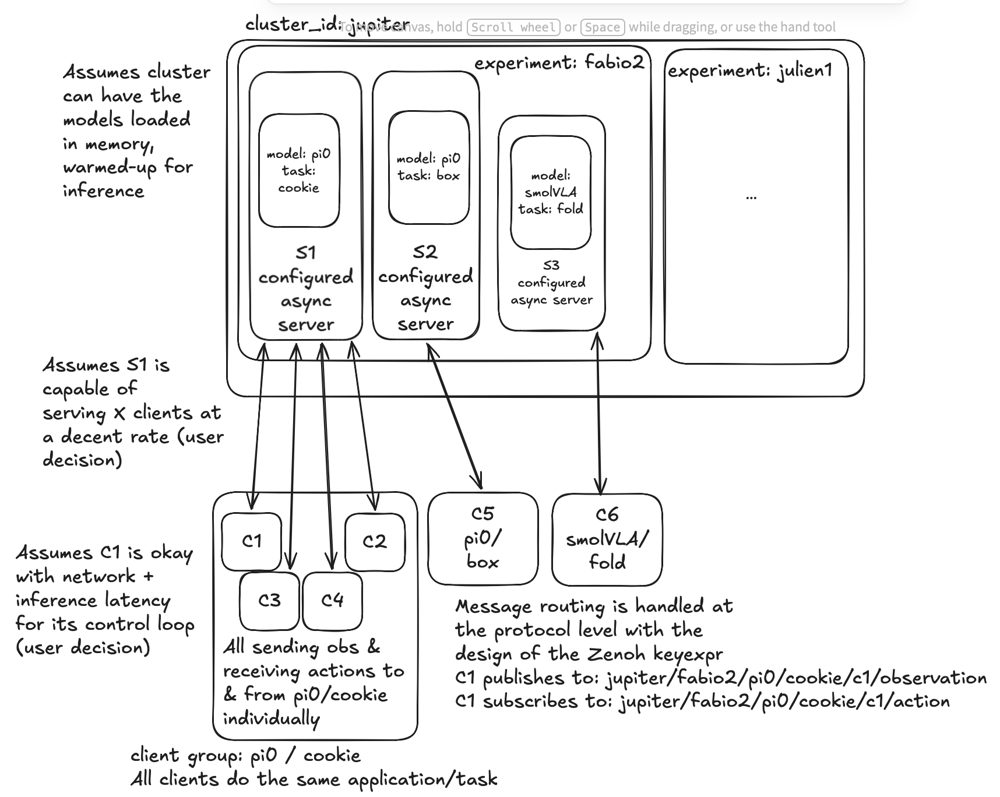

# Decoupled VLA Inference & Edge Control v2: Async Network Inference for `lerobot-rollout`

> **Status**: supersedes the v1 proposal in full. v1 was written against the standalone `src/lerobot/async_inference/` prototype, before `lerobot-rollout` existed. This revision re-grounds the design in the current codebase, keeps v1's decisions that survived contact with it (marked **KEPT** throughout), reverses the ones that didn't, and adds the safety, multi-tenancy, and operations specifications v1 lacked.

## 1. Executive Summary

This document specifies a production-grade system for decoupling GPU-bound policy inference from high-frequency robot control, targeting power users running **hundreds of robots** against centralized GPU clusters. The system keeps v1's **Model-as-a-Service (MaaS)** paradigm and **Zenoh** transport, but changes the integration architecture fundamentally:

- **The client is not a standalone CLI.** It is `--inference.type=remote`, a new `InferenceEngine` backend inside `lerobot-rollout` (`src/lerobot/rollout/inference/`). Every rollout strategy (base, sentry, highlight, dagger, episodic) gets network inference for free — including dataset recording, DAgger pause/resume, Rerun visualization, and safe teardown.
- **The client is weightless.** No policy weights, no policy processors on the edge. `--policy.path` resolves to a config-only `PreTrainedConfig` (no weight download) used for pre-flight validation and action ordering.
- **The server is stateless per request.** All RTC chunk state (leftover prefixes, latency tracking, delay computation) lives client-side in the existing `ActionQueue`/`LatencyTracker` machinery — the client ships prefixes + a delay hint with each observation. A server crash loses zero control state; reconnects and horizontal scaling are trivial.
- **Multi-tenancy is engineered, not assumed.** The real hazards are stateful processor pipelines and episode-scoped policy state — not `predict_action_chunk` purity (which holds for ACT/Pi0/Pi0.5/SmolVLA but _not_ diffusion). The server uses per-session processor instances, a chunk-stateless allowlist, and an exclusive serving mode for policies that need it.
- **The legacy module dies.** `src/lerobot/async_inference/` (~1,900 lines, pickle-over-gRPC, single-client, four confirmed bugs) is deleted in the same PR that lands the new backend. No deprecation cycle: the module is experimental, its CLI undocumented in the main flow, and every config field has a mapped successor (§13.4).

---

## 2. Motivation (unchanged from v1) — **KEPT**

LeRobot's standard control loop runs policy inference and robot I/O in the same process. This breaks down when:

- **The policy is too large for edge hardware** (Pi0-class models need a dedicated GPU).
- **Multiple robots need the same policy** (redundant GPU allocation per robot).
- **Inference latency exceeds the control deadline** (e.g. 150 ms inference on a 33 ms control tick).

Decoupling solves all three: the edge runs a tight CPU loop; a GPU server performs inference for N clients.

What changed since v1: the _local_ version of this decoupling already shipped. `RTCInferenceEngine` (`src/lerobot/rollout/inference/rtc.py`) runs inference in a background thread against a thread-safe `ActionQueue` with latency-aware chunk merging. **The network system is that same architecture with the thread boundary replaced by a network boundary.** This is the design's central simplification: reuse, don't reinvent.

---

## 3. Gap Analysis: v1 Proposal vs. Modern Codebase

| Topic                                     | v1 assumed                                                      | Modern reality                                                                                                 | Verdict                                 |
| ----------------------------------------- | --------------------------------------------------------------- | -------------------------------------------------------------------------------------------------------------- | --------------------------------------- |
| Client architecture                       | Standalone robot-client CLI (§5.1 of v1)                        | `InferenceEngine` ABC seam in `lerobot-rollout` (`rollout/inference/base.py`); strategies are backend-agnostic | **Superseded** — backend, not CLI       |
| Chunk blending                            | Configurable aggregation zoo (`weighted_average`, …)            | `ActionQueue` replace-with-delay-trim (RTC) / append (non-RTC) (`policies/rtc/action_queue.py:147-217`)        | **Superseded** — drop blending entirely |
| Latency compensation                      | Hand-rolled RTT trim (`expired_steps = int(rtt/dt)`, v1 §8.2)   | `ActionQueue.merge(..., real_delay, idx_before)` + `LatencyTracker` already do this, validated                 | **Superseded**                          |
| Multi-tenancy invariant                   | "`predict_action_chunk()` pure ⇒ safe to share"                 | Processor state + episode-scoped policy state are the real hazards (§7)                                        | **Incomplete** — fixed in §8.3          |
| Data logging                              | Client-side `build_dataset_frame` + `add_frame` sketch (v1 §14) | Recording strategies (sentry/episodic/dagger) already log obs + executed actions                               | **Superseded** — free via rollout       |
| MaaS pre-warm, no dynamic loading         | ✓                                                               | Still right; legacy `SendPolicyInstructions` is a pickle/RCE + capacity-planning disaster                      | **KEPT**                                |
| JPEG observation compression              | ✓                                                               | Still right (§10.1)                                                                                            | **KEPT**                                |
| Status/capability validation before start | ✓ (Zenoh queryable)                                             | Still right; extended into a hard sync-safety contract (§8.4)                                                  | **KEPT, extended**                      |
| Time-based send threshold (v1 G14)        | ✓                                                               | Adopted as `buffer_time_s`                                                                                     | **KEPT**                                |
| Zenoh pub/sub data plane                  | ✓                                                               | Confirmed; QoS corrected (§6.3), control plane moved to queryables, liveliness added                           | **KEPT, hardened**                      |
| MessagePack serialization                 | ✓                                                               | Endorsed (zenoh's `ext` serializer cannot encode numpy); must be version-gated (§10.4)                         | **KEPT, with schema discipline**        |
| QoS table (v1 §6.2)                       | "obs best-effort, actions reliable"                             | Conflates transport reliability with congestion control; BLOCK on actions is dangerous                         | **Revised** (§6.3)                      |
| Bugs BUG-1…BUG-4, gaps G1…G14             | Listed as work items                                            | Every one resolved _structurally_ by this design (§13.5 mapping)                                               | **Resolved by design**                  |

---

## 4. Critical Pushbacks on v1

Each pushback: claim → evidence → consequence for this design.

**P1 — A standalone client duplicates `lerobot-rollout`.**
v1 §5.1 assigns the client: observation capture, action execution at frequency, fail-safe, data logging. Every one of those is already owned by rollout strategies and `send_next_action` (`rollout/strategies/core.py:269-304`), which tolerates `None` actions, runs the interpolator, and routes through the canonical robot processors. A standalone client re-implements loop timing, recording, DAgger UX, Rerun, and teardown safety — and then drifts. _Consequence_: the client is `RemoteInferenceEngine`, registered as `--inference.type=remote` next to `sync` and `rtc`.

**P2 — The aggregation-function zoo fabricates actions no policy predicted.**
`0.3*old + 0.7*new` produces hybrid actions that exist in no policy's output distribution; the logged action becomes unexplainable (bad for the reproducibility story) and the implementation hosted a real lock-release race (BUG-2, `async_inference/robot_client.py:236-267`). RTC's prefix-conditioned chunk generation is the principled mechanism for smooth chunk transitions; plain append covers non-RTC chunking. _Consequence_: `ActionQueue` replace/append are the only two merge semantics. The zoo is deleted.

**P3 — "predict_action_chunk pure ⇒ multi-tenant safe" is incomplete.**
Verified in-tree: (a) `RelativeActionsProcessorStep` caches `_last_state` at preprocess (`processor/relative_action_processor.py:131`) and the postprocessor reads it back (`:189`) — a shared pipeline across clients is a race; (b) `DiffusionPolicy.predict_action_chunk` reads `self._queues`, which only `select_action` populates (`policies/diffusion/modeling_diffusion.py:90-108`) — it is **not** chunk-stateless; (c) SAC/SARM have no `predict_action_chunk` at all. _Consequence_: per-session processor instances (mandatory), a chunk-stateless allowlist, `serving_mode: exclusive` for diffusion-family, refusal at startup for SAC/SARM, and `policy.reset()` is **never** called in shared mode (§8.3).

**P4 — v1 re-derives latency compensation that already exists, on top of broken clocks.**
v1 §8 specifies an in-flight RTT dict and manual stale-step trimming. `ActionQueue.merge(original, processed, real_delay, idx_before)` already trims `real_delay` stale steps and cross-validates against actions consumed in flight (`action_queue.py:219-246`). Worse, the legacy code compares wall clocks across machines (`robot_client.py:420` stamps `time.time()` "to compare timestamps across client and server"; `policy_server.py:178` compares it) — NTP skew is the same order as the latencies being measured. _Consequence_: the **monotonic iron rule** (§11): instants never cross machines; client timestamps are opaque echoed tokens; servers report only durations. `delay_steps = ceil((rtt + inference)/dt)` is computed client-side from client-local `perf_counter` samples and shipped per request.

**P5 — One-in-flight per client is a correctness requirement, not a tuning choice.**
At send time the client snapshots `idx_before = queue.get_action_index()` and the leftover prefixes; `merge` validates against them. Two in-flight requests carry conflicting snapshots — the second merge corrupts both RTC replace mode and append mode. The local RTC thread is also strictly one-inference-at-a-time; one-in-flight preserves exact parity. _Consequence_: the worker publishes one observation, waits for its chunk (or timeout), then sends the next. v1 §8.1's out-of-order in-flight dict is dead weight; a late chunk is accepted only if it answers the _latest_ outstanding `seq_id`, otherwise dropped.

**P6 — v1's QoS table conflates transport reliability with congestion behavior.**
"Reliable delivery for actions" sounds right but the dangerous knob is congestion control: a publisher configured `BLOCK` on the action topic can stall the **server's** publish path on one robot's dead uplink (Zenoh blocks up to `wait_before_close`, then may close the transport). A dropped action chunk is _recoverable by design_ — the client's queue keeps the robot moving and the next chunk replaces it. _Consequence_ (§6.3): actions = `reliability=RELIABLE` (hop-level) + `congestion_control=DROP` + `express=True` + `priority=INTERACTIVE_HIGH`; observations = `DROP` + `DATA`. If WAN loss proves material, upgrade the action topic to Zenoh Advanced Pub/Sub (cache + recovery, zenoh ≥ 1.5) rather than BLOCK.

**P7 — Schema-less MessagePack invites silent version drift across a 300-robot fleet.**
msgpack stays (zenoh's `ext` serializer cannot encode numpy/dataclasses, and the team's choice stands), but naked msgpack dicts across heterogeneous fleet versions fail at runtime, on the robot. _Consequence_ (§10.4): a packed little-endian **attachment header** (`schema_version`, `seq_id`, `episode_id`, `client_mono_ns` — the rmw_zenoh pattern) so routing/correlation never deserializes the body; `schema_version` negotiated at the session handshake; additive-only evolution; golden codec tests. Protobuf-over-ZBytes is the documented fallback if drift bites in practice.

**P8 — "Deterministic rollout reproducibility" is unattainable on real robots.**
No seed controls hardware, sensor noise, or network jitter; RTC's latency-driven trimming is inherently timing-dependent. _Consequence_: the contract is **fully logged + replayable** (§12): recording strategies already persist observations and executed actions; the remote engine adds `(session_id, seq_id, episode_id)` provenance so client datasets join server audit logs mechanically.

**P9 — v1 has no safety specification.**
"Log a warning when the buffer empties" is not a fail-safe for a 300-robot fleet. _Consequence_ (§9): a staleness bound (`max_action_age_s` — never execute an action older than X relative to its source observation), an explicit fallback ladder (`hold` / `repeat_last` / `zero` — zero-command required for future velocity-controlled robots), and a DEAD state that triggers the existing strategy shutdown path (return-to-initial-pose, disconnect) via the same `shutdown_event` mechanism RTC uses (`rtc.py:359-360`).

**P10 — Capacity must be formula-driven, not "a user decision".**
v1 §4 says clients-per-server "is a user decision". With `t` = server time per request, `r` = per-client request rate, `H` = RTC execution horizon, `dt` = control period:
`N_max = min( 0.8 / (r·t),  (H·dt/2 − RTT_net) / t )`
→ ACT @ 20 ms, 1 Hz: ~40 clients/GPU. Pi0 @ 150 ms, 1 Hz: ~5 clients/GPU. 300 robots on Pi0 ≈ 60 GPU pods. _Consequence_: the manifest carries `max_sessions`; the server rejects session opens beyond it (with current load in the reply) so clients retry another replica. Micro-batching is deferred — blocked on a real API issue (`predict_action_chunk` takes a _scalar_ `inference_delay`; batched clients have different delays) — behind a `Scheduler` seam so it can land later without redesign (§8.5).

**P11 — Discovery ≠ multicast.**
Zenoh's multicast scouting does not cross WAN, NAT, or most k8s CNIs. _Consequence_: multicast scouting disabled; clients use static `connect.endpoints` (DNS name of the router) + gossip; presence and liveness come from Zenoh **liveliness tokens** (§6.4), not discovery. "Discovery" for a robot fleet is configuration.

---

## 5. System Topology


_(Diagram unchanged from v1 — the topology survives; transport/QoS/session details in it are superseded by §6.)_

- **Router tier**: one or more `zenohd` routers (k8s Deployment + Service, TLS on 7447). Robots **dial out** to the router (NAT-friendly: labs only need outbound 7447/443). GPU servers join as peers via cluster DNS.
- **Server**: one process = one `(model_repo, revision, dtype, device)` on one GPU, pre-warmed from a YAML manifest (**KEPT** from v1, amended: `pin_task: bool` — VLA prompts may vary per session unless pinned).
- **Client**: one robot running `lerobot-rollout --inference.type=remote`. Weightless: config-only policy metadata.
- **Identity**: `client_uuid` per robot; `session_id` per connection epoch; both in every log line on both sides.

---

## 6. Zenoh Design

All Zenoh claims below were verified against zenoh / zenoh-python 1.x (eclipse-zenoh 1.9.0). Pin: `eclipse-zenoh>=1.9,<2.0`; keep `zenohd` on the same minor as the Python binding. Wheels cover manylinux x86_64/aarch64/armv7l/armv6l + macOS — Raspberry Pi edge clients are covered.

### 6.1 Key-expression schema

```
@lerobot/<model_id>/<revision>/<task_slug>/<client_uuid>/obs       client → server
@lerobot/<model_id>/<revision>/<task_slug>/<client_uuid>/action    server → client
@lerobot/<model_id>/<revision>/<task_slug>/status                  queryable (capabilities)
@lerobot/<model_id>/<revision>/<task_slug>/session                 queryable (open/validate)
@lerobot/<model_id>/<revision>/<task_slug>/<client_uuid>/reset     queryable (episode boundary)
@lerobot/<model_id>/<revision>/<task_slug>/<client_uuid>/alive     liveliness token (client)
@lerobot/<model_id>/<revision>/<task_slug>/server/alive            liveliness token (server)
```

Rules (hard, enforced by a `sanitize_keyexpr()` helper):

- Root at the **verbatim chunk** `@lerobot` — verbatim chunks are only matched by identical chunks, so third-party `**` subscribers on a shared router can never scrape the tree.
- Sanitize every user-supplied segment (model ids, task strings, uuids): non-empty, no `* $ ? # /`, no leading/trailing/double `/`. A task string containing `/` must be slugified before it becomes a key chunk.
- Server subscribes with a **single-depth** wildcard (`.../*/obs`) — never `**` (it would also match `status`, `alive`, …).
- v1's `cluster/experiment` prefix segments are dropped from the key schema; they return as free-form `tags` metadata in the session handshake (telemetry/labeling, not routing). Routing topology belongs to deployment (which router you dial), not to key depth.

### 6.2 Data plane vs. control plane (the rmw_zenoh split)

- **Data plane = pub/sub** (KEPT from v1): observations up, action chunks down, correlated by `seq_id` in **attachments** (§10.4). Pub/sub rather than query-per-inference because: a timed-out query's late reply is _dropped by the transport_ (wasted inference), whereas a late pub/sub chunk is still mergeable if it answers the latest outstanding seq; and pub/sub leaves room for server-initiated messages (drain notices). The one-in-flight discipline (P5) is enforced in the client worker, not by the transport.
- **Control plane = queryables** (request/reply with explicit timeouts; the pattern rmw*zenoh uses for ROS 2 services): `status` (pre-flight capability fetch, 2 s timeout), `session` (open/validate → ack with capabilities + `session_id`), `reset` (episode boundary — \_acknowledged*, so episodic strategies know the server-side episode state is clean). Always pass an explicit `timeout` to `session.get()` — the config default is 10 s, far too long for our watchdogs.
- **Episode ordering**: under one-in-flight there is no obs/reset race window in the data plane, but as belt-and-braces the first observation of each episode also carries `episode_start=True` + the new `episode_id` in its header.

### 6.3 QoS (revised from v1 §6.2 — see P6)

| Topic              | reliability | congestion_control     | express  | priority         | Why                                                                                                                                                                                                                                              |
| ------------------ | ----------- | ---------------------- | -------- | ---------------- | ------------------------------------------------------------------------------------------------------------------------------------------------------------------------------------------------------------------------------------------------ |
| `obs`              | default     | **DROP**               | false    | DATA             | Intentional drop already happened at the client's one-slot holder; if the uplink stalls, dropping a frame protects the control loop.                                                                                                             |
| `action`           | RELIABLE    | **DROP** (never BLOCK) | **true** | INTERACTIVE_HIGH | Hop-level reliability over TCP; express skips batching for the small (4–50 KB) latency-critical payload; DROP so one dead robot uplink can never stall the server's publish path. Chunk loss is recoverable: the client buffer rides through it. |
| control queryables | RELIABLE    | default                | —        | —                | Correctness over latency; explicit timeouts bound them.                                                                                                                                                                                          |

Upgrade path if WAN chunk loss proves material: `AdvancedPublisher`/`AdvancedSubscriber` (zenoh ≥ 1.5) with a small cache + heartbeat-based recovery **on the action topic only**. Hop-by-hop RELIABLE is not end-to-end reliability — Zenoh has no broker persistence; a disconnected subscriber's data is gone. The design assumes this (client state machine, §9).

### 6.4 Liveliness (presence + watchdogs)

- Client declares a liveliness token on `.../<client_uuid>/alive`. The server liveliness-subscribes with `history=True`: token appear → ensure session state; token drop → GC the session (mailbox, processor instances) after a grace period.
- Server declares `.../server/alive`. The client liveliness-subscribes: on drop → treat as RECONNECTING (§9), hold/fallback per config, re-run the `status`/`session` handshake when the token reappears.
- Tune the transport lease down from its default so ungraceful-death detection is seconds, not tens of seconds (verify the default in the pinned version; it is config `transport/link/tx/lease`).
- Liveliness cannot detect a _hung-but-connected_ server. The client's per-request timeout (`request_timeout_s`) is the authoritative watchdog — this is the structural fix for legacy BUG-3 (no deadlines on `GetActions`).

### 6.5 Threading constraints (zenoh-python facts that shape both processes)

- **No asyncio API** in zenoh-python — both client and server are thread-based. This matches the existing RTC engine pattern exactly.
- Each callback-based subscriber spawns a dedicated Python thread; **blocking Zenoh calls inside callbacks are disallowed**. Callbacks must be deposit-only (write a slot, set an event, return).
- Channel handlers (`FifoChannel`, `RingChannel`) are Rust-side; `try_recv()` polls without spawning Python threads. `RingChannel(1)` is native latest-only semantics.
- No zero-copy path for our payloads (SHM API is `@_unstable` and same-host-only; `ZBytes` copy behavior undocumented). At ~200 KB × a few Hz per robot, one memcpy is irrelevant.

### 6.6 Router deployment

- `zenohd` official image as a k8s Deployment (1–N replicas; routers mesh and reroute around failures) behind a `LoadBalancer`/`NodePort` Service exposing TLS 7447. No official Helm chart exists — roll-your-own manifests.
- `scouting.multicast.enabled: false`; `scouting.gossip.enabled: true`; clients/servers use static `connect.endpoints`.
- **Auth**: mTLS per robot (`transport.link.tls` with `enable_mtls`) + router **ACL** keyed on `cert_common_names`: a robot's cert may only `put` to `@lerobot/**/<its-uuid>/obs` and receive on `.../<its-uuid>/action`. Caveat (flagged): ACL config reloads require a router restart — plan cert/ACL changes as rolling router restarts.
- Security review input: the third-party Zenoh protocol security analysis (Census Labs, 2025) should be read before exposing 7447 publicly.

---

## 7. The Statelessness Boundary (the load-bearing section)

**Where the network cut goes.** The local RTC pipeline is:

```
obs (robot-processed dict)
  → build_dataset_frame(hw_features, obs, "observation")        CLIENT  (cheap, hardware-coupled)
─────────────────────────── network ───────────────────────────
  → prepare_observation_for_inference(...)                      SERVER  (policy-coupled, heavy)
  → per-session preprocessor(...)                               SERVER  (stateful within the request)
  → policy.predict_action_chunk(obs, inference_delay, prefix)   SERVER  (pure for allowlisted policies)
  → per-session postprocessor(...)                              SERVER  (reads state cached at preprocess)
─────────────────────────── network ───────────────────────────
  → ActionQueue.merge(original, processed, real_delay, idx_before)   CLIENT
```

Three consequences:

1. **The server needs no cross-request state.** `RelativeActionsProcessorStep` writes `_last_state` at preprocess and the postprocessor reads it back _within the same request_. Per-session pipeline instances + one-request-at-a-time-per-session give correctness with zero persistent state.
2. **RTC state stays client-side**, exactly where `RTCInferenceEngine` already keeps it. Each request ships: `inference_delay_steps = ceil(L_max/dt)` (from the client `LatencyTracker`, whose samples are full network-inclusive cycle times — RTT compensation falls out for free), `prefix_model = queue.get_left_over()[:H]`, and `prefix_robot = queue.get_processed_left_over()[:H]` (needed for server-side relative-prefix re-anchoring, mirroring `rtc.py:287-305`). The response returns **both** the model-space and robot-space chunks because `merge` needs both. ≤ `execution_horizon × action_dim` float32 each — a few hundred bytes.
3. **G9 dies structurally.** No bespoke client resize (`F.interpolate` in legacy `helpers.py`), no client-side normalization. Clients ship native camera resolution; the server's canonical processor path does everything — serve-time preprocessing is byte-identical to train-time.

**What the server _does_ hold** (and what it means):

- Per-session processor instances (cheap; normalization stat tensors shared read-only).
- Per-session episode counter + stats. Episode reset = reset the session's pipelines, clear its mailbox. **`policy.reset()` is never called in shared mode** — it is global to the shared policy instance and unnecessary for chunk-pure policies (ACT's ensembler and Pi0/SmolVLA's queues live in `select_action`, not `predict_action_chunk` — verified).
- Policies that are _not_ chunk-pure get `serving_mode: exclusive` (§8.3).

---

## 8. The Inference Server: `lerobot-policy-server`

New package `src/lerobot/policy_server/`; console script `lerobot-policy-server --manifest manifest.yaml`.

### 8.1 Process model — **KEPT** from v1, amended

One process = one model+task on one GPU, loaded and warmed at startup (`warmup_inferences` dummy forwards; covers torch.compile). Multi-GPU nodes run N processes (`CUDA_VISIBLE_DEVICES` pinning). Dynamic model loading (`SendPolicyInstructions`) is **rejected**: pickle/RCE surface, arbitrary-download surface, and it destroys capacity planning. Amendment: `pin_task: false` (default) lets VLA clients set the task per session; `pin_task: true` rejects mismatched tasks at session open.

### 8.2 Concurrency (pure threads — no asyncio in zenoh-python)

```
zenoh subscriber (.../*/obs)          inference worker (1 thread, owns GPU)
  deposit-only callback:                loop:
  slots[client_uuid] = sample   ──►       pick next session with pending obs (RR ring)
  (per-client latest-only)                decode JPEG → per-session preprocess
                                          predict_action_chunk(delay, prefix)
control queryables (status/session/      per-session postprocess → encode
  reset): validate, mutate session        publisher.put(.../<uuid>/action)
  registry, reply                       (publishing from the worker thread is fine)
```

- **Per-client latest-only mailbox**: a wildcard subscriber with a deposit-only callback writing per-client slots (scales to dynamic fleets), or — when the manifest enumerates clients — one `RingChannel(1)` subscriber per client polled via `try_recv()`. Either way: newest observation wins; a superseded request is counted (`superseded_seqs` in the next response) so drops are visible. This deletes legacy BUG-4 (`observations_similar` + `must_go`) by construction — the **client** decides when to request; the server never second-guesses observation content.
- **Single inference worker**: torch releases the GIL inside `forward`, callbacks stay responsive. Strict round-robin over sessions with pending observations: each gets exactly one inference per cycle; starvation is structurally impossible. Overload degrades into longer cycle times → larger (but correct) client `delay_steps` → eventually the client staleness bound trips and the robot holds — safe by construction.

### 8.3 Chunk-stateless allowlist and serving modes

At startup the server classifies the loaded policy:

| Class           | Policies (verified)                                                                              | Mode                                                                                                                                                    |
| --------------- | ------------------------------------------------------------------------------------------------ | ------------------------------------------------------------------------------------------------------------------------------------------------------- |
| chunk-stateless | ACT, Pi0, Pi0.5, SmolVLA (and any policy whose `predict_action_chunk` touches no instance state) | `shared`: N sessions, per-session pipelines, `policy.reset()` never called                                                                              |
| chunk-stateful  | Diffusion family (`predict_action_chunk` reads `select_action`-fed `self._queues`)               | `exclusive`: `max_sessions=1` enforced; episode reset additionally calls `policy.reset()`; second session open → rejected with a self-explanatory error |
| no chunk API    | SAC, SARM                                                                                        | refused at startup                                                                                                                                      |

Implemented as a registry in `policy_server/validation.py`; the cleaner follow-up is a `supports_stateless_chunking` class attribute on `PreTrainedPolicy` (needs a pass over policy families — roadmap §14).

### 8.4 Session open & capability validation (fail fast, fail loud)

`session` queryable payload: `client_uuid`, `policy_type`, `fps`, feature summary (post-rename observation feature names + shapes, ordered action keys), `schema_version`, RTC intent, `tags`. Checks:

| Check                      | Rule                                                            | On mismatch                                                                        |
| -------------------------- | --------------------------------------------------------------- | ---------------------------------------------------------------------------------- |
| Action names **and order** | must equal server's `action_feature_names` exactly              | **hard reject** — this is the sync-safety contract mapping chunk columns to motors |
| Camera names               | client set must cover `policy.config.input_features` image keys | hard reject                                                                        |
| Resolution                 | any H×W accepted (server resizes canonically)                   | warn if aspect ratio differs from training                                         |
| State dim                  | flattened dim must match                                        | hard reject                                                                        |
| `schema_version`           | client within server's supported range                          | hard reject                                                                        |
| fps                        | vs. manifest `trained_fps`                                      | warn (reject only when `strict_fps: true`)                                         |
| Task                       | when `pin_task: true`, must equal `default_task`                | reject                                                                             |
| RTC                        | client RTC requires policy RTC kwargs support                   | downgrade to append mode + warning                                                 |
| Capacity                   | `active_sessions < max_sessions`                                | reject with current load → client retries another replica                          |

Reply: `session_id`, model info (repo, revision — consider a checkpoint hash, §15), `action_feature_names`, `chunk_size`, `trained_fps`, `supports_rtc`, `serving_mode`, `warmed_up`, `schema_version`, warnings. **rename_map is applied client-side** so the wire format is canonical policy-feature keys across heterogeneous robots (also a prerequisite for future batching).

### 8.5 Scheduler seam (micro-batching later, not in v1)

The worker calls a `Scheduler.select(ready: list[Session]) -> list[Session]`; v1 ships `RoundRobin` (`return ready[:1]`). Cross-session batching is blocked on the policy API (`inference_delay` is scalar; batched clients have different delays/prefixes) — when that lands, a `MicroBatch` scheduler groups same-shape sessions. The seam costs nothing now and prevents a redesign later.

### 8.6 Manifest

```yaml
model:
  {
    repo_or_path: lerobot/pi0_towels,
    revision: main,
    dtype: bfloat16,
    device: cuda,
  }
default_task: "fold the towel"
pin_task: false
serving_mode: shared # forced to exclusive for chunk-stateful policies
max_sessions: 5 # from the §P10 formula: Pi0 @150ms, 1 Hz refresh
warmup_inferences: 2
strict_fps: false
zenoh:
  connect_endpoints: ["tls/router.gpu-cluster.internal:7447"]
  tls:
    {
      connect_certificate: ...,
      connect_private_key: ...,
      root_ca_certificate: ...,
    }
health_port: 9100 # HTTP health + Prometheus metrics
debug: { capture_dir: null, capture_max: 256 }
```

Draccus dataclass in `policy_server/manifest.py`; YAML via `--manifest`, individual overrides via CLI.

---

## 9. The Edge Client: `RemoteInferenceEngine`

New file `src/lerobot/rollout/inference/remote.py`, registered `@InferenceEngineConfig.register_subclass("remote")`.

### 9.1 Threading model

| Thread                           | Role                                                                                                                                                                                                                                                                                                                                                                                                                                                        |
| -------------------------------- | ----------------------------------------------------------------------------------------------------------------------------------------------------------------------------------------------------------------------------------------------------------------------------------------------------------------------------------------------------------------------------------------------------------------------------------------------------------- |
| Main (strategy loop)             | `notify_observation(obs)` → lock-protected latest-only slot (identical to `rtc.py` `_obs_holder`). `get_action()` → `ActionQueue.get()` + staleness check. **Never any I/O.** Structurally fixes legacy BUG-1 (blocking send inside the 33 ms loop).                                                                                                                                                                                                        |
| Network worker (1 daemon thread) | Cycle: wait until `queue_remaining·dt ≤ buffer_time_s` and active → snapshot `idx_before`, prefixes, `delay_steps = ceil(L_max/dt)` → encode (JPEG q=`jpeg_quality`) → `publisher.put(obs, attachment=header)` → await chunk on the action subscriber channel (timeout `request_timeout_s`) → `merge(original, processed, ceil(L/dt), idx_before)` → `latency_tracker.add(L)`. Owns the state machine, reconnects, and control queries. One-in-flight (P5). |
| Zenoh action subscriber          | `FifoChannel(2)` handler drained by the worker (no Python callback thread on the hot path); liveliness subscriber callback is deposit-only (sets an event).                                                                                                                                                                                                                                                                                                 |

Reused unchanged: `ActionQueue` (`policies/rtc/action_queue.py`), `LatencyTracker`, `ActionInterpolator` (lives in strategies — `interpolation_multiplier` works with remote for free). Deleted concepts: aggregation zoo, `observations_similar`, `must_go`, `TimedObservation`/`TimedAction` pickles.

### 9.2 Fail-safe state machine

```
              ok                              no chunk for degraded_after_s
 CONNECTING ─────► STREAMING ───────────────────────────────► DEGRADED
   │ ▲               ▲   │ queue empty OR max_action_age_s hit     │
   │ │ backoff,      │   └───────────────────────────────────► STALLED ◄──┘
   │ │ re-handshake  │ first successful merge                      │
   │ └─ RECONNECTING ◄── timeout streak / server liveliness drop ◄─┘
   │        │ offline > max_offline_s, capability/schema mismatch, auth failure
   └──────► DEAD  (failed=True → shutdown_event → strategy teardown: return-to-initial-pose)
```

- **DEGRADED**: requests failing but the queue still holds actions — the robot keeps executing; chunks _are_ the fault-tolerance buffer (1–3 s of coverage makes blips and clean server drains invisible).
- **STALLED**: queue empty or staleness bound hit → apply `fallback`: `hold` (`get_action` → `None`; `send_next_action` already tolerates it), `repeat_last`, or `zero` (required for velocity-controlled robots, where "send nothing" means "keep last velocity").
- **Staleness bound** (sync safety): every merge records `(chunk_start_index, t_send)`; `get_action` refuses any action whose source observation is older than `max_action_age_s` (default 3.0 s ≈ 90 steps @ 30 fps). Bounds open-loop execution after a network stall.
- **DEAD**: only after `max_offline_s` (default 60 s) or a hard contract violation (capability/schema mismatch on reconnect — e.g. the server restarted with a different model; never execute wrong-model chunks). Uses the exact mechanism RTC uses (`failed=True` + global `shutdown_event`) so existing teardown runs unchanged.
- **Watchdog layering**: per-request timeout (hung server — the BUG-3 fix) → server liveliness token (dead server/router) → staleness bound (the robot-side invariant that holds regardless of why data stopped).
- **Pause/resume (DAgger)**: `pause()` stops the worker publishing (slot keeps refreshing, ignored); queue intact — parity with `RTCInferenceEngine.pause`. DAgger's existing `interpolator.reset(); engine.reset(); engine.resume()` sequence works unchanged.
- **`reset()` (episode boundary)**: clear `ActionQueue` + staleness bookkeeping, bump `episode_id`, fire the acked `reset` query (1 s timeout, failure logged — the server has nothing it _must_ do thanks to per-request statelessness), flag `episode_start` on the next observation. `LatencyTracker` intentionally survives reset (latency is episode-invariant; parity with local RTC).
- **`ready`** = session opened ∧ capabilities validated ∧ server `warmed_up`. First-chunk gating is implicit (`get_action` → `None` until the first merge).

### 9.3 Weightless client — exact integration changes

- `rollout/context.py`: `PolicyContext.{policy, preprocessor, postprocessor}` become `| None`. For remote configs, skip step 1 (weight load / PEFT / `.to(device)` / torch.compile / `init_rtc_processor`) and step 6 (`make_pre_post_processors`). Verified safe: strategies only consume `ctx.policy.inference`. Keep steps 2–5 (robot processors, hardware, features, dataset) — they are robot-derived. Keep the visual pre-flight check (`context.py:309-324`): `--policy.path` already loads config-only (`rollout/configs.py:324-328`, no weight download) and failing before dialing the server is free. `use_torch_compile` / explicit `--device` → warn-and-ignore for remote.
- `rollout/inference/factory.py`: signature loosens to `policy: PreTrainedPolicy | None` (+ `policy_config: PreTrainedConfig`); `sync`/`rtc` branches guard `policy is None`; the `remote` branch lazy-imports (`eclipse-zenoh` stays an optional extra).
- The authoritative validation moves to session open (§8.4); the local check becomes a fast-fail convenience.

### 9.4 Config

```python
@InferenceEngineConfig.register_subclass("remote")
@dataclass
class RemoteInferenceConfig(InferenceEngineConfig):
    connect_endpoint: str = "tls/localhost:7447"   # zenoh router endpoint
    tls_cert: str | None = None; tls_key: str | None = None; tls_ca: str | None = None
    client_uuid: str = ""                # "" → uuid4 at start()
    jpeg_quality: int = 90               # 0 = raw (LAN/debug)
    buffer_time_s: float = 0.5           # send next obs when queue playback ≤ this (v1 G14) — KEPT
    max_action_age_s: float = 3.0        # staleness bound (safety)
    degraded_after_s: float = 1.0
    request_timeout_s: float = 5.0
    reconnect_initial_backoff_s: float = 0.5
    reconnect_max_backoff_s: float = 10.0
    max_offline_s: float = 60.0
    fallback: FallbackBehavior = FallbackBehavior.HOLD   # hold | repeat_last | zero
    rtc: RTCConfig = field(default_factory=RTCConfig)    # enabled → replace mode; horizon caps prefix
    tags: dict[str, str] = field(default_factory=dict)   # ex-cluster/experiment labels
```

```bash
# Remote RTC + sentry recording (the reproducibility path)
lerobot-rollout \
    --strategy.type=sentry \
    --policy.path=lerobot/pi0_towels \                 # config-only: no weights downloaded
    --inference.type=remote \
    --inference.connect_endpoint=tls/router.gpu-cluster.internal:7447 \
    --inference.rtc.execution_horizon=10 \
    --robot.type=so100_follower --robot.port=/dev/ttyACM0 \
    --robot.cameras="{front: {type: opencv, index_or_path: 0, width: 640, height: 480, fps: 30}}" \
    --dataset.repo_id=user/rollout_fleet_a --dataset.single_task="fold the towel"
```

---

## 10. Wire Schema

### 10.1 Payload anatomy & rates — **KEPT** (JPEG) with numbers

Upstream per request: joints (24–128 B) + JPEG frames (480p q90 ≈ 40–90 KB each; 720p ≈ 110–230 KB) + RTC prefixes (≤ a few KB) → 60–450 KB depending on cameras. Downstream: `2 × chunk_size × action_dim × 4 B` + metadata → 3–50 KB. Effective request rate is self-clocked by `buffer_time_s` to ~1–4 Hz per robot (not the 30 Hz control rate). 300 robots ≈ 0.3–10 Mbps each — the wire is never the bottleneck; bandwidth budgeting is about camera count/resolution, and each GPU pod only ever sees its own ≤ `max_sessions` clients. Zenoh fragments >64 KiB payloads transparently; multi-MB messages are fine.

### 10.2 Attachment header (fixed-layout, packed little-endian — parsed without touching the body)

| Field            | Type | Notes                                                          |
| ---------------- | ---- | -------------------------------------------------------------- |
| `schema_version` | u16  | negotiated at session open                                     |
| `msg_type`       | u8   | OBS / CHUNK / EVENT                                            |
| `seq_id`         | u64  | per-session monotonic; echoed in the chunk                     |
| `episode_id`     | u32  | bumped by `reset()`                                            |
| `client_mono_ns` | i64  | client `monotonic_ns()`; **opaque to the server, echoed back** |
| `session_epoch`  | u32  | bumped per (re)connect; stale-epoch chunks dropped             |

### 10.3 msgpack bodies

**ObservationMsg** (client → server): `state: {names_ref, data: f32 LE bytes}`, `images: {name: {codec: jpeg|raw, bytes, (h,w,c) if raw}}`, `task: str`, `inference_delay_steps: int`, `prefix_model: tensor?`, `prefix_robot: tensor?` (tensors = raw LE bytes + dtype + shape), `episode_start: bool`.
**ActionChunkMsg** (server → client): `seq_id_echo`, `client_mono_ns_echo`, `chunk_model: tensor`, `chunk_robot: tensor`, `queue_wait_ms: f32`, `inference_ms: f32`, `superseded_seqs: u32`, `server_load: f32`.
**Status / SessionOpen / SessionAck / ResetMsg**: as specified in §8.4.

### 10.4 Schema discipline (P7)

`schema_version` gates at handshake; evolution is additive-only (new optional msgpack keys; unknown keys ignored); attachment layout changes require a version bump; golden codec round-trip tests (tensor exactness, JPEG RGB-channel-order regression — a silent BGR swap poisons every VLA in the fleet) are part of the test suite. **No pickle anywhere** — KEPT from v1 and now structural: nothing in the schema can carry code.

---

## 11. Latency Budget & the Clock Iron Rule

| Stage                          | LAN             | WAN (50 ms RTT) |
| ------------------------------ | --------------- | --------------- |
| JPEG encode ×3 (edge CPU)      | 2–9 ms          | 2–9 ms          |
| Serialize                      | <1 ms           | <1 ms           |
| Uplink (tx + ½RTT)             | ~2 ms           | ~54 ms          |
| Server queue wait              | 0 → 1×inference | 0 → 1×inference |
| Decode + canonical preprocess  | 4–10 ms         | 4–10 ms         |
| **Inference**                  | **15–150 ms**   | **15–150 ms**   |
| Postprocess + downlink + merge | ~2 ms           | ~27 ms          |
| **Total (Pi0-class)**          | **~110–175 ms** | **~190–250 ms** |

Inference is 60–85 % of end-to-end on LAN; the entire transport+serialization stack is <10 ms. WAN adds propagation + uplink bandwidth — identical under any transport. At 30 fps this lands `delay_steps` ≈ 4–8, comfortably inside RTC execution horizons: WAN degrades smoothness parameters, never correctness. _This table is the standing answer to transport-performance bikeshedding._

**Clock iron rule** (P4): wall-clock instants never cross machines. Client stamps `monotonic_ns`, the server echoes it opaquely; `RTT = now − echo`. The server reports only **durations** (`queue_wait_ms`, `inference_ms`) measured on its own monotonic clock; `network_time = RTT − queue_wait − inference` for diagnostics. The schema has no field in which a foreign wall-clock instant can be compared — the legacy `time.time()` bug is unrepresentable.

---

## 12. Reproducibility & Audit (P8)

The contract is **fully logged + replayable**, not "deterministic":

- **Client = source of truth.** Recording strategies already persist observations + executed actions to `LeRobotDataset`. The remote engine logs, per executed action, the `(session_id, seq_id, episode_id)` of its source chunk plus the echoed `queue_wait_ms`/`inference_ms` (dataset-extras columns are a follow-up; client logs in v1).
- **Server audit line per request** (structured JSON): `{ts, session_id, client_uuid, seq_id, episode_id, queue_wait_ms, inference_ms, chunk_range, superseded_seqs, outcome}`.
- **Optional bounded capture**: `debug.capture_dir` writes a ring of request/response pairs (safetensors) for byte-exact offline replay through the same server pipeline.
- **Runbook — "robot #217 stuttered at 14:03"**: (1) Grafana `session_staleness{client="217"}` — spike ⇒ server side, flat ⇒ client/network. (2) Server side: audit lines — `queue_wait_ms` rising across _all_ sessions ⇒ overloaded replica (check `active_sessions` vs `max_sessions`); `superseded_seqs` streak on 217 only ⇒ that client over-requesting; `outcome=error` ⇒ adjacent stack trace. (3) Client side: state-machine transitions + reconnects in the client log; dataset rows show which seq's chunk was executing and where `None` ticks occurred. Every hop shares `(session_id, seq_id)` — the join is mechanical.

---

## 13. Integration & Migration Plan

### 13.1 New

| Path                                                                                                | Content                                                                                                                                                                                                                     |
| --------------------------------------------------------------------------------------------------- | --------------------------------------------------------------------------------------------------------------------------------------------------------------------------------------------------------------------------- |
| `src/lerobot/policy_server/{__init__,schema,codec,manifest,session,scheduler,validation,server}.py` | wire schema constants, msgpack/attachment codecs, manifest dataclasses, `Session` + mailbox, `Scheduler` seam, capability rules + chunk-stateless registry, zenoh servicer + inference worker + drain + HTTP health/metrics |
| `src/lerobot/rollout/inference/remote.py`                                                           | `RemoteInferenceEngine` (~600 lines; mirrors `rtc.py` structure)                                                                                                                                                            |
| `src/lerobot/scripts/lerobot_policy_server.py` + `[project.scripts]` entry                          | thin `main()`                                                                                                                                                                                                               |
| `docker/Dockerfile.policy-server`                                                                   | CUDA runtime base + uv; manifest via ConfigMap                                                                                                                                                                              |
| `docs/source/remote_inference.mdx` (+ `_toctree.yml`)                                               | replaces `async.mdx`                                                                                                                                                                                                        |

### 13.2 Modified

`rollout/inference/factory.py` (config + Optional-typed signature + lazy import) · `rollout/context.py` (weightless branch) · `rollout/inference/__init__.py` · `scripts/lerobot_rollout.py` docstring · `pyproject.toml`: `[async]` extra becomes `eclipse-zenoh>=1.9,<2.0` + `msgpack` (grpcio/matplotlib leave it; grpcio remains under `[hilserl]`/`dev` for the RL stack).

### 13.3 Removed — same landing PR

`src/lerobot/async_inference/` · `tests/async_inference/` · `docs/source/async.mdx` + its `_toctree.yml` entry · the `AsyncInference` service + `Observation`/`Actions`/`PolicySetup` messages from `src/lerobot/transport/services.proto` (regenerate pb2; **`LearnerService` untouched** — `transport/` is shared with HIL-SERL (`src/lerobot/rl/`); the RL test suite gates this change).

### 13.4 Legacy config → successor mapping

| Legacy (`RobotClientConfig`/`PolicyServerConfig`) | Successor                                                  |
| ------------------------------------------------- | ---------------------------------------------------------- |
| `server_address`                                  | `--inference.connect_endpoint` (zenoh router)              |
| `policy_type`, `pretrained_name_or_path`          | `--policy.path` (config-only) + server manifest            |
| `chunk_size_threshold` (0–1 ratio)                | `--inference.buffer_time_s` (seconds)                      |
| `actions_per_chunk`                               | server manifest (validated at session open)                |
| `aggregate_fn_name` + `AGGREGATE_FUNCTIONS`       | **dropped** — `ActionQueue` replace/append                 |
| `policy_device`, `client_device`                  | **dropped** — server concern / chunks arrive CPU f32       |
| `debug_visualize_queue_size`                      | **dropped** — Rerun (`--display_data`) + engine stats      |
| `PolicyServerConfig.{host,port}`                  | manifest `zenoh.connect_endpoints`                         |
| `inference_latency`, `obs_queue_timeout`          | **dropped** — latency client-measured; no server obs queue |
| `SendPolicyInstructions`                          | **dropped** — MaaS manifest + session validation           |
| `observations_similar` / `must_go`                | **dropped** — latest-only slots + client send gate         |
| pickle envelopes                                  | **dropped** — msgpack + attachment headers                 |

### 13.5 Legacy bugs/gaps → structural resolution

BUG-1 → worker thread owns all I/O. BUG-2 → aggregation deleted; `ActionQueue` is internally locked. BUG-3 → per-request timeout + liveliness. BUG-4 → client-side send gating; server newest-wins. G1 → per-session registry. G2 → manifest. G4 → msgpack+attachments. G5 → monotonic echo + `delay_steps`. G7 → recording strategies. G8 → mTLS + ACL. G9 → server-side canonical processors. G11 → `status` queryable. G12 → Prometheus + audit logs. G13 → `lerobot-policy-server` console script. G14 → `buffer_time_s`.

### 13.6 Tests

- **Unit**: codec round-trips (tensor exact; JPEG RGB-order regression), capability-validation matrix (§8.4 as parametrized cases), scheduler fairness + newest-wins supersession (mock policy with configurable sleep), manifest parsing, key-expr sanitization.
- **Loopback integration** (CPU, fast CI): client+server in one process over zenoh peer-to-peer (or a localhost `zenohd` started by the fixture), tiny-ACT, fake 2-camera robot, N=8 concurrent sessions. The headline regression: two sessions with different joint states must not cross-contaminate `RelativeActionsProcessorStep` postprocessing — the test that proves the multi-tenancy claim.
- **Chaos**: kill the server mid-episode → client returns `None`, never raises into the control loop, `failed` stays False within `max_offline_s`, resumes on restart; `docker kill zenohd` → liveliness flap → safe state → re-handshake (explicitly tests re-declaration behavior, flagged unverified upstream); SIGTERM drain → in-flight chunk completes, clients reconnect invisibly.
- **Golden parity**: remote RTC vs local `RTCInferenceEngine` on identical observation sequences → byte-identical merged queues (the re-anchoring contract test). Gate for any real-robot remote-RTC use.

---

## 14. Roadmap

1. **PR1 — schema & codecs** (no torch deps): `policy_server/{schema,codec,manifest}.py`, key-expr sanitizer, golden codec tests.
2. **PR2 — server core**: session registry, scheduler, validation/allowlist, inference worker with mock policy, loopback harness.
3. **PR3 — client engine**: `RemoteInferenceEngine`, factory/context weightless integration, loopback integration + chaos + golden-parity tests.
4. **PR4 — ops & docs**: Dockerfile, health/metrics, drain, ACL examples, `remote_inference.mdx`, rollout docstring.
5. **Landing PR — legacy deletion**: remove `async_inference/` + tests + docs + proto service (RL suite gates), `[async]` extra swap.
6. **Pre-release field validation**: one real robot on a lossy network (watchdog default tuning); JPEG q90 vs raw A/B on one policy (train/serve shift).
7. **Future**: micro-batching (needs per-sample `inference_delay` across policy families), client-side downscale-to-policy-resolution (config-only shapes make it possible), Advanced Pub/Sub on the action topic, per-robot quotas, dataset provenance columns, `supports_stateless_chunking` attribute upstreamed to policy classes.

---

## 15. Open Risks

| Risk                                                                                                                                                                          | Mitigation / decision needed                                                                                                                                  |
| ----------------------------------------------------------------------------------------------------------------------------------------------------------------------------- | ------------------------------------------------------------------------------------------------------------------------------------------------------------- |
| Re-anchoring parity (server-side relative-prefix re-anchor vs `rtc.py`)                                                                                                       | Golden parity test (§13.6) is a hard gate before robot use; likely failure mode is normalizer dtype/device drift                                              |
| First-chunk over-trim when idle: `merge` trims `ceil(L/dt)` even when nothing was consumed (queue empty at episode start) — wasteful at network latencies (600 ms ⇒ 18 steps) | Proposed clamp `real_delay = min(real_delay, last_index - idx_before)` touches the shared `ActionQueue` used by local RTC — needs sign-off + regression tests |
| JPEG train/serve distribution shift                                                                                                                                           | Unmeasured; A/B before locking q90 default (roadmap §14.6)                                                                                                    |
| Watchdog defaults untuned (`request_timeout_s=5`, `degraded_after_s=1`, `max_action_age_s=3`)                                                                                 | Field validation on wired and Wi-Fi; consider named profiles                                                                                                  |
| Capability check can pass while semantics differ (different finetune, different normalization stats, identical feature names)                                                 | Add checkpoint hash/revision pinning to SessionAck — decide in PR2                                                                                            |
| zenoh-python long-session maturity: re-declaration after router restart partially verified; SHM unstable; no asyncio                                                          | Chaos tests own this; thread-based design avoids the asyncio gap entirely                                                                                     |
| Router ACL reload requires restart                                                                                                                                            | Operational runbook: cert/ACL changes = rolling router restart                                                                                                |
| `fallback=zero` has no consumer until velocity actions land in rollout (only `.pos` features routed today)                                                                    | Validate the enum against robot capabilities when velocity support lands                                                                                      |
| Per-client mailbox memory under fleet-scale wildcard subscription                                                                                                             | One decoded-obs slot per client is small; add an LRU GC tied to liveliness drops                                                                              |
