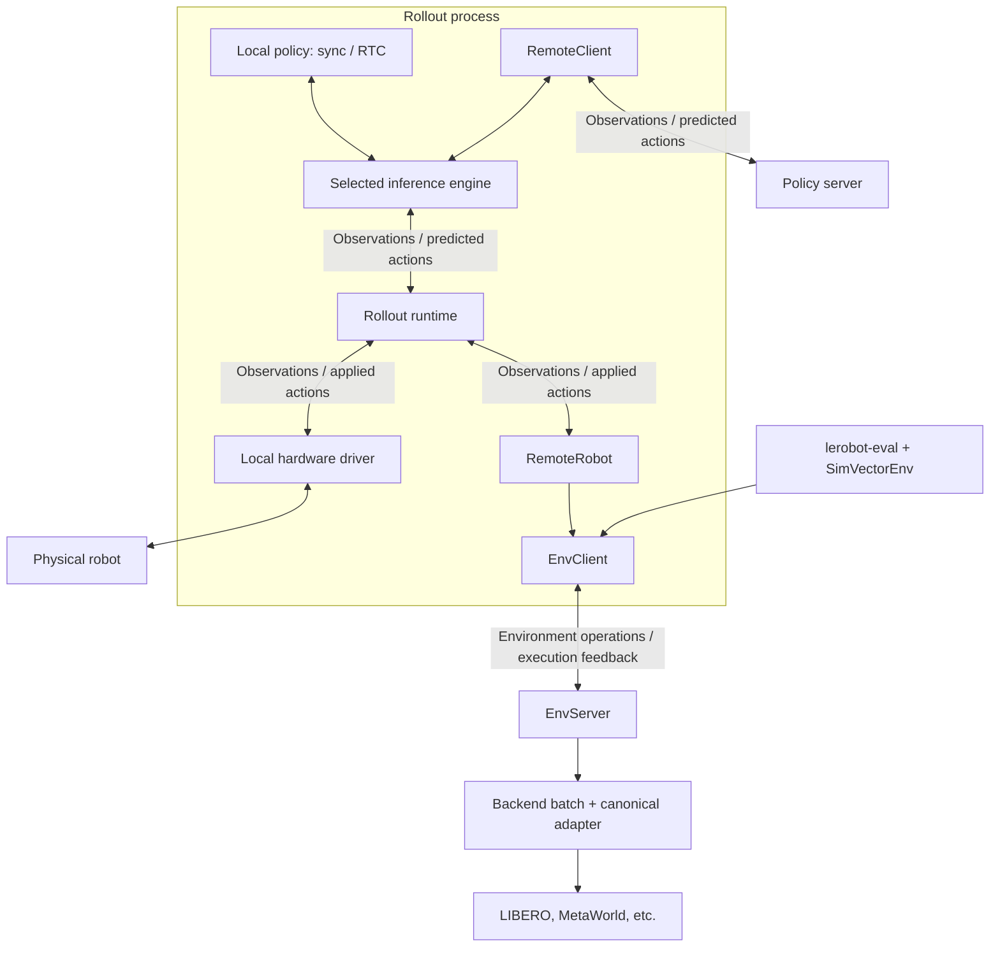
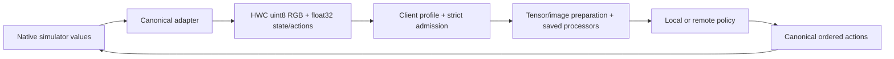

# Environment serving, robots, and inference

This maps the implemented architecture. See [Simulator servers](source/simulator_server.mdx) for commands and [acceptance](../benchmarks/ACCEPTANCE.md) for outstanding benchmark GPU checks and checkpoint metadata issues.

## Independent robot and policy choices



`RemoteRobot` is a driver inside rollout, inheriting the existing `Robot` class. It implements observation reads, action writes, and hold through `EnvClient`. Local hardware drivers use that same Robot API and keep direct device access. Local/remote inference and local/remote robots are independent choices.

Evaluation uses `SimVectorEnv`, a Gym vector interface over the same `EnvClient`. Evaluation opens batched lockstep worlds; rollout opens one realtime world. Neither requires a separate communication implementation.

## Shared communication and schemas

| Contract                                            | Implementation                           | Responsibility                                                                   |
| --------------------------------------------------- | ---------------------------------------- | -------------------------------------------------------------------------------- |
| `query_reply`, `decode_reply`                       | `src/lerobot/transport/wire/client.py`   | Bounded single replies, correlation, structured errors, obsolete channel traffic |
| `Envelope`, `validate_reply`                        | `src/lerobot/transport/wire/protocol.py` | Version, request/instance/session identity, generation, reply type               |
| `FeatureSpec`, `feature_mismatch`, `validate_array` | `src/lerobot/transport/wire/features.py` | Shapes, dtypes, modality, component order, semantics, finite values              |
| NumPy/RGB codec                                     | `src/lerobot/transport/wire/codec.py`    | Shared encoding/decoding and allocation limits                                   |
| Zenoh transport                                     | `src/lerobot/transport/zenoh.py`         | Bounded queries, pub/sub, presence                                               |

The wire modules are torch-free. Remote inference adds a torch-to-NumPy encoder adapter; decoding stays shared. Clients own service-specific admission, cancellation, deadlines, and failure latching. There are no automatic mutation retries.

```text
lerobot/env/v1/deployments/{deployment}/instances/{instance}/sessions/{session}
lerobot/inference/v1/deployments/{deployment}/instances/{instance}/sessions/{session}
```

Environment serving replaces the earlier simulator namespace. Inference addressing, messages, and public compatibility imports remain unchanged. Environment access uses `EnvClient`, `RemoteRobot`, and `lerobot-env-server`.

## Environment discovery and execution

```mermaid
sequenceDiagram
    participant Face as RemoteRobot / SimVectorEnv
    participant Client as EnvClient
    participant Server as EnvServer
    participant World as Backend batch
    Face->>Client: describe()
    Client->>Server: DESCRIBE
    Server-->>Client: ACCEPTED: instance + EnvDescriptor
    Note over Face,Server: Feature discovery does not open a world session
    Face->>Client: open(batch, clock, task, seeds)
    Client->>Server: OPEN
    Server->>World: Create batch and reset
    Server-->>Client: ACCEPTED: session + generation + result
    Face->>Client: apply(action) or step(actions)
    Client->>Server: CONTROL: request ID + generation
    Note over Server: Realtime apply is queued; no execution ACK yet
    Server->>World: Execute on realtime tick / explicit lockstep step
    World-->>Server: Following observation + episode status
    Server-->>Client: ACK: result + execution feedback
    Client-->>Face: Confirmed applied values
    Face->>Client: reset(seeds)
    Client->>Server: CONTROL: current generation
    Server->>World: Reset worlds
    Server-->>Client: ACK: new generation + result
```

The server serializes environment mutations and realtime ticks on one owner thread. Each session exclusively owns its batch. `EnvDescriptor` advertises features, operations, controller/hold conventions, clocks, FPS, tasks, episode limits, and simulator build identity.

`StepResult` carries canonical observations, task descriptions, rewards, termination/truncation, success, simulator time, and episode steps. `ExecutionFeedback` pairs a result with command request ID, generation, execution sequence, applied action, advanced-world mask, and server monotonic timestamps. Images are encoded once in the enclosing result.

Realtime commands use a bounded FIFO. Saturation returns BUSY instead of overwriting an accepted command. Replies follow execution; they do not acknowledge mere admission. Applied values are controller inputs, not a guarantee of completed physical motion. Frozen worlds have `advanced=false` and zero placeholders for new applied values; their terminal transition remains unchanged.

Hold, pause, reset, and close cancel unexecuted commands. Expired commands are discarded. Old generations and duplicate request IDs are rejected. Ambiguous client failures latch the session; close and reopen rather than retrying. Presence loss releases environment resources.

## Policy values and rollout lifecycle



The server YAML controls native tasks, cameras, controller, and timing. Profiles alias camera/action names without reordering components and declare semantics and any required empty cameras. Checkpoint metadata remains authoritative; incompatibilities are rejected. Canonical evaluation bypasses legacy key/environment processors and prepares model inputs once.

`RemoteRobot.world` exposes optional world capabilities, discovered through `get_world()`. Local hardware has no mandatory reward, reset-world, or episode-status methods. Rollout pauses inference around world resets, updates the task, clears chunks/interpolation state, and resumes. World generations, inference generations, and task versions remain distinct.

Delta hold retains gripper/declared retained commands while zeroing motion. Position hold retains targets. Command/hold faults use the existing rollout failure/shutdown handling. Rollout timing remains on the wall clock; display and recording use its existing paths.

## Code map and follow-ups

| Area                                | Location                                                                              |
| ----------------------------------- | ------------------------------------------------------------------------------------- |
| Environment service                 | `src/lerobot/env_server/`, `src/lerobot/scripts/lerobot_env_server.py`                |
| Simulator batches/native conversion | `src/lerobot/sims/{backend,adapters}.py`, `src/lerobot/sims/native/`                  |
| Robot driver/world capability       | `src/lerobot/robots/remote/`                                                          |
| Evaluation interface                | `src/lerobot/envs/sim_client.py`                                                      |
| Rollout orchestration               | `src/lerobot/rollout/`                                                                |
| Remote policy execution             | `src/lerobot/remote_inference/`                                                       |
| Launch and benchmarks               | `scripts/run_sim.py`, `docker/sims/compose.server.yaml`, `benchmarks/benchmarks.yaml` |

Existing in-process evaluation remains available; migrated native environment wrappers retain compatibility imports. CI builds separate policy and simulator images and runs the manifest's benchmarks through the environment server.

Physical EnvServer support is future work. No hardware backend or generic failsafe is implemented. Driver-specific command expiry, watchdogs, hold/stop behavior, torque/disconnect policy, and recovery must be resolved before physical serving.

RL is also a follow-up: adapt `gym_manipulator` task/intervention processing into rollout and collect transitions from executed actions and their resulting feedback. Replay, learners, policy update versions, and dataset persistence remain outside this pass. Realtime feedback provides a collection boundary; it does not yet implement reward aggregation over asynchronous action chunks. Rollout lockstep clocks and statistical regression gating remain deferred.
