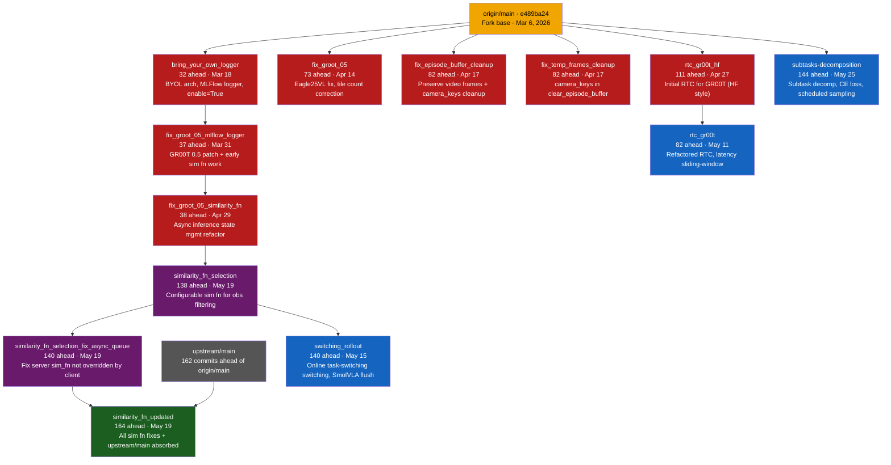

# Branch Analysis — gbionics/lerobot fork

> **Fork base**: `origin/main` tip `e489ba24` (2026-03-06).
> All branches diverge from this same commit.
> `upstream/main` is **162 commits ahead** of `origin/main` — only `similarity_fn_updated` has fully absorbed upstream.

## Comparison Table

| Branch | Ahead of `origin/main` | Behind `origin/main` | Last Active | Family | Unique Content | Action |
|---|---|---|---|---|---|---|
| **`similarity_fn_updated`** | 164 | 0 | 2026-05-19 | Sim fn | Configurable similarity fn + async queue fix + **fully synced with upstream/main** | Best candidate for new main |
| `subtasks-decomposition` | 144 | 0 | 2026-05-25 | Subtasks | Subtask decomposition, CE loss, per-task token accuracy, scheduled sampling, two-stage inference | Merge or keep |
| `switching_rollout` | 140 | 0 | 2026-05-15 | Online task-switching | Online task-switching switching for lerobot-rollout, SmolVLA flush action queue on switch | Merge or keep |
| `similarity_fn_selection_fix_async_queue` | 140 | 0 | 2026-05-19 | Sim fn | Sim fn selection + fix server `--similarity_fn_name` not overridden by client | Superseded by `similarity_fn_updated` |
| `similarity_fn_selection` | 138 | 0 | 2026-05-19 | Sim fn | Initial configurable similarity fn for observation filtering | Superseded by `similarity_fn_selection_fix_async_queue` |
| `rtc_gr00t_hf` | 111 | 0 | 2026-04-27 | RTC/GR00T | Initial RTC for GR00T (HF policy style), testing script | Superseded by `rtc_gr00t` |
| `fix_groot_05` | 73 | 0 | 2026-04-14 | GR00T fix | GR00T 0.5 Eagle25VL fix, tile count correction + upstream absorbs | Review — likely superseded |
| `fix_temp_frames_cleanup` | 82 | 0 | 2026-04-17 | Dataset fix | Fix temp frames deleted in `clear_episode_buffer` using `camera_keys` | Review vs `fix_episode_buffer_cleanup` |
| `fix_episode_buffer_cleanup` | 82 | 0 | 2026-04-17 | Dataset fix | Fix video frame preservation during batch encoding + camera_keys cleanup | Review vs `fix_temp_frames_cleanup` |
| `rtc_gr00t` | 82 | 0 | 2026-05-11 | RTC/GR00T | Refactored RTC for GR00T, latency sliding-window max, full test coverage | Merge or keep |
| `fix_groot_05_similarity_fn` | 38 | 0 | 2026-04-29 | GR00T fix | Async inference state management refactor + inference-in-progress flag | Likely superseded |
| `fix_groot_05_mlflow_logger` | 37 | 0 | 2026-03-31 | Logger | GR00T 0.5 patch + MLFlow logger + early similarity fn work | Superseded |
| `bring_your_own_logger` | 32 | 0 | 2026-03-18 | Logger | BYOL architecture, MLFlow logger, `enable=True` default | Superseded by `fix_groot_05_mlflow_logger` |
| `main` | 0 | 0 | 2026-03-06 | — | Fork base — 162 commits behind `upstream/main` | Rebase onto `similarity_fn_updated` |

## Lineage Diagram

**Color key:**
- **Green** — `similarity_fn_updated`: most complete branch (upstream-synced + all sim fn work)
- **Blue** — active branches with independent unique content to keep/merge
- **Purple** — intermediate branches, partially superseded
- **Red** — superseded or early-stage branches, safe to delete after verifying content absorbed
- **Orange** — `origin/main` (fork base)
- **Gray** — `upstream/main`

## Notes

- All branches share the **same fork point** (`e489ba24`), so there is no linear evolution from `origin/main`.
- **`similarity_fn_updated`** is the only branch fully synced with `upstream/main` and is the best candidate to become the new `origin/main`.
- **`fix_episode_buffer_cleanup`** and **`fix_temp_frames_cleanup`** are sibling branches with 2 unique commits each — check whether their fixes need to be merged into `similarity_fn_updated`.
- **`subtasks-decomposition`** is the most recently active branch and has 26 commits from upstream not yet absorbed.
