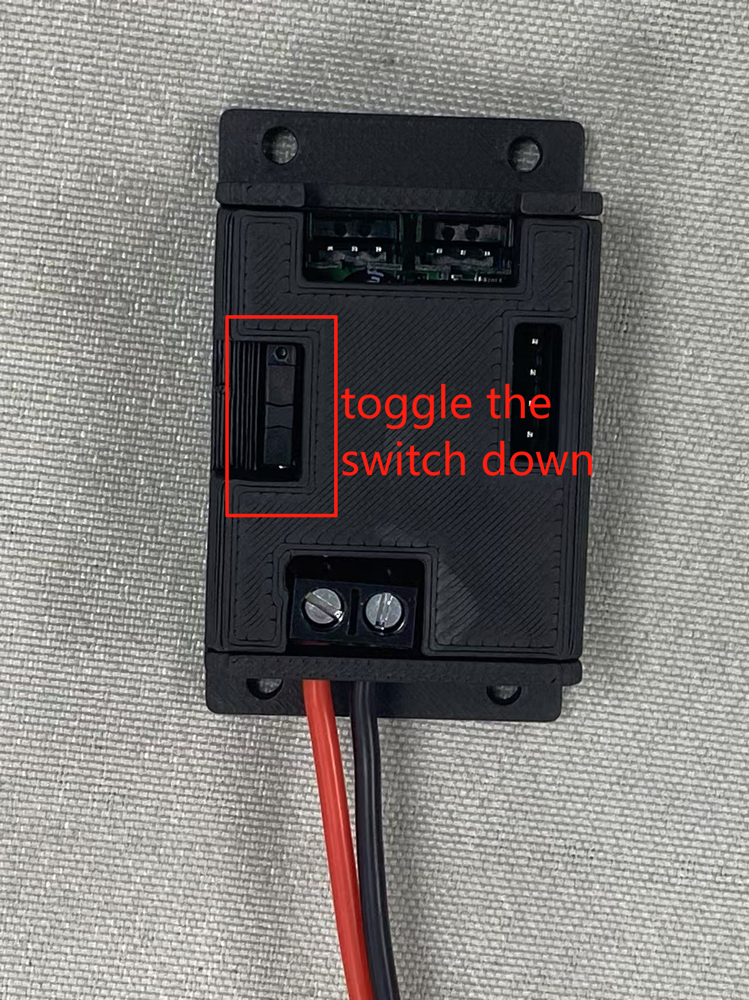
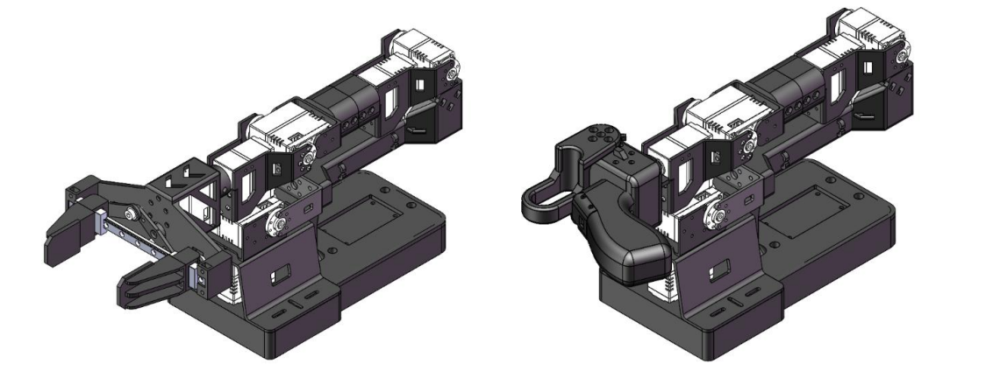

# How to use the LeRobot-starai robotic arm in Lerobot

https://github.com/user-attachments/assets/dcbd27da-9e24-4562-b682-ff3212f6ac4a

## Products Introduction

1. **Open-Source & Developer-Friendly**
   It is an open-source, developer-friendly 6+1 DoF robotic arm solution from [Fishion Star Technology Limited](https://fashionrobo.com/).
2. **Integration with LeRobot**
   Designed for integration with [LeRobot Platform](https://github.com/huggingface/lerobot) , which provides PyTorch models, datasets, and tools for imitation learning in real-world robotic tasks — including data collection, simulation, training, and deployment.
3. **Comprehensive Learning Resources**
   Provides comprehensive open-source learning resources like assembly and calibration guides, and example custom grasping tasks to assist users in quickly getting started and developing robotic applications.
4. **Compatible with Nvidia**
   Supports deployment on the reComputer Mini J4012 Orin NX 16GB platform.


## Main Features

- Ready to Go — No Assembly Required. Just Unbox and Dive into the World of AI.
- 6+1 Degrees of Freedom and a 470mm Reach — Built for Versatility and Precision.
- Powered by Dual Brushless Bus Servos — Smooth, Silent, and Strong with up to 300g Payload.
- Parallel Gripper with 66mm Maximum Opening — Modular Fingertips for Quick-Replace Flexibility.
- Exclusive Hover Lock Technology — Instantly Freeze Leader Arm at Any Position with a Single Press.


## Specifications


| Item                 | Follower Arm \| Viola                             | Leader Arm \|Violin                               |
| -------------------- | ------------------------------------------------- | ------------------------------------------------- |
| Degrees of Freedom   | 6+1                                               | 6+1                                               |
| Reach                | 470mm                                             | 470mm                                             |
| Span                 | 940mm                                             | 940mm                                             |
| Repeatability        | 2mm                                               | -                                                 |
| Working Payload      | 300g (with 70% Reach)                             | -                                                 |
| Servos               | RX8-U50H-M x2<br/>RA8-U25H-M x4<br/>RA8-U26H-M x1 | RX8-U50H-M x2<br/>RA8-U25H-M x4<br/>RA8-U26H-M x1 |
| Parallel Gripper Ki  | √                                                 | -                                                 |
| Wrist Rotate         | Yes                                               | Yes                                               |
| Hold at any Position | Yes                                               | Yes (with handle button)                          |
| Wrist Camera Mount   | √                                                 | -                                                 |
| Works with LeRobot   | √                                                 | √                                                 |
| Works with ROS 2     | √                                                 | /                                                 |
| Works with MoveIt    | √                                                 | /                                                 |
| Works with Gazebo    | √                                                 | /                                                 |
| Communication Hub    | UC-01                                             | UC-01                                             |
| Power Supply         | 12v/120w                                          | 12v/120w                                          |

For more information about the servo, please refer to the link below.

[RA8-U25H-M](https://fashionrobo.com/actuator-u25/23396/)

[RX18-U100H-M](https://fashionrobo.com/actuator-u100/22853/)

[RX8-U50H-M](https://fashionrobo.com/actuator-u50/136/)


## Initial Environment Setup

For Ubuntu X86:

- Ubuntu 22.04
- CUDA 12+
- Python 3.10
- Troch 2.6

## Installation

### Install LeRobot

1. Environments such as pytorch and torchvision need to be installed based on your CUDA.
   
    Install Miniconda: For Jetson:
    
    ```bash
    wget https://repo.anaconda.com/miniconda/Miniconda3-latest-Linux-aarch64.sh
    chmod +x Miniconda3-latest-Linux-aarch64.sh
	./Miniconda3-latest-Linux-aarch64.sh
    source ~/.bashrc
    ```
    Or, For X86 Ubuntu 22.04:
    
    ```bash
    mkdir -p ~/miniconda3
    cd miniconda3
    wget https://repo.anaconda.com/miniconda/Miniconda3-latest-Linux-x86_64.sh -O ~/miniconda3/miniconda.sh
    bash ~/miniconda3/miniconda.sh -b -u -p ~/miniconda3
    rm ~/miniconda3/miniconda.sh
    source ~/miniconda3/bin/activate
    conda init --all
    ```
    
2. Create and activate a fresh conda environment for lerobot

    ```bash
    conda create -y -n lerobot python=3.10 && conda activate lerobot
    ```

4. When using miniconda, install ffmpeg in your environment:

    ```bash
    conda install ffmpeg -c conda-forge
    ```
    This usually installs ffmpeg 7.X for your platform compiled with the libsvtav1 encoder. If libsvtav1 is not supported (check supported encoders with ffmpeg -encoders), you can:

    - [On any platform] Explicitly install ffmpeg 7.X using:

    ```bash
    conda install ffmpeg=7.1.1 -c conda-forge
    ```

5. Install LeRobot with dependencies for the starai motors:

    ```bash
    cd ~/lerobot && pip install -e ".[starai]"
    ```
    
6. Check Pytorch and Torchvision

    Since installing the lerobot environment via pip will uninstall the original Pytorch and Torchvision and install the CPU versions of Pytorch and Torchvision, you need to perform a check in Python.

    ```python
    import torch
    print(torch.cuda.is_available())
    ```

    If the result is False, you need to reinstall Pytorch and Torchvision according to the [official website tutorial](https://fashionrobo.com/).

### Unboxing

https://github.com/user-attachments/assets/56130bd9-21ee-4ae4-9cac-3817ac4d659f

UC-01 debuging board switch：



### Configure arm port

Run the following command in the terminal to find USB ports associated to your arms：

```bash
lerobot-find-port
```

For example：

1. Example output when identifying the leader arm's port (e.g., `/dev/tty.usbmodem575E0031751` on Mac, or possibly `/dev/ttyACM0` on Linux):
2. Example output when identifying the follower arm's port (e.g., `/dev/tty.usbmodem575E0032081`on Mac, or possibly `/dev/ttyACM1` on Linux):

> [!NOTE]
>
> If the ttyUSB0 serial port cannot be identified, try the following solutions:
>
> List all USB ports.
>
> ```sh
> lsusb
> ```
>
> 
>
> Once identified, check the information of the ttyusb.
>
> ```sh
> sudo dmesg | grep ttyUSB
> ```
>
> 
>
> The last line indicates a disconnection because brltty is occupying the USB. Removing brltty will resolve the issue.
>
> ```sh
> sudo apt remove brltty
> ```
>
> 
>
> Finally，use chmod command.
>
> ```sh
> sudo chmod 777 /dev/ttyUSB*
> ```
>


## Calibrate

### For Initial Calibration

Please rotate each joint left and right to the corresponding positions.

### For Re-Calibration

Follow the on-screen prompt: enter the letter "c" and press the Enter key.

Below are the reference values. Under normal circumstances, the actual limit reference values should fall within the range of **±10°** of these references.

| 舵机ID  | 角度下限参考值 | 角度上限参考值 | 备注                               |
| ------- | -------------: | -------------: | ---------------------------------- |
| motor_0 |          -180° |           180° | 转动到限位处                       |
| motor_1 |           -90° |            90° | 转动到限位处                       |
| motor_2 |           -90° |            90° | 转动到限位处                       |
| motor_3 |          -180° |           180° | 没有限位，需转动到角度上下限参考值 |
| motor_4 |           -90° |            90° | 转动到限位处                       |
| motor_5 |          -180° |           180° | 没有限位，需转动到角度上下限参考值 |
| motor_6 |             0° |           100° | 转动到限位处                       |

### leader

> [!TIP]
>
> Connect the leader to /dev/ttyUSB0, or modify the command below.


```bash
lerobot-calibrate     --teleop.type=starai_violin --teleop.port=/dev/ttyUSB0 --teleop.id=my_awesome_staraiviolin_arm
```

### follower

> [!TIP]
>
> Connect the follower to /dev/ttyUSB1, or modify the command below.

```bash
lerobot-calibrate     --robot.type=starai_viola --robot.port=/dev/ttyUSB1 --robot.id=my_awesome_staraiviola_arm
```

## Teleoperate


https://github.com/user-attachments/assets/23b3aa00-9889-48d3-ae2c-00ad50595e0a


Move the arm to the position shown in the diagram and set it to standby.




Then you are ready to teleoperate your robot (It won't display the cameras)! Run this simple script :

```bash
lerobot-teleoperate \
    --robot.type=starai_viola \
    --robot.port=/dev/ttyUSB1 \
    --robot.id=my_awesome_staraiviola_arm \
    --teleop.type=starai_violin \
    --teleop.port=/dev/ttyUSB0 \
    --teleop.id=my_awesome_staraiviolin_arm
```
After the program starts, the Hover Lock Technology remains functional.


## Add cameras

https://github.com/user-attachments/assets/82650b56-96be-4151-9260-2ed6ab8b133f


After inserting your two USB cameras, run the following script to check the port numbers of the cameras. It is important to remember that the camera must not be connected to a USB Hub; instead, it should be plugged directly into the device. The slower speed of a USB Hub may result in the inability to read image data.

```bash
lerobot-find-cameras opencv # or realsense for Intel Realsense cameras
```

The terminal will print out the following information. For example, the laptop camera is `index 2`, and the USB camera is `index 4`.

```markdown
--- Detected Cameras ---
Camera #0:
  Name: OpenCV Camera @ /dev/video2
  Type: OpenCV
  Id: /dev/video2
  Backend api: V4L2
  Default stream profile:
    Format: 0.0
    Width: 640
    Height: 480
    Fps: 30.0
--------------------
Camera #1:
  Name: OpenCV Camera @ /dev/video4
  Type: OpenCV
  Id: /dev/video4
  Backend api: V4L2
  Default stream profile:
    Format: 0.0
    Width: 640
    Height: 360
    Fps: 30.0
--------------------

Finalizing image saving...
Image capture finished. Images saved to outputs/captured_images
```


After confirming that the external camera is connected, replace the camera information below with the actual camera details. This will allow you to display the camera feed on your computer during teleoperation:

```bash
lerobot-teleoperate \
    --robot.type=starai_viola \
    --robot.port=/dev/ttyUSB1 \
    --robot.id=my_awesome_staraiviola_arm \
    --robot.cameras="{ front: {type: opencv, index_or_path: 2, width: 640, height: 480, fps: 30}}" \
    --teleop.type=starai_violin \
    --teleop.port=/dev/ttyUSB0 \
    --teleop.id=my_awesome_staraiviolin_arm \
    --display_data=true
    
```

## Record the dataset


https://github.com/user-attachments/assets/8bb25714-783a-4f29-83dd-58b457aed80c

> [!TIP]
>
> Use the features of Hugging Face Hub to upload your dataset, and please refer to the following official article link.
>
> [lmitation Learning for Robots](https://huggingface.co/docs/lerobot/il_robots?teleoperate_koch_camera=Command)
>
> 


Once you're familiar with teleoperation, you can record your first dataset.

Record 10 episodes.

```bash
lerobot-record \
    --robot.type=starai_viola \
    --robot.port=/dev/ttyUSB1 \
    --robot.id=my_awesome_staraiviola_arm \
    --robot.cameras="{ up: {type: opencv, index_or_path: /dev/video2, width: 640, height: 480, fps: 30},front: {type: opencv, index_or_path: /dev/video4, width: 640, height: 480, fps: 30}}" \
    --teleop.type=starai_violin \
    --teleop.port=/dev/ttyUSB0 \
    --teleop.id=my_awesome_staraiviolin_arm \
    --display_data=true \
    --dataset.repo_id=starai/record-test \
    --dataset.episode_time_s=30 \
    --dataset.reset_time_s=30 \
    --dataset.num_episodes=10 \
    --dataset.push_to_hub=False \
    --dataset.single_task="Grab the black cube"
```


## Replay an episode

```bash
lerobot-replay \
    --robot.type=starai_viola \
    --robot.port=/dev/ttyUSB1 \
    --robot.id=my_awesome_staraiviola_arm \
    --dataset.repo_id=starai/record-test \
    --dataset.episode=1 # choose the episode you want to replay
```


## Train

Train a policy to control your robot

```bash
lerobot-train \
  --dataset.repo_id=starai/record-test \
  --policy.type=act \
  --output_dir=outputs/train/act_viola_test \
  --job_name=act_viola_test \
  --policy.device=cuda \
  --wandb.enable=False \
  --policy.repo_id=starai/my_policy
```

To resume training from a checkpoint

```bash
lerobot-train \
  --config_path=outputs/train/act_viola_test/checkpoints/last/pretrained_model/train_config.json \
  --resume=true
```

## Evaluate your policy

运行以下命令记录 10 个评估回合：

```bash
lerobot-record  \
  --robot.type=starai_viola \
  --robot.port=/dev/ttyUSB1 \
  --robot.cameras="{ up: {type: opencv, index_or_path: /dev/video2, width: 640, height: 480, fps: 30},front: {type: opencv, index_or_path: /dev/video4, width: 640, height: 480, fps: 30}}" \
  --robot.id=my_awesome_staraiviola_arm \
  --display_data=false \
  --dataset.repo_id=starai/eval_record-test \
  --dataset.single_task="Put lego brick into the transparent box" \
  --policy.path=outputs/train/act_viola_test/checkpoints/last/pretrained_model
  # <- Teleop optional if you want to teleoperate in between episodes \
  # --teleop.type=starai_violin \
  # --teleop.port=/dev/ttyUSB0 \
  # --teleop.id=my_awesome_leader_arm \
```


## Reference Documentation

Seeed Wiki：[How to use the SO10xArm robotic arm in Lerobot | Seeed Studio Wiki]([如何在 Lerobot 中使用 SO100/101Arm 机器人手臂 | Seeed Studio Wiki](https://wiki.seeedstudio.com/cn/lerobot_so100m/))

Huggingface Project:[Lerobot](https://github.com/huggingface/lerobot/tree/main)

Huggingface:[LeRobot](https://huggingface.co/docs/lerobot/index)

ACT or ALOHA:[Learning Fine-Grained Bimanual Manipulation with Low-Cost Hardware](https://tonyzhaozh.github.io/aloha/)

VQ-BeT:[VQ-BeT: Behavior Generation with Latent Actions](https://sjlee.cc/vq-bet/)

Diffusion Policy:[Diffusion Policy](https://diffusion-policy.cs.columbia.edu/)

TD-MPC:[TD-MPC](https://www.nicklashansen.com/td-mpc/)


