# Video encoding parameters

When video storage is enabled, LeRobot stores each camera stream as an **MP4** file instead of saving one image file per timestep. Video encoding compresses across time, which usually cuts dataset size and I/O compared to a pile of PNG, while keeping MP4 — a format every player and loader understands.

Encoding frames into an MP4 is a full FFmpeg pipeline: choice of encoder, pixel format, GOP/keyframes, quality vs. speed, and optional extra encoder flags. Most of these knobs are user-tunable through `camera_encoder`, a nested `VideoEncoderConfig` (`lerobot.configs.video.VideoEncoderConfig`) passed through PyAV.

You can set these parameters from the CLI with `--dataset.camera_encoder.<field>` (e.g. with `lerobot-record` or `lerobot-rollout`). The same block applies to every camera video stream in that run.

<Tip>
  Video storage must be on for `camera_encoder` to have any effect —
  `use_videos=True` in Python APIs, or `--dataset.video=true` on the CLI (the
  recording default). With video off, inputs stay as images and `camera_encoder`
  is ignored.
</Tip>

For details on **when** frames are written vs. encoded (streaming vs. post-episode), queues, and other top-level `--dataset.*` switches, see [Streaming Video Encoding](./streaming_video_encoding). For an encoding-parameter comparison and experiments, see the [video-benchmark Space](https://huggingface.co/spaces/lerobot/video-benchmark).

---

## Example

```bash
lerobot-record \
    --robot.type=so100_follower \
    --robot.port=/dev/tty.usbmodem58760431541 \
    --robot.cameras="{laptop: {type: opencv, index_or_path: 0, width: 640, height: 480, fps: 30}}" \
    --robot.id=black \
    --teleop.type=so100_leader \
    --teleop.port=/dev/tty.usbmodem58760431551 \
    --teleop.id=blue \
    --dataset.repo_id=<my_username>/<my_dataset_name> \
    --dataset.num_episodes=2 \
    --dataset.single_task="Grab the cube" \
    --dataset.streaming_encoding=true \
    --dataset.encoder_threads=2 \
    --dataset.camera_encoder.vcodec=h264 \
    --dataset.camera_encoder.preset=fast \
    --dataset.camera_encoder.extra_options={"tune": "film", "profile:v": "high", "bf": 2} \
    --display_data=true
```

---

## Tuning parameters

<Tip warning={true}>
The defaults are tuned to balance **compression ratio**, **visual quality**, and **decoding/seek speed** for typical robotics datasets. Changing them can affect both recording (CPU load, frame drops) and training (decoding throughput, image quality).

Only override these parameters if you have a specific reason to, and measure the impact on your pipeline before relying on the new settings.

</Tip>

All flags below are prefixed with `--dataset.camera_encoder.` on the CLI.

| Parameter       | Type             | Default       | Description                                                                                                                                                                            |
| --------------- | ---------------- | ------------- | -------------------------------------------------------------------------------------------------------------------------------------------------------------------------------------- |
| `vcodec`        | `str`            | `"libsvtav1"` | Video codec name. `"auto"` picks the first available hardware encoder from a fixed preference list, falling back to `libsvtav1`.                                                       |
| `pix_fmt`       | `str`            | `"yuv420p"`   | Output pixel format. Must be supported by the chosen codec in your FFmpeg build.                                                                                                       |
| `g`             | `int`            | `2`           | GOP size — a keyframe every `g` frames. Emitted as FFmpeg option `g`.                                                                                                                  |
| `crf`           | `int` or `float` | `30`          | Abstract quality value, mapped per codec (see the [mapping](#mapping-videoencoderconfig--ffmpeg-options) below). Lower → higher quality / larger output where the mapping is monotone. |
| `preset`        | `int` or `str`   | `12` \*       | Encoder speed preset; meaning depends on the codec. <br/>\* When unset and `vcodec=libsvtav1`, LeRobot defaults to `12`.                                                               |
| `fast_decode`   | `int`            | `0`           | `libsvtav1`: `0–2`, passed via `svtav1-params`. <br/>`h264` / `hevc` (software): if `>0`, sets `tune=fastdecode`. <br/>Other codecs: usually unused.                                   |
| `video_backend` | `str`            | `"pyav"`      | Only `"pyav"` is currently implemented for video encoding.                                                                                                                             |
| `extra_options` | `dict`           | `{}`          | Extra FFmpeg or codec specific options merged after the structured fields above. Cannot override keys already set by those fields.                                                     |

---

## Depth streams

Depth maps (Intel RealSense, Reachy 2) are stored as their **own video streams** alongside the RGB streams. Raw depth (`uint16` millimetres or `float32` metres) can't survive an 8-bit codec, so LeRobot **quantizes** each map to a 12-bit code (`[0, 4095]`) — logarithmically by default, to match the `1/depth` error profile of depth sensors — then packs it into a high-bit-depth pixel format (`gray12le`) and encodes it with a 12-bit codec.

```mermaid
flowchart LR
    A["Raw depth (uint16 mm / float32 m)"] --> B["Clip to depth_min, depth_max"]
    B --> C["Quantize to 12-bit code 0–4095 (log or linear)"]
    C --> D["Pack into gray12le"]
    D --> E["Encode video (hevc Main 12)"]
    E --> F[("MP4 + metadata: depth_min/max, shift, use_log")]
    F -. "load time (depth_output_unit)" .-> G["Dequantize to mm or m"]

    classDef input fill:#e3f2fd,stroke:#1565c0,color:#0d47a1;
    classDef encode fill:#ede7f6,stroke:#5e35b1,color:#311b92;
    classDef store fill:#fff8e1,stroke:#f9a825,color:#e65100;
    classDef load fill:#e8f5e9,stroke:#2e7d32,color:#1b5e20;

    class A input;
    class B,C,D,E encode;
    class F store;
    class G load;
```



Configure the depth pipeline through a parallel **`depth_encoder`** block (`DepthEncoderConfig`). It inherits every `VideoEncoderConfig` field (`vcodec`, `pix_fmt`, `crf`, …) and adds four quantizer knobs, set via `--dataset.depth_encoder.<field>`:

```bash
lerobot-record \
    ... \
    --dataset.depth_encoder.vcodec=hevc \
    --dataset.depth_encoder.depth_min=0.05 \
    --dataset.depth_encoder.depth_max=5.0 \
    --dataset.depth_encoder.use_log=true
```

| Parameter   | Type    | Default      | Description                                                                                                                       |
| ----------- | ------- | ------------ | --------------------------------------------------------------------------------------------------------------------------------- |
| `vcodec`    | `str`   | `"hevc"`     | Defaults to HEVC Main 12 (a 12-bit-capable codec). `ffv1` is a lossless alternative.                                              |
| `pix_fmt`   | `str`   | `"gray12le"` | Single-channel 12-bit pixel format used to carry the quantized codes.                                                             |
| `depth_min` | `float` | `0.01`       | Depth in metres mapped to quantum `0`. Values below are clipped on decode.                                                        |
| `depth_max` | `float` | `10.0`       | Depth in metres mapped to quantum `4095`. Values above are clipped on decode.                                                     |
| `shift`     | `float` | `3.5`        | Pre-log offset (metres) used in logarithmic quantization for numerical stability near zero. Must satisfy `depth_min + shift > 0`. |
| `use_log`   | `bool`  | `True`       | If `true`, quantize in log-space (recommended for typical depth sensors). Set to `false` for uniform/linear quantization.         |

> [!TIP]
> `depth_min`, `depth_max`, and `shift` are always interpreted in **metres**, regardless of the input depth's unit. Inputs are auto-detected: integer arrays (e.g. `uint16` millimetres straight from a RealSense) are treated as millimetres, floating arrays as metres.
> Pick `depth_min` / `depth_max` to bracket the actual working range of your sensor — quanta outside that range saturate, which can crush detail at the boundaries.

Depth features are flagged with `"is_depth_map": true` in `meta/info.json`, and their quantizer settings (`video.depth_min`, `video.depth_max`, `video.shift`, `video.use_log`) are persisted — which is what lets depth be **dequantized back to physical units** on load.

### Output unit at load time

`depth_encoder` is a **record-time** concern. The unit that depth maps are dequantized to on _load_ (e.g. during training) is set separately by the read-time flag `--dataset.depth_output_unit`:

```bash
lerobot-train \
    --dataset.repo_id=<my_username>/<my_dataset_name> \
    --dataset.depth_output_unit=m \
    --policy.type=act
```

| Parameter           | Type  | Default | Description                                                                                  |
| ------------------- | ----- | ------- | -------------------------------------------------------------------------------------------- |
| `depth_output_unit` | `str` | `"mm"`  | Physical unit depth maps are dequantized to on load: `"mm"` (millimetres) or `"m"` (metres). |

> [!TIP]
> This is purely a decode-time presentation choice — it does **not** alter the stored video or its metadata, so the same dataset can be read as `mm` or `m` without re-encoding. It has no effect on datasets without depth cameras.

---

## Persistence in dataset metadata

After the first episode of a video stream is encoded, the encoder configuration is **persisted into the dataset metadata** (`meta/info.json`) under each video feature, alongside the values probed from the file itself. For a video feature `observation.images.<camera>`, the layout in `info.json` is:

```json
{
  "features": {
    "observation.images.laptop": {
      "dtype": "video",
      "shape": [480, 640, 3],
      "info": {
        "video.height": 480,
        "video.width": 640,
        "video.codec": "h264",
        "video.pix_fmt": "yuv420p",
        "video.fps": 30,
        "video.channels": 3,
        "is_depth_map": false,
        "video.g": 2,
        "video.crf": 30,
        "video.preset": "fast",
        "video.fast_decode": 0,
        "video.video_backend": "pyav",
        "video.extra_options": { "tune": "film", "profile:v": "high", "bf": 2 }
      }
    }
  }
}
```

Two sources contribute to the `info` block:

- **Stream-derived** (read back from the encoded MP4 with PyAV): `video.height`, `video.width`, `video.codec`, `video.pix_fmt`, `video.fps`, `video.channels`, `is_depth_map`, plus `audio.*` if an audio stream is present.
- **Encoder-derived** (taken from `VideoEncoderConfig`): `video.g`, `video.crf`, `video.preset`, `video.fast_decode`, `video.video_backend`, `video.extra_options`.

<Tip>
  This block is populated **once**, from the **first** episode. It assumes every
  episode in the dataset was encoded with the same `camera_encoder`. Changing
  encoder settings partway through a recording is not supported — the
  `info.json` will only reflect the parameters used for the first episode.
</Tip>

---

## Merging datasets

When aggregating datasets with `merge_datasets`, video files are concatenated as-is (no re-encoding), and encoder fields in `info.json` are merged per-key:

- **Stream-derived fields must match** across sources: `video.codec`, `video.pix_fmt`, `video.height`, `video.width`, `video.fps`. Otherwise FFmpeg's concat demuxer fails.
- **Encoder-tuning fields are merged loosely**: `video.g`, `video.crf`, `video.preset`, `video.fast_decode`, `video.extra_options`. If every source agrees, the value is kept; if not, it's set to `null` (or `{}` for `video.extra_options`) and a warning is logged.
