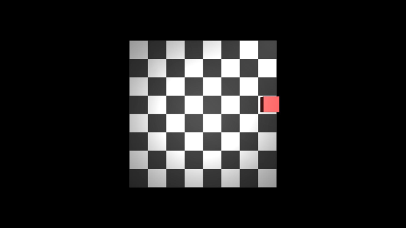

# Grid HIL SERL Environment

This example demonstrates a **simplified HIL-SERL setup** for computer vision-based grid position prediction. Instead of complex robotic manipulation, the algorithm learns to predict which of the 64 grid cells contains a red cube based on camera images, with human feedback during training. Episodes are single prediction attempts: if the guess is correct, the agent receives reward 1; otherwise reward 0.

## Overview

The environment consists of:
- An 8x8 grid world with high-definition visual rendering
- A red cube that randomly spawns at grid cell centers
- Top-left origin coordinate system (0,0) = top-left corner
- Automatic high-definition image capture (1920x1080)


## Environment preview



## Files

- `grid_scene.xml` - Mujoco scene definition with 8x8 grid
- `grid_cube_randomizer.py` - Main script for randomizing cube positions
- `README.md` - This documentation

## Usage

### Install LeRobot (one time)
Follow the main repository instructions (from repo root):
```bash
pip install -e ".[hilserl]"
```

### 2. Record Demonstrations (Optional - this repo already contains a recorded dataset)
```bash
# From the repository root
python examples/grid_hil_serl/record_grid_demo.py \
  --config_path examples/grid_hil_serl/record_grid_position_lerobot.json
```

### 3. Train HIL-SERL Policy
```bash
# Terminal 1: Start learner
cd src
python -m lerobot.scripts.rl.learner --config_path ../examples/grid_hil_serl/train_grid_position.json

# Terminal 2: Start actor (with human feedback)
cd src
python -m lerobot.scripts.rl.actor --config_path ../examples/grid_hil_serl/train_grid_position.json
```

The actor prints a rolling accuracy over the last 50 episodes and saves a plot every
10 episodes to `outputs/grid_position/accuracy_plots/` so you can monitor training
progress without attaching a debugger.

## Features

This example gives you a fast, single‑step prediction task: every episode the
cube appears in one of the 64 cells of an 8×8 grid and the policy must guess the
cell from a high‑definition overhead image. Episodes are only one step long, so
each prediction immediately becomes a labelled training example. Along the way the
actor logs a rolling 50‑episode success rate and stores matplotlib accuracy plots,
making it easy to gauge progress without additional tooling. Because the cubes are
placed exactly at grid centres and the camera is fixed, the setup stays perfectly
repeatable while still exercising the end‑to‑end vision→prediction loop.


Accuracy typically climbs toward ~95 % after roughly 140 prediction episodes.

## HIL-SERL Workflow

This simplified setup demonstrates the core HIL-SERL concept with minimal complexity:

### Training Phase (Offline)
1. **Automatic Data Collection**: Environment randomly places cube in different grid positions
2. **Supervised Learning**: Algorithm learns to predict grid position from images
3. **Ground Truth Labels**: Exact grid coordinates provided for each image

### Human-in-the-Loop Phase (Online)
1. **Algorithm Prediction**: Model predicts cube position from camera images
2. **Binary Feedback**: Human (or auto-supervision) accepts or corrects the guess
3. **Iterative Learning**: Model improves based on the accepted/corrected outcome

### Key Simplifications
- **No Robot Control**: Focus purely on computer vision prediction
- **Single-Step Episodes**: One prediction per episode with immediate success/failure reward
- **Discrete Predictions**: 64 possible outputs (one per grid cell)
- **Perfect Ground Truth**: Exact position labels available
- **Visual Task Only**: No complex motor control or physics

## Integration with LeRobot

The environment integrates with LeRobot's HIL-SERL framework through:

1. **Custom Gym Environment**: `GridPositionPrediction-v0` registered with gymnasium
2. **LeRobot-Compatible Interface**: Proper observation/action space formatting
3. **Config Files**: `record_grid_position.json` and `train_grid_position.json`
4. **Dataset Collection**: Automated recording of image-position pairs

## Dependencies

- mujoco
- numpy
- PIL (Pillow)
- gymnasium (optional, for integration)
- matplotlib
