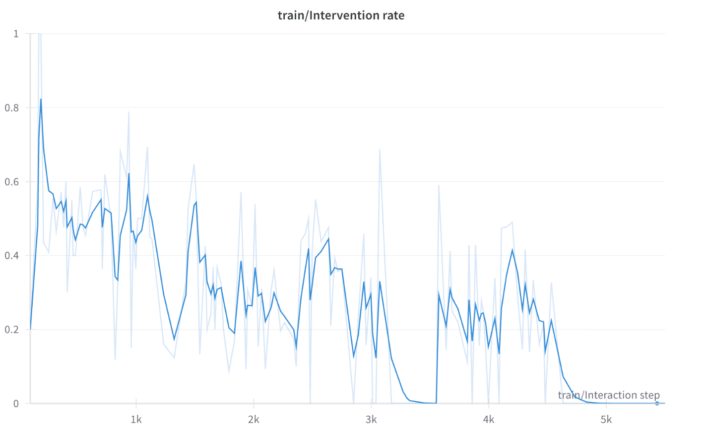

# LeRobot Training Guide: Panda Cube Picking

A concise guide for training a robot policy to pick cubes using LeRobot's HIL-SERL framework.

## Installation

Install LeRobot with HIL-SERL support as shown in the [official documentation](https://huggingface.co/docs/lerobot/hilserl):

```bash
pip install -e ".[hilserl]"
```

## Recording Demonstrations

Proceed with recording sample episodes for pretraining the reinforcement learning algorithm:

```bash
python -m lerobot.scripts.rl.gym_manipulator --config_path examples/hil_serl_simulation_training/hi_rl_test_gamepad.json
```

**Important Notes:**

- **Recommended**: Collect 30-40 episodes including some failed picking attempts
- **Control**: Use a gamepad controller for better end-effector control (configuration already set up)
- **Dataset Storage**:
  - `dataset_root` points to local folder where dataset is saved
  - `repo_id` points to HuggingFace account for dataset upload
  - **Prerequisite**: Install and authorize HuggingFace CLI with token to push datasets and replace the username in the `hi_rl_test_gamepad.json` and `train_gym_hil_env_gamepad.json`

## Training the Policy

Start both the learner and actor using these commands:

```bash
# Terminal 1: Start learner
python -m lerobot.scripts.rl.learner --config_path examples/hil_serl_simulation_training/train_gym_hil_env_gamepad.json

# Terminal 2: Start actor
python -m lerobot.scripts.rl.actor --config_path examples/hil_serl_simulation_training/train_gym_hil_env_gamepad.json
```

The learner initializes with parameters from the offline training dataset.

## Human Intervention Strategy

**Important**: Allow the policy a few episodes to test picking on its own before intervening.

**Best practices** for human intervention (see [official guide](https://huggingface.co/docs/lerobot/hilserl#guide-to-human-interventions)):

1. **Guide the end effector back to the object** if it's drifting away from the cube
2. **Guide the end effector above the cube** and let the policy try to pick it and raise it
3. **Completely pick the object** if needed

**Progression Strategy:**

- As training progresses, interventions should become less aggressive
- Once the policy manages to pick the cube on its own, start intervening only to guide the end effector to the approximate area where the object is found

## Training Results

The fully trained policy result can be seen in this video:


## Resuming Training from Checkpoint

Checkpoints are automatically saved based on the `save_freq` parameter in `train_gym_hil_env_gamepad.json` and are stored in the `outputs` folder.

To resume training, both actor and learner need to be called with the policy path:

```bash
# Terminal 1: Resume learner
python -m lerobot.scripts.rl.learner --config_path examples/hil_serl_simulation_training/train_gym_hil_env_gamepad.json --policy.path=examples/hil_serl_simulation_training/outputs/train/2025-08-05/13-45-02_default/checkpoints/0002000/pretrained_model

# Terminal 2: Resume actor
python -m lerobot.scripts.rl.actor --config_path examples/hil_serl_simulation_training/train_gym_hil_env_gamepad.json --policy.path=examples/hil_serl_simulation_training/outputs/train/2025-08-05/13-45-02_default/checkpoints/0002000/pretrained_model
```

Where `policy.path` is the full path to the locally saved checkpoints.

## Monitoring Training

Set the Weights & Biases flag to `true` in `train_gym_hil_env_gamepad.json` to follow live training results.

The trained intervention rate should approximately look like this after a while:



## Configuration Files

- `hi_rl_test_gamepad.json`: Recording configuration
- `train_gym_hil_env_gamepad.json`: Training configuration

## Key Parameters

- **Save Frequency**: Controlled by `save_freq` in training config
- **Checkpoint Location**: `outputs/train/YYYY-MM-DD/HH-MM-SS_jobname/checkpoints/`
- **Policy Path**: Points to `pretrained_model/` directory within checkpoints
