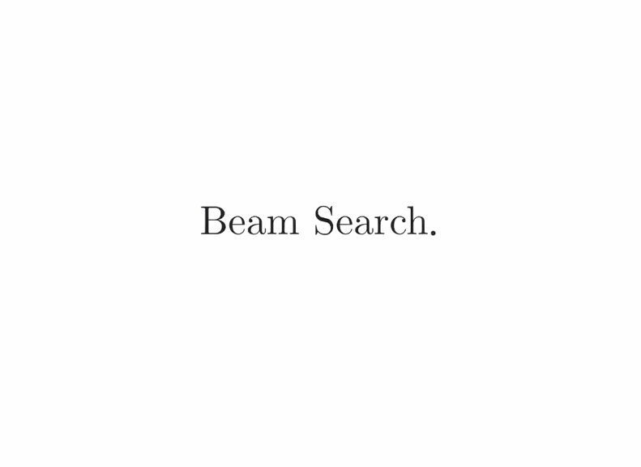
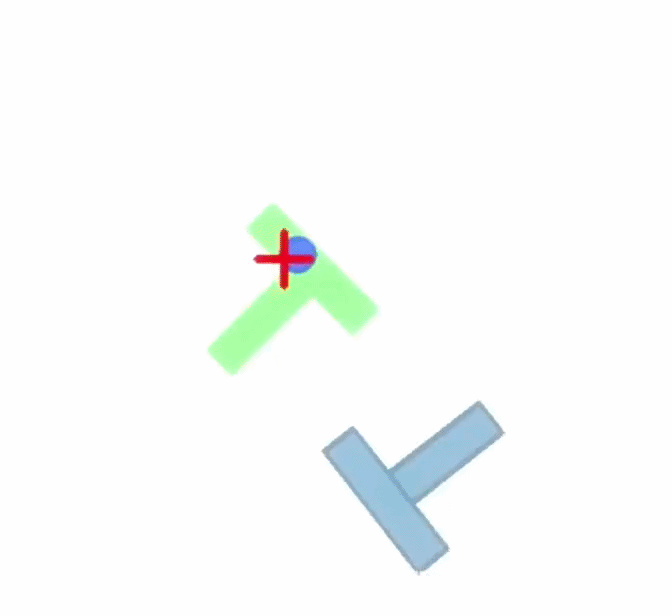
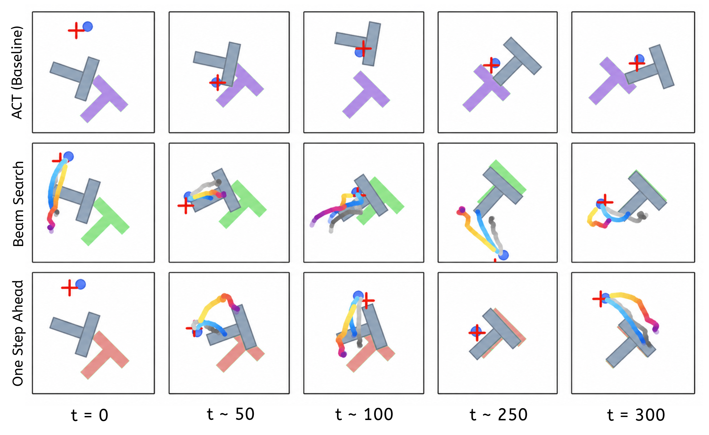

# Look Ahead: Search-Driven Reasoning in Embodied AI

Project page: [https://azeer.co/research/lookahead/](https://azeer.co/research/lookahead/)

This repository contains the PushT tree-search experiments and visualizations for
Look Ahead. It is intended to be used with a compatible LeRobot checkout or fork.
The plotting and animation scripts can inspect saved outputs independently, but
the evaluators rely on LeRobot policy loading, preprocessing, environment
construction, and PushT simulation utilities.

<table>
  <tr>
    <th>Algorithm</th>
    <th>Demo</th>
  </tr>
  <tr>
    <td></td>
    <td></td>
  </tr>
</table>

## Abstract

Search lets an embodied policy look ahead before committing to an action. We
study this idea in PushT by augmenting a pretrained Action Chunk Transformer with
Beam Search over perturbed action chunks.

Candidate futures are evaluated in cloned simulator states and scored with
coverage-based reward. This turns single-pass ACT inference into
receding-horizon action selection while keeping the learned policy as the
proposal mechanism.

We also introduce One Step Ahead, a lightweight gate that first simulates the
nominal policy chunk and invokes full search only when the predicted coverage
change suggests that additional computation is necessary.

<p align="center">
  
</p>

## Reproduction

Run PushT tree search in parallel:

```bash
python examples/tree_search/pusht/parallel_search_eval.py \
  --policy.path=aadarshram/act_pusht \
  --policy.device=cuda \
  --policy.use_amp=false \
  --episodes=50 \
  --episode-workers=10 \
  --noise-std=40 \
  --depth=3 \
  --num-candidates=3 \
  --beam-width=2 \
  --chunk-size=100 \
  --seed=0 \
  --max_steps=300 \
  --execute-steps=10 \
  --log-every-steps=10 \
  \
  --render-videos=30 \
  --dump_frames=true \
  --plot_policy_trace \
  --dump_search_images=true \
  --video_overlay=false \
  \
  --output_dir="out/50_eps_parallel_viz/n40_d3_c3_b2_e10"
```

Run the ACT PushT baseline with LeRobot:

```bash
lerobot-eval \
  --policy.path=aadarshram/act_pusht \
  --env.type=pusht \
  --eval.batch_size=1 \
  --eval.n_episodes=50 \
  --seed=0 \
  --policy.use_amp=false \
  --policy.device=cuda
```

Detailed script options, visualization tools, and output layouts are documented
in [pusht/README.md](pusht/README.md).
