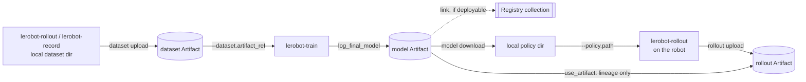

# W&B-native LeRobot pipeline (SO-101)

Record on a real robot, publish the dataset, train from that exact dataset version, publish the
trained policy, roll it out on the robot, and publish the rollout with a lineage edge back to the
model that produced it — with W&B as the only remote store.

Every command below is copy-pasteable and exercised by
`tests/integrations/wandb_artifacts/test_showcase_readme.py`, which extracts each `lerobot-wandb`
invocation from this file and parses it against the real CLI. A flag that stops existing fails that
test.

## Pipeline



Solid arrows move bytes. The dashed arrow is a Registry link, and the `MA -> RA` edge moves no
bytes at all — it is a lineage reference recorded on the upload run.

## What this example is and is not

Read this before the commands; it is the part that keeps you from being misled.

- **W&B is the only remote store here.** Nothing in this example pushes to the Hugging Face Hub.
  `lerobot-wandb` never touches the Hub.
- **Local disk stays the runtime cache and the recording buffer.** Artifacts are materialized to
  disk before anything reads them. W&B is a durable store for finished artifacts, not a filesystem
  the robot reaches through.
- **No W&B call happens inside the robot control loop.** Publishing is a separate step you run
  after the robot is disconnected.
- **Aliases are mutable; versions are not.** `:latest` and `:candidate` move. `:v3` never does.
- **Training records the immutable version it actually trained on.** You may pass a mutable alias;
  the run records the resolved `:vN` it was pointed at, so the run stays reproducible even after
  the alias moves.
- **The default publish alias is not a promotion.** `--alias` defaults to `latest`, which means
  "most recent", not "approved for production". Registry linking is the deliberate promotion step.
- **Rollout success counts are supplied by you.** Nothing here scores a rollout automatically; you
  pass `--episodes-succeeded` from your own judgement.

## 0. Prerequisites

```bash
uv sync --locked --extra core_scripts --extra feetech --extra training
wandb login
export WANDB_ENTITY=my-team
export WANDB_PROJECT=so101-pick-cube
```

`core_scripts` pulls in the dataset and hardware stacks, `feetech` the SO-101's motor bus, and
`training` both `wandb` and `accelerate`. Everything below assumes an SO-101 follower on
`/dev/ttyACM0` and a leader on `/dev/ttyACM1`; adjust ports and camera indices to your setup.

## 1. Record a teaching dataset

Standard LeRobot recording, unmodified — W&B is not involved yet.

```bash
lerobot-record \
  --robot.type=so101_follower --robot.port=/dev/ttyACM0 --robot.id=my_follower \
  --teleop.type=so101_leader --teleop.port=/dev/ttyACM1 --teleop.id=my_leader \
  --robot.cameras="{ front: {type: opencv, index_or_path: 0, width: 640, height: 480, fps: 30}}" \
  --dataset.repo_id=local/pick-cube \
  --dataset.root=./data/pick-cube \
  --dataset.single_task="Pick up the cube and place it in the bin" \
  --dataset.num_episodes=30 \
  --dataset.push_to_hub=false
```

## 2. Publish the dataset as an Artifact

The directory is fully validated locally first — metadata parses, parquet matches the declared
schema, every referenced video exists, indices agree — before a W&B run is created. A malformed
dataset costs you no run and no upload.

```bash
lerobot-wandb dataset upload \
  --root ./data/pick-cube \
  --entity my-team \
  --project so101-pick-cube \
  --name pick-cube \
  --alias raw
```

Prints the resolved immutable ref, e.g. `my-team/so101-pick-cube/pick-cube:v0`. Record that; it is
what makes a later training run reproducible.

## 3. Train directly from the Artifact

No `--dataset.repo_id`: exactly one of `repo_id` or `artifact_ref` may be set. The artifact is
materialized under `--output_dir` before any dataset object is built, and the run records both the
requested ref and the resolved `:vN`.

```bash
lerobot-train \
  --dataset.artifact_ref=my-team/so101-pick-cube/pick-cube:raw \
  --policy.type=act \
  --policy.device=cuda \
  --output_dir=outputs/train/act_pick_cube \
  --job_name=act_pick_cube \
  --batch_size=8 \
  --steps=100000 \
  --wandb.enable=true \
  --wandb.project=so101-pick-cube \
  --wandb.entity=my-team \
  --wandb.model_artifact_name=pick-cube-policy \
  --wandb.model_artifact_aliases='["candidate"]' \
  --wandb.registered_model_name=pick-cube-policy \
  --policy.push_to_hub=false
```

`--wandb.model_artifact_name` publishes the final checkpoint as its own versioned collection,
separate from the periodic per-checkpoint uploads. `--wandb.registered_model_name` additionally
links that version into the Registry collection `wandb-registry-model/pick-cube-policy`.

Resuming works without re-downloading the dataset. Resumption needs `--config_path` as well as
`--resume=true` (the same `--output_dir` alone is not enough — `validate()` rejects it):

```bash
lerobot-train --resume=true \
  --config_path=outputs/train/act_pick_cube/checkpoints/last/pretrained_model/train_config.json
```

The already-materialized dataset copy under that `--output_dir` is reused, and its identity is
verified against the sidecar written by the original download before any training resumes.

> **PEFT/LoRA runs:** an adapter-only checkpoint is uploaded but **not** linked into the Registry —
> it cannot be rolled out on its own, since its base model is resolved at load time and is not in
> the artifact. The reason is recorded in the artifact's metadata as `registry_link_refused_reason`.
> Publish a merged checkpoint to register a deployable version.

## 4. Fetch the trained policy on the robot machine

Downloads transactionally into a staging directory, validates it is a loadable policy checkpoint,
and only then promotes it to `--root`. An interrupted download never leaves a half-written policy
where you pointed it.

```bash
lerobot-wandb model download \
  --ref my-team/so101-pick-cube/pick-cube-policy:candidate \
  --root ./policies/pick-cube-candidate
```

The resulting directory is usable directly as `--policy.path`. **Write down the resolved
`:vN` it prints** — that, not `:candidate`, is what the robot is about to run, and it is what step 6
must record. The alias may move between now and then; the version cannot.

## 5. Roll out on the real robot

Standard `lerobot-rollout`, unmodified and fully offline with respect to W&B. The `rollout_` prefix
on the dataset name is required by the rollout config.

```bash
lerobot-rollout \
  --strategy.type=episodic \
  --policy.path=./policies/pick-cube-candidate \
  --robot.type=so101_follower --robot.port=/dev/ttyACM0 --robot.id=my_follower \
  --teleop.type=so101_leader --teleop.port=/dev/ttyACM1 --teleop.id=my_leader \
  --dataset.repo_id=local/rollout_pick-cube \
  --dataset.root=./data/rollout_pick-cube \
  --dataset.num_episodes=20 \
  --dataset.single_task="Pick up the cube and place it in the bin" \
  --dataset.push_to_hub=false
```

Count the successes yourself while it runs. You will pass that number in the next step.

## 6. Publish the rollout with lineage back to the model

Disconnect the robot first; this step is pure upload.

```bash
lerobot-wandb rollout upload \
  --root ./data/rollout_pick-cube \
  --entity my-team \
  --project so101-pick-cube \
  --name pick-cube-rollout \
  --model-ref my-team/so101-pick-cube/pick-cube-policy:v3 \
  --episodes-succeeded 14
```

Note the `:v3` rather than `:candidate`. The ref is resolved again at upload time, so passing the
alias would record whatever it points at _now_ — not necessarily the version the robot ran, if
someone promoted a new candidate in between. Recording a model the rollout didn't use is worse than
recording nothing, because it looks authoritative.

This creates a run that declares the model as an **input** — resolved for lineage, never
downloaded — and the rollout as an **output** of type `rollout`, distinct from a training dataset
so nothing can later train on a policy's own output by mistake.

Logged to the run: episode count, success count, success rate, frame count, duration, and both the
requested and resolved model refs. Exactly one representative video is shown in the run UI, chosen
deterministically. The complete rollout — every episode, every camera — lives in the Artifact.

> **On that one video:** in Dataset v3 a single `.mp4` holds as many episodes as fit under the
> writer's file-size target, so the clip in the UI is an episode _span_. The run summary records
> which episodes it actually shows, under `representative_video_episodes`.

## 7. Promote what worked

Nothing is promoted automatically. When a rollout justifies promotion, promote **the exact version
the rollout evaluated** — `pick-cube-policy:v3`, whatever `:candidate` resolved to when you
downloaded it, which the rollout run recorded as `model_artifact_resolved_ref`.

`lerobot-wandb model upload` cannot do this: it always logs a _new_ artifact version from a local
directory. Re-uploading the downloaded policy would produce a different version, carrying no edge
to the rollout that justified it, while the rollout stays attached to the version you actually
tested. That is the opposite of what promotion is for.

Until the CLI grows a promote command (tracked in #24), move the alias and add the Registry link on
the existing version, either in the W&B UI or with the SDK:

```python
import wandb

api = wandb.Api()
artifact = api.artifact("my-team/so101-pick-cube/pick-cube-policy:v3", type="model")

# Project-collection alias.
artifact.aliases.append("production")
artifact.save()

# Registry aliases are separate: they are assigned on the link, not on the artifact above.
with wandb.init(entity="my-team", project="so101-pick-cube", job_type="promote") as run:
    run.link_artifact(
        artifact,
        target_path="wandb-registry-model/pick-cube-policy",
        aliases=["production"],
    )
```

## Where things live afterwards

| Thing                    | Where                                                  |
| ------------------------ | ------------------------------------------------------ |
| Teaching dataset         | `dataset` Artifact, `pick-cube`                        |
| Trained policy           | `model` Artifact, `pick-cube-policy` (+ Registry link) |
| Rollout episodes         | `rollout` Artifact, `pick-cube-rollout`                |
| Which dataset trained it | Training run config + final model Artifact metadata    |
| Which model drove it     | Rollout run input edge + rollout Artifact metadata     |
