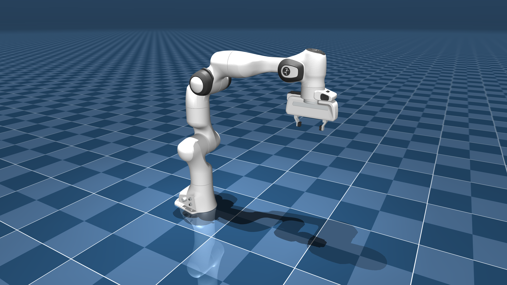

# Franka Emika Panda Description (MJCF)

Requires MuJoCo 2.3.3 or later.

## Overview

This package contains a simplified robot description (MJCF) of the [Franka Emika
Panda](https://www.franka.de/) developed by [Franka
Emika](https://www.franka.de/company). It is derived from the [publicly
available URDF
description](https://github.com/frankaemika/franka_ros/tree/develop/franka_description).

  

## URDF → MJCF derivation steps

1. Converted the DAE [mesh
   files](https://github.com/frankaemika/franka_ros/tree/develop/franka_description/meshes/visual)
   to OBJ format using [Blender](https://www.blender.org/).
2. Processed `.obj` files with [`obj2mjcf`](https://github.com/kevinzakka/obj2mjcf).
3. Eliminated the perfectly flat `link0_6` from the resulting submeshes created for `link0`.
4. Created a convex decomposition of the STL collision [mesh
   file](https://github.com/frankaemika/franka_ros/tree/develop/franka_description/meshes/collision)
   for `link5` using [V-HACD](https://github.com/kmammou/v-hacd).
5. Added `<mujoco> <compiler discardvisual="false"/> </mujoco>` to the
   [URDF](https://github.com/frankaemika/franka_ros/tree/develop/franka_description/robots)'s
   `<robot>` clause in order to preserve visual geometries.
6. Loaded the URDF into MuJoCo and saved a corresponding MJCF.
7. Matched inertial parameters with [inertial.yaml](
   https://github.com/frankaemika/franka_ros/blob/develop/franka_description/robots/common/inertial.yaml).
8. Added a tracking light to the base.
9. Manually edited the MJCF to extract common properties into the `<default>` section.
10. Added `<exclude>` clauses to prevent collisions between `link7` and `link8`.
11. Manually designed collision geoms for the fingertips.
12. Added position-controlled actuators for the arm.
13. Added an equality constraint so that the left finger mimics the position of the right finger.
14. Added a tendon to split the force equally between both fingers and a
    position actuator acting on this tendon.
15. Added `scene.xml` which includes the robot, with a textured groundplane, skybox, and haze.

## License

This model is released under an [Apache-2.0 License](LICENSE).
