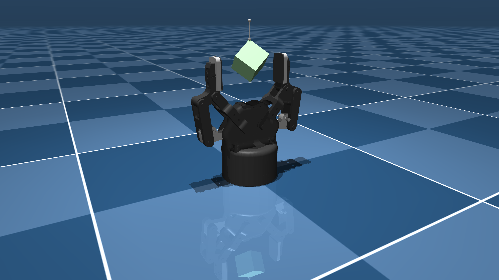

# Robotiq 2F-85 Description (MJCF)

Requires MuJoCo 2.2.2 or later.

## Overview

This package contains a simplified robot description (MJCF) of the [Robotiq 85mm
2-Finger Adaptive
Gripper](https://robotiq.com/products/2f85-140-adaptive-robot-gripper) developed
by [Robotiq](https://robotiq.com/). It is derived from the [publicly available
URDF
description](https://github.com/ros-industrial/robotiq/tree/kinetic-devel/robotiq_2f_85_gripper_visualization).

  

## URDF → MJCF derivation steps

1. Added `<mujoco> <compiler discardvisual="false"/> </mujoco>` to the URDF's
   `<robot>` clause in order to preserve visual geometries.
2. Loaded the URDF into MuJoCo and saved a corresponding MJCF.
3. Manually edited the MJCF to extract common properties into the `<default>` section.
4. Added `<exclude>` clauses to prevent collisions between the linkage bodies.
5. Broke up collision pads into two pads for more contacts.
6. Increased pad friction and priority.
7. Added `impratio=10` for better noslip.
8. Added `scene.xml` which includes the robot, with a textured groundplane, skybox, and haze.
9. Added hanging box to `scene.xml`.

## License

This model is released under a [BSD-2-Clause License](LICENSE).
