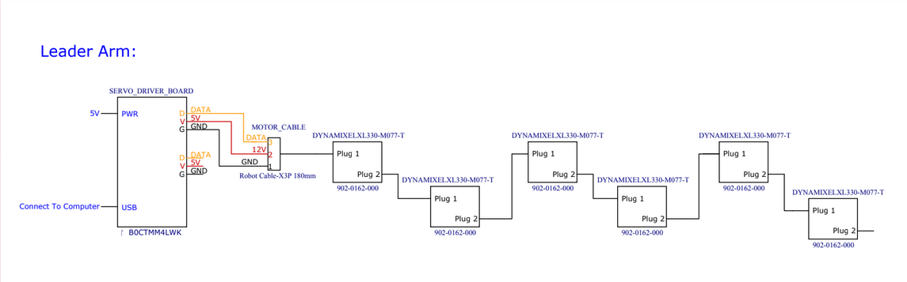
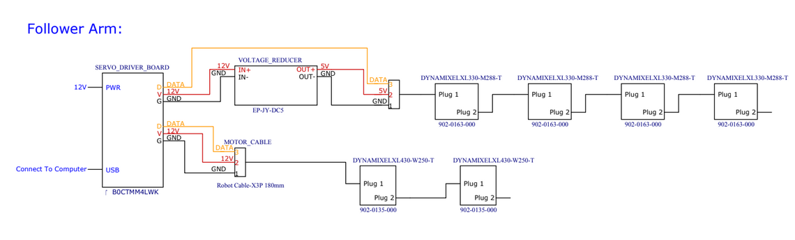

# Alexander Koch Arm V1.1

This folder the instructions to assembly a slightly modified version of the [Alexander Koch Arms](https://github.com/AlexanderKoch-Koch/low_cost_robot). 

## Assembly Instructions

### Leader Arm
Video of the Assembly: #TODO: What is the best format to put this video? I'm thinking Youtube?

1. Order all off the shelf parts from the BILL_OF_MATERIALS.md.
2. Print all parts with a 3D printer.
   1. Precision: 0.2mm minimum height layer
   2. Material: PLA, ABS, PETG or other reasonably strong plastics.
   3. Suggested: Prusa Mini+, Bambu P1, Ender3, etc.
3.  Scan each motor. #TODO: Check this-- should I add more information?
4.  Follower the video to in assembling the mechanical structure. #TODO(jess-moss): Should I add more info here?
5.  Use the electrical diagram to wire the robot
    1.  Using 6 Dynamixel motor cables, daisy chain each motor to the one after it. Tip: Each Dynamixel has two ports, but they are electrically identical.
    2.  Get three male to female wires. Plug them into the D, V, and G of the PCB.
    3.  Connect these to the motor cable of the first (shoulder rotation) Dynamixel with G being connected to Pin 1, V to Pin 2, and D to Pin 3. (Hint: The cable connector has a small 1, 2, and 3 on it so you can identify each pin).
    4.  Plug in the PWR using the 5V power source, and connect the USB-C connector to your computers.

### Follower Arm
Video of the Assembly: #TODO: What is the best format to put this video? I'm thinking Youtube?

1. Order all off the shelf parts from the BILL_OF_MATERIALS.md.
2. Print all parts with a 3D printer.
   1. Precision: 0.2mm minimum height layer
   2. Material: PLA, ABS, PETG or other reasonably strong plastics.
   3. Suggested: Prusa Mini+, Bambu P1, Ender3, etc.
3.  Scan each motor. #TODO: Check this-- should I add more information?
4. Follower the video to in assembling the mechanical structure. #TODO(jess-moss): Should I add more info here? 
5.  Use the electrical diagram to wire the robot
    1.  Use the 6 Dynamixel motor cables to daisy chain the four XL330 motors together and the two XL430 motors together. Do not connect the XL430 motor to the XL 330 motor.
    2.  Get three male to female wires. Plug them into the D, V, and G of the PCB.
    3.  Connect these to the motor cable of the first (shoulder rotation) Dynamixel XL430 with G being connected to Pin 1, V to Pin 2, and D to Pin 3. (Hint: The cable connector has a small 1, 2, and 3 on it so you can identify each pin).
    4.  Get three more male to female wires. Plug them into the second port D, V, and G of the PCB.
    5.  Connect the V to IN+ and G to IN- of the DC Converter.
    6.  Connect the motor cable of the first Dynamixel XL330 (i.e. wrist extention rotation) by connecting Pin 1 to OUT- of the DC converter, Pin 2 connected to OUT+ of the DC converter and Pin 3 connected to D from the second port of the PCB. 
    7.  Plug in the PWR using the 12V power source, and connect the USB-C connector to your computers.

