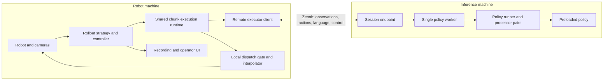

# Asynchronous Remote Inference for LeRobot

Date: 2026-09-28

Status: Design proposal; implementation has not started.

Code baseline: `e595b7902` (2026-09-25).

## 1. Purpose and scope

Enable a robot running `lerobot-rollout` to execute a policy hosted on another machine, without downloading model weights or requiring a local GPU. Robot observation capture, action dispatch, operator interaction, and recording stay local. Policy computation and policy-specific processors run on the server.

The first release serves **one active robot session from one preloaded model process**. It supports a lab LAN and private remote connections. It must work with rollout's interactive language features and integrate with its existing strategies. The architecture preserves a clear path to multiple robots sharing model weights and to model selection based on task or robot state.

The design uses Zenoh as its only remote-inference communication stack. Reusable Zenoh integration should also support future LeRobot communication needs. Converting unrelated existing communication paths is outside this feature's scope.

### 1.1 Product decisions

| Area | Decision |
| --- | --- |
| Initial topology | One robot, one active session, one preloaded model server |
| Future topology | Shared model serving and task/state-based model selection remain possible |
| Network | LAN and private remote connections; direct connection or an optional Zenoh router |
| Client | No weights or GPU required; PyTorch and existing rollout dependencies are acceptable |
| Integration | A remote `InferenceEngine` backend, with chunk execution shared with local asynchronous inference |
| Policy support | A general contract and default runner, with explicit exceptions for incompatible configurations |
| Language | Live instructions, VQA, and autosteering supported when the policy has the corresponding capability |
| Model loading | Operator-configured, preloaded deployment; clients cannot request arbitrary downloads |
| Fault recovery | Bounded buffered execution, then a conservative local stop; no automatic session recovery required |
| Replacement | Remove the existing `async_inference` implementation; no compatibility layer or migration guide |

### 1.2 Explicit non-goals for the first release

- Multi-client scheduling, GPU batching, load balancing, or automatic replica selection.
- Public multi-tenant hosting, accounts, billing, or fleet orchestration.
- Transparent reconnection, state migration, or automatic motion resumption after faults.
- Concurrent action and language inference on the same model.
- Support for every policy configuration, observation-history model, or robot control mode.
- A PyTorch-free edge package, a new robot-control CLI, or a general-purpose message-bus framework.
- Hard real-time guarantees. The local loop avoids network and model waits, but Python and hardware I/O remain subject to scheduling and device latency.

## 2. Architecture and ownership

Separate **where computation runs** from **how actions are scheduled and executed**.



The shared chunk runtime can also call a local executor, bypassing serialization and Zenoh. Local and remote execution must use the same scheduling, prefix preparation, result-acceptance, and provenance rules where they claim the same execution mode.

| Component | Owns | Does not own |
| --- | --- | --- |
| Rollout strategy/controller | Robot lifecycle, operator intent, recording, intervention, run segments | Network retries or policy computation |
| Local dispatch gate | Permission to dispatch, freshness checks, planned holds, fault stops, interpolation invalidation | Model selection or policy normalization |
| Chunk runtime | Action buffer, refill decisions, continuation snapshots, execution generations, task provenance | Model weights or transport callbacks |
| Executor client | Session negotiation, encoding, bounded network exchange, result correlation | Motor commands |
| Policy runner | Canonical preprocessing, policy calls, canonical postprocessing, policy capability validation | Robot timing or action dispatch |
| Server session | Mutable policy/processor context, request sequencing, reset ordering | Client action cursor or operator intent |

Preserve `InferenceEngine` as rollout's interface. Extract focused helpers from local RTC rather than duplicating its loop in a remote backend. Keep synchronous `select_action()` execution intact unless a separately justified change is necessary.

Server operations are serialized by one policy worker. Zenoh callbacks validate a bounded envelope and enqueue work; they never invoke a policy, mutate processor state, or wait for GPU work. The client likewise keeps encoding, network waits, and result decoding outside the control thread. CPU contention still needs measurement on edge hardware.

## 3. User workflow

1. The operator starts a named deployment with a pinned checkpoint and its processors.
2. The server loads the policy, validates its serving configuration, warms the enabled computation paths, resets warmup state, and advertises readiness.
3. The client connects to the deployment, obtains a serving descriptor, validates its robot configuration, and opens an exclusive session.
4. Rollout begins only after compatibility and session admission succeed. Initial actions require a fresh observation and an accepted result.
5. The operator can change instructions, ask supported questions, and use autosteering through the existing rollout interfaces.
6. On a terminal inference fault, the client stops policy motion locally. Restarting the rollout establishes a new session. Transparent recovery is unnecessary in this release.

Examples below describe the intended interface; they are not runnable commands until implemented. Hardware arguments follow the existing rollout CLI.

```bash
# GPU machine: load and advertise one deployment.
lerobot-policy-server --config_path=server.yaml

# Robot machine: obtain model metadata from the server, without loading weights.
lerobot-rollout \
    --inference.type=remote \
    --inference.endpoint=tcp/192.168.1.42:7447 \
    --inference.deployment=manipulation \
    --task="pick up the cube" \
    --interactive=true \
    --robot.type=so101_follower \
    --robot.port=/dev/ttyACM0
```

The remote path does not require `--policy.path`. An optional expected artifact identity lets the client insist on a particular deployed checkpoint. Local inference retains its existing policy configuration workflow. Unsupported combinations of local-only policy/device options and remote configuration fail clearly rather than being silently ignored.

## 4. Observation and action boundary

The client applies robot-side observation processing and an explicit feature mapping, then constructs a canonical observation frame. The frame crosses the network before policy-specific device placement, normalization, tokenization, and model preparation.

The server applies the checkpoint's canonical policy processors and returns postprocessed **canonical actions**. These are the inputs to local robot-action processing, not necessarily motor commands. Local interpolation, limits, kinematic conversions, and dispatch remain on the robot machine.

Feature mapping must be applied exactly once. The negotiated descriptor defines the wire ordering; the robot's native dictionary order is not a wire contract. A known permutation can be explicitly aligned during setup. Missing or semantically incompatible features are rejected.

Use named typed features rather than a schema permanently limited to one state vector and RGB images. Initially implement the scalar/tensor and RGB features needed by supported policies, and reject unsupported modalities explicitly. Future depth, tactile, or other tensors must not require changing the session and scheduling architecture.

Use raw RGB for lossless transport tests and a configurable JPEG encoding for bandwidth-constrained operation. JPEG is lossy: reusing canonical processors does not make compressed remote inputs byte-identical to local inputs. Do not apply RGB JPEG encoding to depth or arbitrary tensors. Image channel order, shape, dtype, and encoding are explicit.

Observation snapshots must have stable ownership. If a camera or processor reuses buffers, copy the necessary arrays before asynchronous encoding. Keep snapshots bounded; do not retain every control-loop frame.

## 5. Policy compatibility

### 5.1 Default-compatible chunk contract

A standard chunk-serving policy accepts a complete current observation batch through `predict_action_chunk()` and returns an ordered action sequence. It does not require hidden preparation performed only by `select_action()`. Its execution length and action representation are defined, and its processors support the documented input/output shapes.

Provide a default `PolicyRunner` for this contract. New conforming policies should need no transport code or family-name entry in a remote-serving allowlist. Capability defaults are a documented author contract, backed by reusable conformance tests; method presence and a successful dummy call are not proof of correct semantics.

Capabilities describe:

- Prediction and execution lengths, action interval, feature layout, and action representation.
- Whether current observations suffice or temporally sampled history is required.
- Supported chunk modes, including guided/trained RTC and checkpoint delay limits.
- Text-query support, obtained from the policy's language capability interface.
- Reset behavior and whether policy calls retain mutable session state.
- Any configuration restrictions or custom runner required.

The server is exclusive in this release, so mutable policy state is allowed when its lifecycle is understood. No claim of statelessness or future safe model sharing follows from single-client compatibility.

### 5.2 Exceptions and adapters

An adapter is appropriate when a policy needs special input preparation, selects an execution slice, or uses another action representation. Keep that logic with the policy or runner, outside the transport and generic server.

Reject configurations whose semantics are not implemented. Examples include observation history that would be incorrectly sampled only at chunk-request frequency, temporal ensembling that requires a different prediction cadence, and models that depend on unimplemented `select_action()` state preparation.

Honor `n_action_steps` and equivalent execution-length settings. Do not assume the full predicted horizon should be dispatched. For RTC, preserve the continuation horizon required by the selected mode separately from ordinary playback length.

### 5.3 Initial validation targets

The following are validation targets, not a declaration that all configurations already satisfy the contract:

| Target | Required coverage |
| --- | --- |
| ACT without temporal ensembling | Correct execution slice and plain chunk playback |
| Pi0 and Pi05 | Guided RTC, relative-action processing where applicable |
| Compatible trained-RTC Pi05 checkpoint | Trained prefix limits and rejection of unusable results |
| SmolVLA with one observation step | Plain chunks and supported RTC behavior |
| EO1 with an appropriate language-capable checkpoint | Plain chunks, live instructions, VQA, and next-subtask generation |
| Other conforming policies | Generic runner/conformance suite; no transport changes |

At least one real language-capable policy must pass end-to-end validation before release. A mock text head alone does not satisfy the language requirement. WALL-X and additional policies can join the support matrix when their configuration-specific contracts are validated.

## 6. Shared chunk execution

### 6.1 Execution modes

| Mode | Behavior |
| --- | --- |
| Plain chunks | Execute the configured slice; append a prefetched chunk only under the negotiated age and timing budget |
| Guided RTC | Construct and re-anchor continuation context, invoke supported guidance, and merge a compatible result |
| Trained RTC | Additionally enforce checkpoint training-delay limits and the actual conditioned overlap |

Plain prefetch does not reproduce synchronous inference exactly: observations can age while earlier actions finish. Initially permit at most one pending inference or one accepted successor chunk beyond the chunk being executed; do not request another successor until that slot is free. Validate freshness at dispatch, and document the latency/reactivity tradeoff. A policy or task needing tighter feedback may be unsuitable for this mode.

An explicitly requested unsupported mode is an error. Do not silently downgrade RTC to plain playback. A default mode may be negotiated only if its resolved value is reported before motion starts.

### 6.2 Atomic execution snapshot

Before issuing inference, atomically snapshot the action cursor, queue generation, available model-space and canonical-action continuation, and action provenance. Separate individually locked queue getters do not form a coherent snapshot.

Bind the request to an immutable observation and its capture/sample time. Track both the observation's age and the cursor at the request snapshot. A buffered observation must not be presented as newly captured merely because encoding starts now.

The local control loop consumes actions while the executor operates. The merge uses actual committed progress in policy-action steps, with a defined relationship to interpolation. Popping an action into an interpolator commits it; it does not mean the robot has already reached its endpoint. Preserve this distinction when constructing the continuation and testing splice behavior.

### 6.3 Timing quantities

Keep these measurements separate:

| Quantity | Use |
| --- | --- |
| Source observation age | Bound how stale a proposed or dispatched action may be |
| End-to-end request turnaround | Estimate when to refill and what RTC delay to request |
| Actual action progress | Align the arriving chunk with the committed trajectory |
| Server-local durations | Diagnose queueing, preprocessing, policy, and postprocessing cost |

Client-local monotonic time is authoritative for client deadlines and ages. Server timestamps are not compared with client timestamps. Echoed client times are opaque on the server; server reports contain durations. If device timestamps use another clock, they require explicit conversion before being used for age limits.

Measure turnaround across encoding, network transfer, server work, decoding, and acceptance. Do not add inference duration a second time to an already complete turnaround measurement. Keep source age before request submission separately.

An initial estimate is `ceil(turnaround / policy_action_interval)`. It predicts delay; it is not unconditional permission to trim. No actions may have been consumed during startup or a hold. Conversely, a frozen action cursor does not make an old observation fresh.

Retain the local RTC consumption-aware merge semantics during extraction. Trained RTC must reject chunks whose measured overlap exceeds the conditioned or checkpoint-supported overlap. Future changes to these semantics require shared local/remote tests.

### 6.4 Refill and acceptance

Use a refill threshold in seconds of remaining policy playback. A practical budget requires remaining playback to exceed measured turnaround plus headroom, within the policy's usable horizon. Warmup latency, steady-state latency, and language-generation duration must not be mixed into one action-latency estimate.

Initially allow one outstanding action request per session. The client publishes only when ready for a new request; it keeps the latest observation locally between requests. The server has one bounded pending action slot and rejects additional requests as busy. It does not silently supersede accepted stateful work.

Accept a result only if its server instance, session, generation, request ID, artifact identity, shape, and execution context match; its values are valid; its observation is fresh enough; and its mode-specific continuation constraints hold. Request timeout or generation invalidation makes a later reply ineligible.

Each accepted chunk retains source observation time, request ID, task/version, and generation. Freshness follows each chunk/action; merging a fresh result must not make older appended actions appear fresh.

## 7. Interactive language

### 7.1 Required behavior

- `set_task()` works without reopening a session or changing deployment keys.
- Existing VQA and autosteering entry points work remotely for capable policies.
- Text answers and errors return through `QueryAnswer` and the control-thread observer path.
- Unsupported policy capabilities are reported before accepting a query.
- Text input length, output length, pending queries, and execution deadlines are bounded.

Separate `language/request` and `language/result` topics distinguish text traffic from action requests. Separation does not imply concurrent GPU execution. Both operations use the single policy worker.

### 7.2 Planned hold for text generation

Text generation may take longer than an action buffer can cover. The initial implementation uses a planned hold instead of requiring concurrent inference or predicting whether every language call will finish in time:

1. Queue the operator/autosteer query locally; stop submitting action requests.
2. On the control thread, enter a robot-supported hold, invalidate queued motion and interpolation, and advance the execution generation. Acknowledge the hold to the background worker before it submits the query. Continue observation capture and operator handling; the control thread never waits for that worker.
3. Allow any already executing policy call to finish within its deadline; discard its motion result. The server worker serializes the generation change before the language call.
4. Submit a fresh observation with the query, query kind, instruction version, and autosteer generation.
5. Run the policy's text path using an isolated language processor pair where processor state requires it. A subsequent action call always preprocesses its own fresh observation.
6. Deliver the result only if its query context is still valid. Apply a next-subtask answer through the existing task-update path on the client.
7. If the same run remains active and the operator has not paused, stopped, or intervened, request a fresh action chunk without stale continuation and leave the planned hold once that chunk is usable.

This resumption completes an operator-authorized query within a healthy run; it is not automatic recovery from a fault. A paused/stopped run stays paused/stopped. Autosteering measures its next interval from the applied result so it cannot continuously request text without allowing motion.

A completed language call returning an invalid/empty answer produces a query error and can resume healthy action execution under the existing instruction. An uncertain timed-out or hung policy call faults the session: cancellation does not prove a running GPU call has stopped. The server must not start another model call concurrently to work around it.

The shared runtime exposes the planned-hold mechanism so this behavior does not become a remote-only implementation. Existing synchronous inference remains unchanged. Continuous motion during language generation is a future capability requiring separately validated concurrency or compute separation.

### 7.3 Task changes and stale answers

The client is the authority for operator intent. Action requests carry the actual task and an incrementing task version. Accepted queued actions retain their source task; dataset labels use the dispatched task, not the latest requested task.

A normal instruction change allows the already accepted buffer to provide continuity while the next request uses the new instruction. A response for an older task that was still in flight at the change is discarded. RTC may condition the new result on the remaining committed trajectory; plain playback finishes only the already accepted slice. Explicit stop/intervention invalidates motion immediately.

An autosteer turn carries a separate intent generation. Stopping or retargeting autosteering, manual re-instruction, reset, and run termination invalidate obsolete next-subtask results. String equality alone is insufficient: changing away from and back to the same text must not revive an earlier response. Superseded VQA results are also discarded or explicitly reported as cancelled; they cannot affect motion.

## 8. Zenoh protocol

### 8.1 Addressing and topology

Use an application namespace with explicit deployment, server-instance, and session identities:

```text
lerobot/inference/v1/deployments/<deployment>/describe
lerobot/inference/v1/deployments/<deployment>/instances/<instance>/open
lerobot/inference/v1/deployments/<deployment>/instances/<instance>/alive

# Let S be the selected instance prefix plus /sessions/<session>.
S/control
S/obs
S/act
S/language/request
S/language/result
S/alive
```

`describe`, `open`, and `control` are queryables with explicit timeouts. Observations, actions, and language requests/results use correlated pub/sub messages. Presence uses liveliness tokens. Keys follow Zenoh's hierarchical key-expression rules; deployment identifiers are validated single segments, not raw Hub IDs or task strings. [Zenoh abstractions](https://zenoh.io/docs/manual/abstractions/).

Each server boot has a new random instance ID; each admitted session has a new random session ID. Discovering multiple instances without explicitly selecting one is an ambiguity error in this release. After selection, all work addresses exactly one instance/session. Tasks belong in messages, not routing keys.

Direct mode connects the client to a listening server. Router mode has both processes connect to a configured Zenoh router. Use explicit endpoints; do not rely on multicast discovery for private remote networks.

### 8.2 Transport behavior

Configure bounded queues and non-blocking congestion behavior for the data path. Network publication must not stall the policy worker or robot control thread. Delivery reliability does not establish freshness or execution eligibility; request correlation and deadlines remain authoritative.

The implementation spike must verify the selected zenoh-python release's callback, congestion, timeout, payload-size, and liveliness behavior in direct and router configurations. Select and lock a tested binding/router combination rather than depending on unverified API assumptions. Avoid shared-memory and other optional transport optimizations in the initial implementation.

Control callbacks enqueue ordered worker commands where model state is involved. They must not wait inside a callback for an in-flight model call. Reset acknowledgements are emitted only after the worker has actually applied the reset. The transport adapter owns any query/reply lifetime management required by the tested API.

### 8.3 Encoding and envelope

Use MessagePack with explicitly validated message types. Tensors use contiguous bytes plus dtype, shape, and endianness; images include encoding and dimensions. Do not serialize Python objects, executable code, arbitrary class names, or pickle payloads.

Every data message includes protocol version, message type, server-instance ID, session ID, execution generation, and request ID. Replies echo the corresponding request identity. Task version and query-intent generation accompany the operations that need them.

Before decompression or tensor allocation, enforce encoded-byte limits and validated rank, dimensions, dtype, expected byte count, decoded image size, and string lengths. Reject non-finite action values and feature mismatches. Structured errors distinguish unsupported capability, malformed payload, busy session, stale generation, incompatible artifact, and execution failure.

Use a versioned typed envelope rather than adding a custom packed binary header initially. Breaking changes require a protocol-major change. Additive optional fields may be ignored; unsupported required capabilities must cause negotiation failure.

| Message | Principal contents |
| --- | --- |
| Serving descriptor | Artifact identity, feature schemas, execution modes, language capabilities, readiness, server instance |
| Session open | Unique open-operation ID, expected artifact identity, robot/feature mapping, action interval, requested mode and encoding |
| Session accepted | Session ID, resolved contract, effective limits and execution configuration |
| Observation request | Observation ID/time, typed features, task/version, cursor snapshot, RTC delay and continuation if used |
| Action result | Canonical action chunk, required model-space continuation, source/task identity, server durations |
| Language request | Fresh observation, question/kind, task version, query-intent generation |
| Language result | Answer or structured error, echoed query and observation identities |
| Session control | Pause/invalidate-motion/reset/close operation, operation ID, target generation; worker-applied acknowledgement |

Returning both model-space and canonical chunks is acceptable where RTC needs them. Their meanings must be explicit; ordinary chunk clients need not retain redundant model-space data. Relative RTC re-anchoring remains server-side against the current request's state and canonical processors.

## 9. Session contract and state

### 9.1 Compatibility before motion

The descriptor identifies resolved checkpoint and adapter revisions, processor configurations/statistics, and effective inference settings. Resolve mutable repository references at server startup. For local artifacts, compute a content identity over the relevant model and processor files. A human deployment name is not an artifact identity.

Validate ordered feature mappings, shapes, supported modalities, action semantics, action interval, mode, and checkpoint RTC limits. Use available metadata for units and coordinate conventions; where metadata is absent, require an explicit deployment/robot configuration rather than claiming dimensions prove compatibility. Camera resolution flexibility is conditional on the actual processor contract.

Policy action interval and interpolated motor-update frequency are distinct. Reject an unsupported action interval rather than treating every FPS mismatch as an informational warning.

Build the remote rollout context from the negotiated descriptor without instantiating a local policy. Hardware connection may be required to inspect capabilities, but no policy motion begins before admission. Do not couple remote readiness gating to `use_torch_compile`.

### 9.2 Exclusive admission and ownership

The server accepts exactly one active session. A second client receives `BUSY`; it cannot replace the first session merely by reusing a client label. Client labels are diagnostic metadata, not identity or authorization.

Session open is idempotent for a bounded open-operation ID so retrying an unanswered open cannot create a second session. Keep bounded request-ID bookkeeping for the session. Duplicate data requests must not execute a stateful policy twice; return a retained terminal outcome or a duplicate/stale error. The client does not automatically replay timed-out inference calls.

Close, client-liveliness loss, or bounded idle-without-presence cleanup releases the session. Never release and reuse the loaded policy while an old session's model call is still executing. If that call hangs, the process stays unavailable until the operator restarts it. This is acceptable for the initial scope.

### 9.3 Reset and generations

Keep dataset episode IDs separate from inference execution generations. A recording boundary need not reset policy state.

Client reset immediately invalidates old queued work and interpolation locally, advances the generation, and clears the observation slot. The network worker submits an ordered reset command; no new-generation inference is accepted until the reset is acknowledged. Reset/close commands are idempotent. Old-generation replies cannot merge even if received after the acknowledgement.

Distinguish invalidating motion continuation from a full policy reset. A planned language hold clears motion continuation but need not erase planner memory. A full run reset resets the appropriate policy and processor state. The runner defines these operations without transport code reaching into policy-private queues.

## 10. Conservative local fault handling

Keep a small lifecycle: `CONNECTING -> ACTIVE -> FAULTED -> CLOSED`. Planned language holds and operator pauses are execution conditions within a healthy session, not an automatic reconnection state machine.

| Condition | Required behavior |
| --- | --- |
| Startup/handshake failure | Report failure before policy motion; do not start a retrying autonomous run |
| Initial action unavailable | Stay locally held while obtaining the first fresh result, within startup deadline |
| Ordinary late result | Continue only eligible buffered/interpolated actions within their age limits |
| Active motion buffer exhausted, action too old, request timeout, or malformed result for the active request | Latch fault, invalidate queued motion and interpolation, invoke local robot-supported stop/hold |
| Reply for a completed, cancelled, or obsolete request/session/generation | Discard without changing motion permission or refreshing freshness/deadlines |
| Server/router presence lost | Stop new requests; eligible buffered execution is allowed until the earliest local age, buffer, or request bound, then fault |
| Planned language hold | Keep observing and servicing UI; suppress ordinary action-starvation faults while enforcing the language deadline |
| Operator stop/intervention | Immediately revoke policy dispatch; obsolete replies cannot restore it |
| Terminal fault | Require explicit restart/new session; never resume motion merely because a connection returns |

The fault gate is checked on every motor tick, including ticks that only drain interpolation. Checking `get_action()` alone is insufficient. No sensor or network request is required to revoke dispatch permission.

Stop/hold behavior belongs to the robot integration. Position targets, velocities, grippers, and mixed actions cannot use one universal zero vector. Support only robot configurations with a defined, tested local stop/hold path; reject others at setup. Apply stop commands through the appropriate local hardware interface. A software hold is not a certified safety system.

Fault teardown must not automatically command a return-to-initial-pose movement. Normal operator-requested reset may retain that workflow. Keep the implementation limited to a stop reason/dispatch gate and the required teardown distinction; do not build an extensive recovery framework.

## 11. Configuration and deployment

The intended server configuration contains:

```yaml
deployment: manipulation
model:
  repo_or_path: organization/checkpoint
  revision: <resolved-or-pinned-revision>
  device: cuda
execution:
  supported_modes: [chunk, rtc_guided]  # validated against this checkpoint
  action_fps: 30
language:
  enabled: true                       # requires a text-capable checkpoint
  motion_during_query: hold
zenoh:
  mode: peer
  listen_endpoints: [tcp/0.0.0.0:7447]
```

This shows configuration shape, not a claim that a particular checkpoint supports every listed capability. For router mode use configured connect endpoints instead of a server listener. Keep effective RTC settings deployment-owned initially; the client requests a mode and validates the returned settings. Do not allow client options to silently mutate a shared model's global configuration.

Client configuration covers endpoint, deployment/optional instance, optional expected artifact identity, execution mode, refill playback threshold, maximum source-observation age, encoding, and handshake/action/language deadlines. Report effective negotiated settings at startup. Select numerical defaults from measured hardware/model profiles; transport success alone does not establish a usable latency budget.

Support authenticated encrypted Zenoh connections for private remote deployments, with a documented mTLS/router ACL example. TCP without authentication is an explicit trusted-lab configuration, not the private-remote recommendation. A session ID or key prefix is not authentication. Router policy must restrict which participants can publish action/control traffic and access observations. Zenoh ACL enforcement depends on topology and configured subjects, so validate the actual example end to end. [Zenoh access control](https://zenoh.io/docs/manual/access-control/).

Provide a new `remote` extra for the Zenoh binding and codec dependencies. Model extras are installed server-side as required; the client is permitted to retain normal LeRobot/PyTorch dependencies. Use existing optional-dependency flags and `require_package(...)` conventions.

## 12. Observability and recording

Use structured logs sharing deployment, instance, session, generation, and request/query IDs. Report action turnaround, source age at dispatch, queue playback, server stage durations, dropped/stale results, query duration, planned holds, and faults. Keep basic status/readiness visible through the Zenoh control surface. A metrics service and dashboard are optional follow-ups.

Recording stays with rollout. Preserve existing dataset semantics and use the task associated with the dispatched action. Add a bounded/asynchronously written inference-event sidecar keyed to dataset episode/frame or control-tick IDs, so requests, task changes, holds, and faults can be correlated without forcing dataset schema changes.

Distinguish predicted canonical actions, dispatched commands after robot processing, and measured robot state. A recorded command is not proof the hardware achieved it. Do not claim exact physical replay or deterministic robot execution.

## 13. Proposed code organization

Paths describe responsibilities; exact file boundaries may be adjusted during implementation.

```text
src/lerobot/inference/
    contracts.py          # observations, chunks, capabilities, provenance
    execution.py          # shared chunk scheduling and acceptance
    policy_runner.py      # canonical policy execution and adapter interface

src/lerobot/remote_inference/
    configs.py
    protocol.py           # messages, validation, version negotiation
    codec.py
    client.py             # remote executor and session exchange
    server.py             # exclusive session endpoint and policy worker

src/lerobot/transport/zenoh.py
                          # small reusable configuration/channel helpers

src/lerobot/rollout/inference/remote.py
                          # InferenceEngine integration
src/lerobot/scripts/lerobot_policy_server.py
```

Refactor local `rollout/inference/rtc.py` into the shared execution path while preserving its public configuration. Extend rollout context construction for descriptor-based remote setup. Add a control-thread dispatch gate shared by strategies, and adapt language handling to preserve nonblocking query submission and observer delivery.

Keep policy semantics out of `transport/zenoh.py`. There is no requirement to implement multiple transports or a generic transport plugin system. The reusable value is a consistent Zenoh configuration and bounded-channel layer.

## 14. Implementation stages and acceptance criteria

### Stage 1: Contracts and shared local behavior

- Define the default policy runner, capabilities, execution modes, snapshots, and provenance.
- Extract local chunk execution without changing synchronous inference.
- Add atomic continuation snapshots and verify consumption/interpolation alignment.
- Preserve task labeling, relative actions, and guided/trained RTC behavior.

Gate: existing relevant rollout/RTC tests pass; new tests exercise shared components rather than a copied inference loop.

### Stage 2: One complete remote action path

- Add typed codec, direct Zenoh connection, descriptor, exclusive admission, and one-in-flight requests.
- Integrate descriptor-based client startup, freshness enforcement, and conservative fault dispatch.
- Validate optional-router operation, encrypted private connection configuration, and no client weight loading.

Gate: a fake robot and real processor pipelines execute the same controlled action scenario through local and remote executors. Raw serialization preserves values; tolerance-based policy checks account for stochastic or device-specific numerics.

### Stage 3: Interactive language and lifecycle boundaries

- Implement live task changes and separate language topics.
- Implement planned holds, text results, autosteering intent generations, and fresh action resumption.
- Validate intervention, reset, pause, fault, and stop races without automatic reconnection.

Gate: VQA and autosteering work with a real text-capable checkpoint; slow language generation never causes concurrent model calls or stale motion resumption.

### Stage 4: Hardware validation and replacement

- Validate supported policies on a real robot over wired LAN and representative private remote conditions.
- Measure tail turnaround, frame encoding cost, playback coverage, task-change latency, and JPEG impact.
- Remove `src/lerobot/async_inference/`, its tests and documentation, and its dedicated configuration/dependency entries; add the new feature's tests and user documentation.
- Remove only the obsolete `AsyncInference` service/messages from shared protobuf definitions. Preserve `LearnerService`, shared messages, and dependencies still used by RL or other integrations; regenerate bindings and run relevant transport/RL checks.
- Update extras, script registration, documentation navigation, and stale repository references. No compatibility shim or migration guide is required.

Gate: the complete action and language workflow passes before replacement lands. Removing the old async path does not imply deleting gRPC from unrelated existing features.

### Required validation scenarios

| Area | Cases |
| --- | --- |
| Contract | Feature order, execution slice, incompatible units/configuration, processor identity, unsupported RTC/text |
| Codec | Raw tensor exactness, RGB order, malformed shape/dtype, oversized images, NaN actions, protocol mismatch |
| Scheduling | Empty startup, refill, variable delay, no consumption during a hold, interpolation, trained-delay rejection |
| Isolation over time | New session after close, reset during inference, duplicate requests, stale server/session/generation replies |
| Language | Slow VQA, next-subtask application, manual retargeting, same-text reuse, cancelled autosteering, query failure |
| Faults | Server death, router loss, dropped messages, hung model call, buffer starvation, fault during interpolation |
| Robot boundary | Position and mixed-mode stop behavior where supported, no automatic homing after fault |
| Recording | Correct task labels and request/frame provenance across task changes, language holds, and reset |

Use deterministic fake clocks and executors for timing/race tests, direct/router loopback integration for transport behavior, and a small real-policy/real-robot matrix for release validation. Do not make universal performance or safety claims from mock tests.

## 15. Extension path

### Multiple robots sharing one loaded model

Keep session identity and session-owned mutable context from the beginning, while enforcing capacity one. Later add per-session pending work, admission based on measured latency budgets, and a scheduler. Sharing weights requires a verified separation of policy state, processor state, and language/planner state; increasing a capacity setting alone is not sufficient.

Policies with inseparable mutable model state can remain exclusive. Batchability is a separate capability from safe sharing. Language calls require their own admission/scheduling policy before they can occupy a worker serving several robots.

### Task/state-based model selection

A future selector accepts task/state metadata and returns a compatible deployment and instance. It may be implemented as an application service or a Zenoh router plugin. Zenoh routes messages by configured keys; interpreting robot state and choosing a policy is application behavior, not an automatic consequence of installing a router.

Deployment addressing independent of task text and the serving descriptor provide the necessary boundaries. A model switch must invalidate incompatible continuation, validate the new contract, and establish explicit policy state. Do not broadcast observations to all model servers and race their actions to the robot.

### Further capabilities

Temporal-history requests with explicit sampling, concurrent language execution, server-side batching, and recoverable sessions can be added through capability and protocol evolution. None should require relocating robot dispatch or embedding policy-specific behavior in transport code.

## 16. Remaining implementation investigations

Product scope and architectural direction are settled by this proposal. These bounded investigations determine implementation details:

- Select the tested zenoh-python/router versions and validate callback/reply lifetimes and QoS under congestion.
- Audit initial policy configurations against the default runner and identify small required adapters.
- Choose and validate the first real language-capable checkpoint and its processor isolation requirements.
- Specify exact cursor/interpolator commitment semantics and prove them with shared-runtime tests.
- Establish supported robot stop/hold implementations and measured deadline/refill profiles.
- Validate metadata completeness for feature semantics and define explicit configuration where checkpoint metadata is insufficient.

If an investigation finds a policy or robot configuration incompatible, report the restriction and reject that configuration. Do not hide the mismatch through implicit preprocessing, execution-mode changes, or weaker fault handling.
