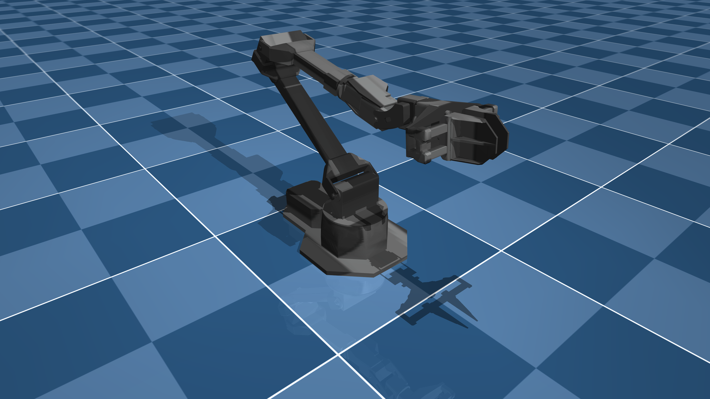

# ViperX 300 6DOF Description (MJCF)

> [!IMPORTANT]
> Requires MuJoCo 2.2.2 or later.

## Changelog

See [CHANGELOG.md](./CHANGELOG.md) for a full history of changes.

## Overview

This package contains a simplified robot description (MJCF) of the [ViperX 300 6DOF](https://www.trossenrobotics.com/viperx-300-robot-arm-6dof.aspx) developed by [Trossen Robotics](https://www.trossenrobotics.com/). It is derived from the [publicly available URDF description](https://github.com/Interbotix/interbotix_ros_manipulators/blob/main/interbotix_ros_xsarms/interbotix_xsarm_descriptions/urdf/vx300s.urdf.xacro).

  

## URDF → MJCF derivation steps

1. Added `<mujoco> <compiler discardvisual="false" strippath="false" fusestatic="false"/> </mujoco>` to the URDF's
   `<robot>` clause in order to preserve visual geometries.
2. Loaded the URDF into MuJoCo and saved a corresponding MJCF.
3. Manually edited the MJCF to extract common properties into the `<default>` section.
4. Used [`interbotix_black.png`](https://github.com/Interbotix/interbotix_ros_manipulators/blob/main/interbotix_ros_xsarms/interbotix_xsarm_descriptions/meshes/interbotix_black.png) to texture the visual geoms.
5. Added a light to track `gripper_link`.
6. Removed `gripper` joint.
7. Added an equality constraint so that the right finger mimics the position of the left finger.
8. Manually designed box collision geoms for the gripper.
9. Added `exclude` clause to prevent collisions between `base_link` and `shoulder_link`.
10. Added position controlled actuators.
11. Added `impratio=10` and `cone=elliptic` for better noslip.
12. Added `scene.xml` which includes the robot, with a textured groundplane, skybox, and haze.

## License

This model is released under a [BSD-3-Clause License](LICENSE).
