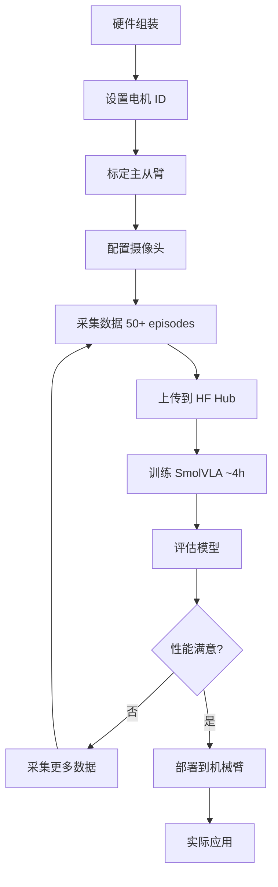

# 🚀 快速开始指南

> 5 分钟了解如何使用本教程

---

## 📁 项目结构

```
so101_smolvla_tutorials/
├── README.md                    # 详细说明文档
├── QUICKSTART.md               # 本文件
├── real_robot/                 # 实体机械臂教程
│   ├── 01_so101_setup_and_calibration.ipynb
│   ├── 02_so101_data_collection.ipynb
│   └── 03_so101_smolvla_training_and_inference.ipynb
├── mujoco_sim/                 # MuJoCo 仿真教程
│   └── mujoco_smolvla_quickstart.ipynb
├── datasets/                   # 数据集存储
├── models/                     # 模型存储
└── docs/                       # 文档
    └── FAQ.md                  # 常见问题
```

---

## 🎯 我应该从哪里开始？

### 场景 1️⃣: 我有 SO101 实体机械臂

**按顺序执行**:

```
1️⃣ real_robot/01_so101_setup_and_calibration.ipynb
   ↓ 设置电机 ID、标定主从臂

2️⃣ real_robot/02_so101_data_collection.ipynb
   ↓ 采集训练数据（推荐 50+ episodes）

3️⃣ real_robot/03_so101_smolvla_training_and_inference.ipynb
   ↓ 训练模型、部署到实体机械臂
```

**预计时间**:
- 设置和标定: 1-2 小时
- 数据采集: 2-4 小时（50 episodes）
- 训练: 4-8 小时（取决于 GPU）

---

### 场景 2️⃣: 我想先在 MuJoCo 中学习

**从这里开始**:

```
1️⃣ mujoco_sim/mujoco_smolvla_quickstart.ipynb
   ↓ 了解 MuJoCo 仿真和 sim2real gap

2️⃣ 参考项目: https://github.com/q442333521/lerobot-mujoco
   ↓ 完整的 MuJoCo 教程（8 个 notebook）
```

**⚠️ 重要提示**:
- MuJoCo 训练的模型**不能直接用于实体机械臂**
- 存在 sim2real gap（物理、视觉、环境差异）
- 适合学习流程，但最终需要真实数据

---

## 📋 前置要求

### 硬件

- **实体机械臂场景**:
  - ✅ SO101 主臂 + 从臂
  - ✅ USB 摄像头 x 1-2
  - ✅ Linux 电脑（Ubuntu 22.04 推荐）

- **MuJoCo 场景**:
  - ✅ 任何电脑（有 GPU 更好）

### 软件

```bash
# 1. 克隆 LeRobot
git clone https://github.com/huggingface/lerobot.git
cd lerobot

# 2. 安装基础依赖
pip install -e .

# 3. 安装 SmolVLA 依赖
pip install -e ".[smolvla]"

# 4. 安装 Feetech 驱动（实体机械臂必需）
pip install -e ".[feetech]"

# 5. 验证安装
python -c "import lerobot; print(lerobot.__version__)"
```

---

## 🔥 核心概念

### Q: 有没有训练好的模型可以直接用？

**A**: ❌ 没有通用的即用模型

- `lerobot/smolvla_base`: 基础模型，**需要在您的数据上微调**
- `lerobot/svla_so101_pickplace`: 数据集示例，不是模型

**原因**: SmolVLA 对环境（桌面、背景、光照、摄像头）非常敏感，即使有别人的模型，也需要在您的环境中重新训练。

### Q: 需要采集多少数据？

**A**: 推荐 **50+ episodes**

- 最少: 25 episodes（可能性能不佳）
- 推荐: 50 episodes（基本可用）
- 理想: 100+ episodes（性能优秀）

参考官方数据集: 50 episodes，5 个物体位置，每个位置 10 个演示

### Q: MuJoCo 数据能用于实体机械臂吗？

**A**: ❌ 不能直接用

**Sim2Real Gap**:
- 物理差异：摩擦、惯性、延迟
- 视觉差异：渲染 vs 真实摄像头
- 环境差异：仿真简单，真实复杂

**最佳方案**: 直接在实体机械臂上采集真实数据

---

## 📊 典型工作流

### 完整流程（实体机械臂）



### 时间线

| 阶段 | 时间 | 备注 |
|------|------|------|
| 硬件组装 | 2-4 小时 | 首次组装 |
| 设置和标定 | 1-2 小时 | 只需一次 |
| 数据采集 | 2-4 小时 | 50 episodes |
| 数据上传 | 10-30 分钟 | 取决于网速 |
| 模型训练 | 4-8 小时 | 取决于 GPU |
| 评估调优 | 1-2 小时 | 迭代过程 |
| **总计** | **1-2 天** | 首次完整流程 |

---

## 🛠️ 常见问题快速索引

### 安装问题

- [找不到 USB 端口](docs/FAQ.md#q21-找不到-usb-端口)
- [电机连接失败](docs/FAQ.md#q22-电机连接失败)
- [摄像头无法打开](docs/FAQ.md#q23-摄像头无法打开)

### 训练问题

- [CUDA Out of Memory](docs/FAQ.md#q24-训练时-cuda-out-of-memory)
- [训练时间太长](docs/FAQ.md#q12-训练需要多长时间)
- [如何监控训练](docs/FAQ.md#步骤-4-监控训练进度)

### 数据问题

- [需要多少数据](docs/FAQ.md#q8-需要采集多少数据)
- [环境不同要重新采集吗](docs/FAQ.md#q10-如果我的环境和别人不一样需要重新采集数据吗)
- [如何提高数据质量](docs/FAQ.md#q11-如何提高数据质量)

**完整 FAQ**: [docs/FAQ.md](docs/FAQ.md)

---

## 📚 学习资源

### 官方文档

- [LeRobot GitHub](https://github.com/huggingface/lerobot)
- [SO101 组装指南](https://huggingface.co/docs/lerobot/en/so101)
- [SmolVLA 文档](https://huggingface.co/docs/lerobot/en/smolvla)
- [实体机械臂教程](https://huggingface.co/docs/lerobot/en/il_robots)

### 社区资源

- [LeRobot Discord](https://discord.com/invite/s3KuuzsPFb) - 获取帮助
- [参考项目: lerobot-mujoco](https://github.com/q442333521/lerobot-mujoco)
- [SmolVLA Paper](https://huggingface.co/papers/2506.01844)
- [示例数据集](https://huggingface.co/datasets/lerobot/svla_so101_pickplace)

### Colab Notebooks

- [SmolVLA 训练](https://colab.research.google.com/github/huggingface/notebooks/blob/main/lerobot/training-smolvla.ipynb)

---

## 🎓 学习路径建议

### 新手路径（推荐）

```
1. 阅读 README.md 了解项目概览
   ↓
2. 查看 docs/FAQ.md 了解常见问题
   ↓
3. 如果有实体机械臂:
   - 按顺序完成 real_robot/ 下的 3 个 notebook

4. 如果没有实体机械臂:
   - 学习 mujoco_sim/ 下的教程
   - 参考 lerobot-mujoco 项目
   ↓
5. 遇到问题查阅 FAQ 或在 Discord 提问
```

### 进阶路径

```
1. 完成基础流程后
   ↓
2. 尝试更复杂的任务
   - 多物体操作
   - 双臂协作
   ↓
3. 优化性能
   - 数据增强
   - 超参数调优
   - 架构改进
   ↓
4. 探索高级主题
   - Sim2Real 迁移
   - 多任务学习
   - 在线学习
```

---

## 💡 最佳实践

### 数据采集

✅ **推荐**:
- 采集 50+ 高质量 episodes
- 包含足够的任务变化（物体位置、姿态）
- 保持光照稳定
- 动作流畅，避免卡顿

❌ **避免**:
- 数据量太少（< 25 episodes）
- 缺乏变化（所有 episodes 几乎相同）
- 包含失败的尝试
- 环境光照剧烈变化

### 训练

✅ **推荐**:
- 使用 Weights & Biases 监控训练
- 定期保存 checkpoint
- 在验证集上评估
- 训练足够的 steps (20k+)

❌ **避免**:
- 训练太短（< 10k steps）
- 不监控 loss 曲线
- 过拟合（验证 loss 上升）

### 部署

✅ **推荐**:
- 先在安全环境测试
- 逐步增加任务复杂度
- 记录失败案例
- 迭代改进

❌ **避免**:
- 直接在复杂场景测试
- 忽视安全问题
- 期望一次成功

---

## 🆘 获取帮助

### 遇到问题？

1. **查阅 FAQ**: [docs/FAQ.md](docs/FAQ.md)
2. **搜索 Issues**: [GitHub Issues](https://github.com/huggingface/lerobot/issues)
3. **Discord 提问**: [LeRobot Discord](https://discord.com/invite/s3KuuzsPFb)
4. **论坛讨论**: [HF Forum](https://discuss.huggingface.co/)

### 提问模板

```
【问题类型】: 硬件 / 软件 / 训练 / 部署

【环境信息】:
- OS: Ubuntu 22.04
- LeRobot版本: 0.4.1
- GPU: RTX 3090

【问题描述】:
[详细描述问题]

【错误信息】:
```
[粘贴错误日志]
```

【已尝试】:
1. ...
2. ...
```

---

## ✅ 检查清单

### 开始前

- [ ] 已阅读 README.md
- [ ] 已安装 LeRobot 和所有依赖
- [ ] (实体机械臂) 硬件已组装完成
- [ ] (实体机械臂) USB 端口权限已设置
- [ ] 已登录 Hugging Face Hub

### 数据采集前

- [ ] 主从臂已标定
- [ ] 摄像头已测试
- [ ] 工作空间整洁，光照良好
- [ ] 明确任务描述

### 训练前

- [ ] 数据集已上传到 Hub
- [ ] GPU 可用且显存足够
- [ ] 已登录 W&B (可选)
- [ ] 已设置合适的超参数

### 部署前

- [ ] 模型已训练完成
- [ ] 已在测试数据上评估
- [ ] 工作空间安全
- [ ] 摄像头配置与训练时一致

---

**🎉 准备好了吗？选择您的场景，开始学习吧！**

- **有实体机械臂** → [real_robot/01_so101_setup_and_calibration.ipynb](real_robot/01_so101_setup_and_calibration.ipynb)
- **先用 MuJoCo 学习** → [mujoco_sim/mujoco_smolvla_quickstart.ipynb](mujoco_sim/mujoco_smolvla_quickstart.ipynb)
- **有问题** → [docs/FAQ.md](docs/FAQ.md)
