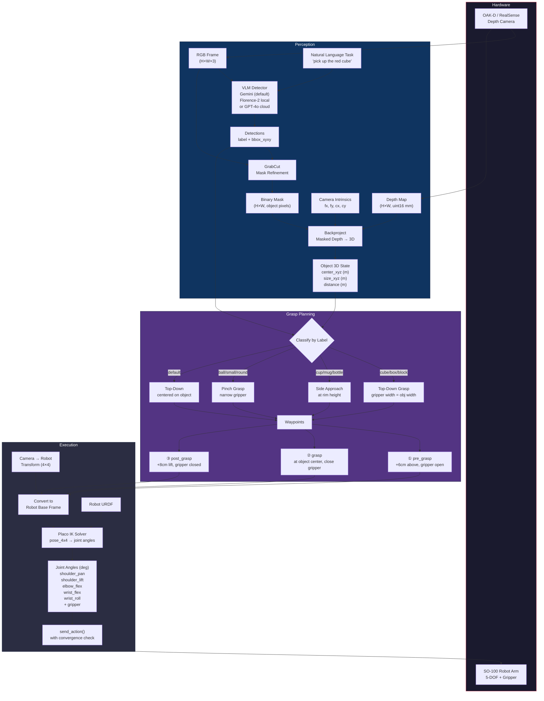
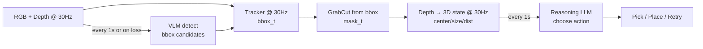

# Zero-Shot Manipulation Pipeline

## Architecture



## Revised real-time loop (fast tracking, slow VLM + reasoning)

For a responsive setup (like the single-front-camera tabletop scene in your screenshot), run a **fast loop** that tracks an object continuously and only calls the expensive models on a timer.

- **Fast loop (camera FPS, e.g. 30Hz)**:
  - Track the current object bounding box in RGB (OpenCV CSRT/KCF)
  - Derive a mask from the tracked box (GrabCut) and compute 3D state from depth
  - Smooth the 3D state (optional)
- **Slow loop (e.g. every 1s)**:
  - Run the VLM detector to (re)acquire bounding boxes when tracking is lost/drifting
  - Run the reasoning LLM to choose actions from a compact scene summary

This reduces latency and avoids “box drift” caused by running the VLM on every frame.



## Usage

```bash
pip install -e ".[perception,oakd]"
```

### Test perception only (no robot needed)

```bash
export GEMINI_API_KEY="your-key-here"   # from https://aistudio.google.com/
python -m lerobot.scripts.test_perception_pipeline --query "a red cube and a blue cup"
```

### Full autonomous manipulation

```bash
# Gemini (default)
lerobot-auto-manipulate \
    --robot.type=so100_follower \
    --robot.port=/dev/ttyUSB0 \
    --robot.cameras='{"front": {"type": "oakd", "fps": 30, "width": 640, "height": 480, "use_depth": true}}' \
    --task="pick up the red cube" \
    --urdf=./SO101/so101.urdf \
    --vlm.backend=gemini \
    --camera_to_robot_tf="0,0,0.4,0,0,0"

# Local Florence-2 (no API key needed, runs on GPU)
lerobot-auto-manipulate \
    --vlm.backend=local \
    --task="pick up the red cube" \
    --urdf=./SO101/so101.urdf \
    ...
```

### Agentic flow (stereo + VLM + LLM reasoning)

Use the **reasoning agent** when you want the system to *choose* among multiple detections (e.g. “pick the red cube” when both a red and a blue cube are visible), or to reason and retry/fail instead of always picking the first match.

Flow: **Observe** (stereo RGB + depth → VLM detections → 3D state per object) → **Reason** (LLM sees task + scene summary and outputs a structured action) → **Act** (pick by index, place, done, fail, or retry).

```bash
export GEMINI_API_KEY="your-key"
lerobot-agentic-manipulate \
    --robot.type=so100_follower \
    --robot.cameras='{"front": {"type": "oakd", "fps": 30, "width": 640, "height": 480, "use_depth": true}}' \
    --task="pick up the red cube" \
    --urdf=./SO101/so101.urdf \
    --vlm.backend=gemini \
    --camera_to_robot_tf="0,0,0.4,0,0,0" \
    --agent.model=gemini-2.5-flash
```

Optional: use a different LLM for reasoning (e.g. OpenAI) with `--agent.use_gemini=false`, `--agent.model=gpt-4o`, and `OPENAI_API_KEY` set.

Python API for custom agentic loops:

```python
from lerobot.agent import ReasoningAgent, SceneObservation, build_scene_summary

agent = ReasoningAgent(model="gemini-2.5-flash", is_gemini=True)
scene = SceneObservation(objects=[...], task="pick the red cube")
action = agent.reason(scene)  # AgentAction(action="pick", object_index=0) etc.
```
