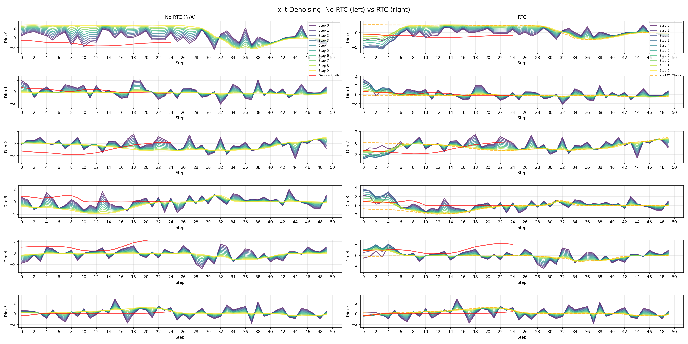

# Real-Time Chunking (RTC) Module

This module implements Real-Time Chunking and related adaptive inference techniques for robotics policies in LeRobot.

## Overview

Real-Time Chunking (RTC) addresses the challenge of real-time inference in action chunking policies by treating chunk generation as an inpainting problem. It strategically handles overlapping timesteps between action chunks using prefix attention mechanisms.

It is particularly effective for handling long-horizon inference in robotics policies.

## Integration with Policies

RTC can be integrated with any policy that supports flow mathicng for chunking:

- **SmolVLA**: Vision-language-action model with RTC support
- **Pi0**: Action prediction model with adaptive chunking
- **Pi05**: Action prediction model with adaptive chunking

## Original Implementation

This implementation is based on Physical Intelligence's Kinetix RTC:

- [Original RTC implementation](https://github.com/Physical-Intelligence/real-time-chunking-kinetix/blob/main/src/model.py#L214)
- [Kinetix GitHub Repository](https://github.com/Physical-Intelligence/real-time-chunking-kinetix)

## References

- [Real Time Chunking Paper](https://www.physicalintelligence.company/research/real_time_chunking)
- [Physical Intelligence Kinetix](https://github.com/Physical-Intelligence/real-time-chunking-kinetix)

## How to run

### Check with data from the dataset

```bash
uv run python examples/rtc/eval_dataset.py \
--policy.path=helper2424/smolvla_check_rtc_last3 \
--dataset.repo_id=helper2424/check_rtc \
--rtc.execution_horizon=8 \
--device=mps \
--seed=42
```

This script will evaluate RTC on a data from a dataset and save the results to a file, u can check the results in the `rtc_debug_output` directory.

The example output should look like this:


It shows how flow matching works with RTC and without it. The chart shows values of action predictions for each timestep. The colour shows the the generation progress. The blue ones - earlier timesteps, the yellow ones - later timesteps. The red line is the ground truth (previous action chunk).
