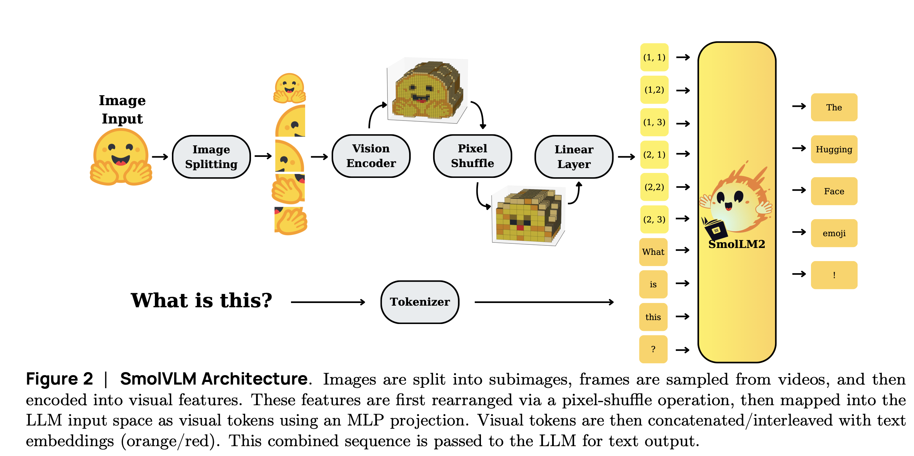

## SMOLANDFAST Policy Overview

This module defines a policy class (SMOLANDFASTPolicy) and its underlying model (SMOLANDFAST) that integrate with the LeRobot framework for learning and executing robot control policies from multimodal inputs (images, states, language). The implementation builds on top of pretrained vision–language models and the FAST tokenizer to generate continuous robot actions.

### SmolVLM2

Main component of the system is autoregressive VLM(SmolVLM2-256M-Video-Instruct) that consist of following parts:

* Processor
* Vision model
* Connector
* Text model



### Processor
Processor main responsibilities include:

* Image preprocessing: Resizes images into 512×512 resolution for vision encoder. Split images into multiple sub-images.
* Text tokenization: Converts task descriptions or other textual inputs into token sequences suitable for the model.
* Padding and masking: Generates appropriate pad masks for both image and text inputs, ensuring consistent sequence lengths during training and inference.

#### Image Splitting

In the original SmolVLM implementation, image splitting works as follows:

> "To balance efficiency and fidelity in multimodal learning, high-resolution images are not fed directly into the model as a single input. Instead, they are split into multiple sub-images, while also including a downsized global version of the original.
This strategy allows the model to preserve fine-grained details from sub-images without overwhelming the token budget, while the global view ensures overall scene context. The result is a more efficient encoding that maintains visual quality without incurring excessive computational costs."

However, this preprocessing step is computationally very expensive. Implementations such as PI0 and SmolVLA skip image splitting and process the original image directly.

By default, image splitting is disabled. To enable it, set `do_image_splitting = True` in the config. 

### Vision model

The vision model is a modified version of SigLIP. It processes images resized to 512×512 and divides them into 16×16 patches, resulting in 1024 tokens per image.

### Connector

The connector bridges the vision encoder outputs to the language model by reshaping and projecting image features into the text embedding space. Its main components are:
* Scale Factor (scale_factor): Controls how aggressively the image token sequence is reduced. The default value is 4, which can produce a very compact sequence.
* Pixel Shuffle: Rearranges the flattened image sequence to reduce spatial resolution while increasing embedding dimensionality, effectively combining multiple image tokens into one.
* Modality Projection: A linear layer that maps the reshaped image embeddings into the language model’s hidden dimension.

With the default scale_factor = 4, the effective token length is 1024/4**2 = 64 tokens per image

This is quite aggressive and can lead to a loss of fine-grained visual information.

To preserve more detail, the scale_factor can be reduced. By default I set `scale_factor = 1`, but this value could be changed in config. The connector no longer aggressively compresses the token sequence, retaining the full 1024 tokens per image for better fidelity at the cost of increased computation.

> ⚠️ **Warning:** If the scale_factor is changed from 4, the linear layer in the modality projection must be recreated, and the connector should be unfrozen.

### Text model
At the core of SmolVLM is a lightweight SmolLM2 language backbone, which processes both text tokens and projected visual tokens together in a unified sequence.
Key aspects:
* Joint Processing: Visual tokens from the connector are concatenated with text tokens, allowing the model to reason across modalities in the same attention space.
* Context Length: Extended beyond the typical 2k tokens, supporting 8k–16k contexts depending on the model size. This enables handling of higher-resolution images and longer multimodal inputs.
* Efficiency-Oriented: Designed to balance capacity with compactness, ensuring small models remain practical for edge deployment while still performing competitively on reasoning-heavy tasks.

## Train command

```
lerobot-train  --dataset.repo_id=lerobot/pusht --policy.type=smolandfast --env.type=pusht --policy.push_to_hub=False --wandb.enable=True --eval_freq=1000 --steps=30000 --batch_size=64 --log_freq=50 --eval.batch_size=32 --eval.n_episodes=64
```