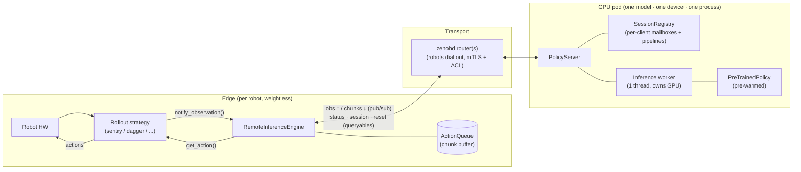
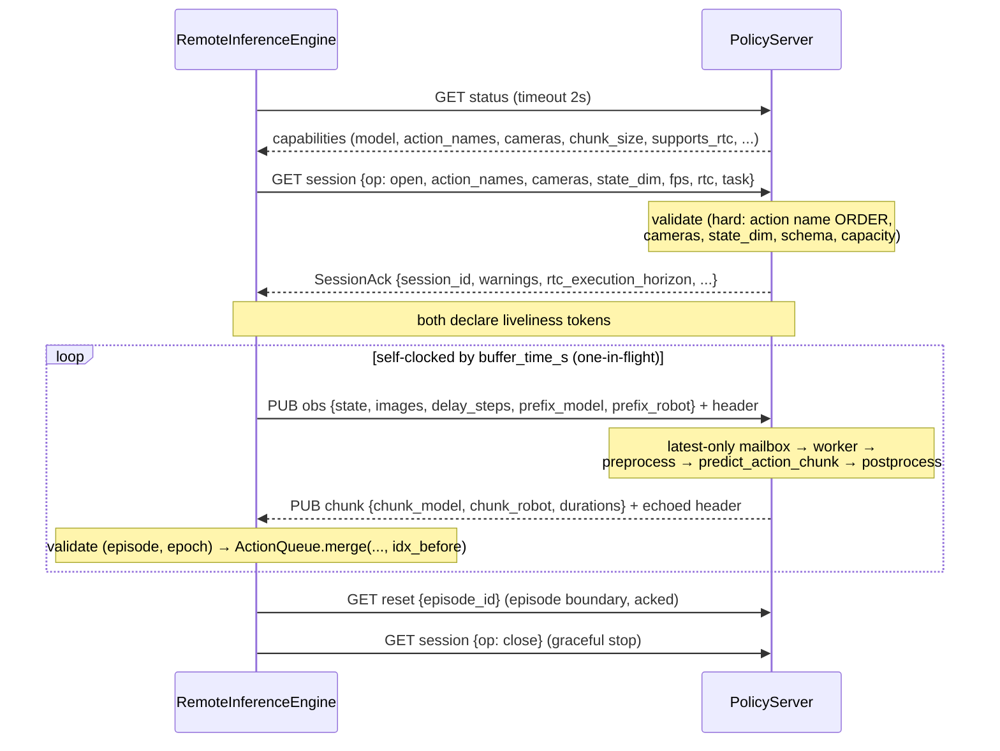
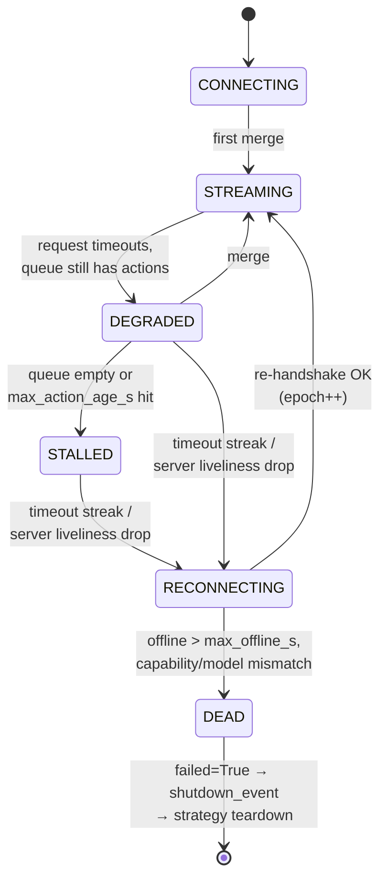

# Remote Inference Architecture

How `lerobot-policy-server` and `lerobot-rollout --inference.type=remote` decouple GPU-bound policy inference from high-frequency robot control over Zenoh.

This document explains the **internals** — the wire protocol, threading models, state machines, and safety invariants. For the user-facing guide (CLI quickstarts, deployment), see [`docs/source/remote_inference.mdx`](../../../docs/source/remote_inference.mdx).

## 1. The problem and the shape of the solution

Running a large policy (Pi0-class, ~150 ms inference) inside a 33 ms control loop doesn't work, and putting a GPU next to every robot doesn't scale. LeRobot already solved the _local_ version of this problem: `RTCInferenceEngine` runs inference in a background **thread** that fills a thread-safe `ActionQueue`, while the control loop pops one action per tick.

Remote inference is **that same architecture with the thread boundary replaced by a network boundary**:

```
local RTC:    control loop ──ActionQueue──  inference thread (same process, same GPU)
remote:       control loop ──ActionQueue──  network worker ══zenoh══ policy server (GPU, elsewhere)
```

Three design commitments follow from this:

- **The client is a backend, not a CLI.** `RemoteInferenceEngine` plugs into the existing `InferenceEngine` seam (`rollout/inference/base.py`), so every rollout strategy (base, sentry, highlight, dagger, episodic) gets network inference — including dataset recording, pause/resume, and safe teardown — without changing a line.
- **The client is weightless.** No policy weights, no policy processors on the edge. `--policy.path` resolves to a config-only `PreTrainedConfig` used for pre-flight validation and action ordering.
- **The server is stateless per request.** All chunk state (RTC prefixes, latency tracking, delay computation) lives client-side in the existing `ActionQueue`/`LatencyTracker`. The client ships prefixes + a delay hint with every observation, so a server crash loses zero control state.

## 2. Component map



One server process = one pre-warmed `(model, revision, dtype, device)` serving up to `max_sessions` robots. Scaling out = more pods; clients rejected with the current load retry another replica.

## 3. Where the network cut goes

The local RTC pipeline is split at the cheapest, most hardware-coupled point. Everything policy-coupled (resize, normalize, tokenize) runs server-side with the **canonical training-time processors**, so serve-time preprocessing is byte-identical to train-time:

```
robot obs (processed dict)
  → build_dataset_frame(...)                          CLIENT   cheap, hardware-coupled
  → rename_map applied to keys                        CLIENT   wire format = canonical policy keys
══════════════════════ network (msgpack + JPEG) ══════════════════════
  → prepare_observation_for_inference(...)            SERVER   tensors, batch dim, device
  → per-session preprocessor(...)                     SERVER   stateful within the request
  → policy.predict_action_chunk(obs, delay, prefix)   SERVER   pure for allowlisted policies
  → per-session postprocessor(...)                    SERVER   reads state cached at preprocess
══════════════════════ network ══════════════════════
  → ActionQueue.merge(original, processed, delay, idx_before)   CLIENT
```

The reply carries **both** the model-space (`chunk_model`) and robot-space (`chunk_robot`) chunks because `ActionQueue.merge` needs both, and the next request's relative-action prefix re-anchoring needs the robot-space tail.

## 4. Wire protocol

### 4.1 Key-expression schema (Zenoh)

```
@lerobot/<model_slug>/<revision>/<task_slug>/<client_uuid>/obs       client → server   pub/sub
@lerobot/<model_slug>/<revision>/<task_slug>/<client_uuid>/action    server → client   pub/sub
@lerobot/<model_slug>/<revision>/<task_slug>/status                  queryable (capabilities)
@lerobot/<model_slug>/<revision>/<task_slug>/session                 queryable (open / close)
@lerobot/<model_slug>/<revision>/<task_slug>/<client_uuid>/reset     queryable (episode boundary)
@lerobot/<model_slug>/<revision>/<task_slug>/<client_uuid>/alive     liveliness token (client)
@lerobot/<model_slug>/<revision>/<task_slug>/server/alive            liveliness token (server)
```

`@lerobot` is a **verbatim chunk**: wildcards never match it, so third-party `**` subscribers on a shared router cannot scrape the tree. User-supplied segments are sanitized (`sanitize_key_segment`), and the server subscribes with single-depth wildcards only (`.../*/obs`, never `**`).

Data plane = pub/sub (a late chunk is still usable; a timed-out query reply is not). Control plane = queryables with explicit timeouts (the rmw_zenoh pattern). QoS (`zenoh_utils.py`): actions are `RELIABLE + congestion DROP + express + INTERACTIVE_HIGH` — **never BLOCK**, so one dead robot uplink can never stall the server's publish path; a dropped chunk is recoverable because the client buffer keeps the robot moving.

### 4.2 Messages

Every data-plane message carries a **packed little-endian attachment header** (27 bytes, parsed without touching the body):

| field            | type | meaning                                                   |
| ---------------- | ---- | --------------------------------------------------------- |
| `schema_version` | u16  | negotiated at session open; additive-only body evolution  |
| `msg_type`       | u8   | OBS / CHUNK / EVENT                                       |
| `seq_id`         | u64  | per-session monotonic; echoed in the chunk                |
| `episode_id`     | u32  | bumped by `reset()`                                       |
| `client_mono_ns` | i64  | client monotonic clock — **opaque to the server, echoed** |
| `session_epoch`  | u32  | bumped per (re)connect; stale-epoch chunks dropped        |

Bodies are msgpack (`codec.py`): tensors as raw little-endian bytes + dtype + shape, images JPEG (RGB convention enforced inside the codec; `jpeg_quality=0` = raw). No pickle anywhere — nothing on the wire can carry code.

**Clock iron rule:** wall-clock instants never cross machines. The client computes RTT from its own monotonic clock via the echoed `client_mono_ns`; the server reports only **durations** (`queue_wait_ms`, `inference_ms`).

### 4.3 Session lifecycle



The **action-name order check is a hard reject**: it is the contract that maps chunk columns to motors. A mismatch means wrong-joint commands, so the session never opens.

## 5. The client: `RemoteInferenceEngine`

File: `src/lerobot/rollout/inference/remote.py`, registered as `--inference.type=remote` (`RemoteInferenceConfig` in `factory.py`).

### 5.1 Threading model

| thread                 | role                                                                                                                                                                                           |
| ---------------------- | ---------------------------------------------------------------------------------------------------------------------------------------------------------------------------------------------- |
| main (strategy loop)   | `notify_observation()` → latest-only slot; `get_action()` → `ActionQueue.get()` + staleness check + fallback. **Never any I/O.**                                                               |
| network worker (1)     | gate on `buffer_time_s` → snapshot `(seq, episode, epoch)` then `idx_before` + RTC prefixes → publish obs → await chunk (timeout) → revalidate → merge. Owns the state machine and reconnects. |
| zenoh callback threads | deposit-only: chunk → bounded queue; server liveliness → event.                                                                                                                                |

**One-in-flight is a correctness requirement, not a tuning choice.** `merge(..., idx_before)` validates against the consumption index snapshotted at send time; two in-flight requests would carry conflicting snapshots and corrupt both RTC-replace and append modes. The worker therefore publishes one observation, waits for its chunk (or timeout), then sends the next. A late chunk is accepted only if it answers the latest outstanding `seq_id` _and_ the current `(episode, epoch)`.

### 5.2 The request cycle

```
queue playback ≤ buffer_time_s?              (self-clocking: ~1–4 Hz, not the 30 Hz control rate)
  ├─ snapshot (seq, episode, epoch)
  ├─ snapshot idx_before, prefix_model = queue.get_left_over()[:H],
  │           prefix_robot = queue.get_processed_left_over()[:H]
  ├─ revalidate (episode, epoch) unchanged      ← a reset racing the snapshot skips the cycle
  ├─ delay_steps = ceil(LatencyTracker.max() / dt)
  ├─ publish obs + header
  ├─ await chunk (request_timeout_s)
  ├─ revalidate (episode, epoch) under _anchor_lock   ← a stale chunk can never survive a reset
  └─ merge(chunk_model, chunk_robot, ceil(measured_latency/dt), idx_before); update anchor
```

Because the `LatencyTracker` samples are full network-inclusive cycle times, RTT compensation falls out for free — the same `delay`-trimming machinery local RTC uses absorbs network latency as just more delay.

### 5.3 Fail-safe state machine



- **DEGRADED**: the chunk buffer _is_ the fault tolerance — 1–3 s of buffered actions makes network blips and clean server drains invisible to the robot.
- **Staleness bound** (`max_action_age_s`): `get_action` refuses any action whose source observation is too old, bounding open-loop execution after a stall. Then the **fallback ladder** applies: `hold` (return `None`; the robot holds), `repeat_last`, or `zero` (the safe stop for velocity-controlled robots).
- **Watchdog layering**: per-request timeout (catches a _hung-but-connected_ server) → server liveliness token (catches a dead server/router) → staleness bound (the robot-side invariant that holds regardless of why data stopped).
- **DEAD** is reserved for hard failures: offline beyond `max_offline_s` with no successful merge (a server that handshakes but never delivers chunks still runs out of budget), or a contract violation on reconnect (model/revision changed, RTC capability flipped — never execute wrong-model chunks). It triggers the exact mechanism local RTC uses: `failed=True` + the global `shutdown_event`, so the existing teardown (return-to-initial-pose) runs unchanged.
- **Pause/resume** (DAgger): `pause()` stops publishing; the queue stays intact. A pause during an outage freezes the offline budget so a human correction can never be aborted by `max_offline_s`.

### 5.4 Episode boundaries

`reset()` (control thread) atomically — under the same lock the merge path takes — clears the `ActionQueue`, nulls the staleness anchor, bumps `episode_id`, and invalidates the observation slot (the previous episode's final frame must not seed the new one). The worker sends an acked `reset` query, and the next observation header carries the new `episode_id` anyway — so a lost ack costs nothing (the server is stateless per request).

## 6. The server: `PolicyServer`

Files: `src/lerobot/policy_server/`. Entry point: `lerobot-policy-server --manifest server.yaml` (draccus dataclasses in `manifest.py`).

### 6.1 Concurrency model

zenoh-python is thread-based (no asyncio); callbacks must be deposit-only:

```
zenoh subscriber (.../*/obs)            inference worker (1 thread, owns GPU)
  deposit-only callback:                  loop:
  session.deposit(header, body)   ──►       scheduler picks next session with pending obs
  (per-client latest-only mailbox)          decode → episode-boundary check
                                            preprocess → predict_action_chunk(delay, prefix)
control queryables (status /                postprocess → encode
  session / reset): validate,               publisher.put(.../<uuid>/action)
  mutate registry, reply inline

liveliness subscriber (.../*/alive): mark sessions for GC on token DELETE
```

- **Latest-only mailboxes**: the newest observation wins; superseded requests are counted and reported in the next reply (`superseded_seqs`), so drops are visible client-side. The client decides _when_ to request; the server never second-guesses observation content.
- **Single inference worker** + round-robin over ready sessions: every ready session gets exactly one inference per cycle — starvation is structurally impossible. Overload degrades into longer cycle times → larger (but correct) client `delay_steps` → eventually the client staleness bound trips and the robot holds. Safe by construction.
- The `Scheduler` seam (`scheduler.py`) exists so cross-session micro-batching can land later without redesign (blocked today on `predict_action_chunk` taking a _scalar_ `inference_delay`).
- `_inference_lock` serializes the worker's predict path against episode resets arriving on queryable threads (in exclusive mode a `policy.reset()` mid-predict would corrupt the in-flight request).

### 6.2 Multi-tenancy: engineered, not assumed

Sharing one policy instance across sessions is only safe when `predict_action_chunk` touches no cross-request instance state. That property is **verified per family and encoded as a registry** (`validation.py`) — never inferred:

| class           | policies                                          | mode        | why                                                                                 |
| --------------- | ------------------------------------------------- | ----------- | ----------------------------------------------------------------------------------- |
| chunk-stateless | `act`, `pi0`, `pi05`, `smolvla` (`n_obs_steps=1`) | `shared`    | chunk call is pure (smolvla overwrites its 1-deep queue with the request's own obs) |
| chunk-stateful  | `diffusion` (and `smolvla` with `n_obs_steps>1`)  | `exclusive` | chunk call reads `select_action`-fed `_queues` → server populates them per request  |
| no chunk API    | `sac`, `tdmpc`, ... (no `predict_action_chunk`)   | refused     | nothing to serve                                                                    |
| unverified      | any other chunk-API policy                        | `exclusive` | a manifest can force `exclusive`, but never `shared` for an unverified policy       |

The real multi-tenancy hazard is **processor state**, not just policy purity: `RelativeActionsProcessorStep` caches `_last_state` at preprocess and the postprocessor reads it back. The server therefore builds a **fresh pre/post pipeline pair per session** — two robots at different joint positions can never cross-contaminate each other's action conversions. `policy.reset()` is **never** called in shared mode (it is global to the shared instance).

### 6.3 Statelessness and the RTC prefix

The server holds no cross-request control state. Each observation ships everything inference needs:

- `inference_delay_steps` — computed client-side from network-inclusive latency.
- `prefix_model` — the unexecuted tail of the previous chunk in model space (feeds `prev_chunk_left_over`).
- `prefix_robot` — the same tail in robot space. For relative-action policies the server **re-anchors** it against the state cached by _this request's_ preprocess (`reanchor_relative_rtc_prefix`, mirroring `rtc.py`), so the prefix is expressed relative to where the robot actually is now.

Consequences: reconnects are trivial, horizontal scaling is trivial, and a `kill -9` on the server loses nothing the client can't re-send.

### 6.4 Episode and reconnect hygiene

- Fresh sessions start at the `episode_id = -1` sentinel: the **first** observation of any session always triggers the boundary branch (pipelines reset; exclusive policies `reset()`), so a mid-episode reconnect can never inherit stale state.
- Session replacement is identity-checked (`SessionRegistry.remove(expected=...)`): a GC sweep that snapshotted an old session can never tear down its just-handshaked replacement.
- Liveliness GC double-checks with an explicit liveliness `get` before closing: the token key is per-client (not per-epoch), so a _late_ DELETE from a previous incarnation must not kill the live session.
- Drain (`SIGTERM`): drop the liveliness token first (clients ride their buffers), finish the in-flight inference, undeclare the control surface, then close. Clients reconnect to another replica invisibly.

## 7. Latency budget (why the transport is never the bottleneck)

| stage                          | LAN           | WAN (50 ms RTT) |
| ------------------------------ | ------------- | --------------- |
| JPEG encode + serialize (edge) | 2–9 ms        | 2–9 ms          |
| uplink                         | ~2 ms         | ~54 ms          |
| decode + canonical preprocess  | 4–10 ms       | 4–10 ms         |
| **inference**                  | **15–150 ms** | **15–150 ms**   |
| postprocess + downlink + merge | ~2 ms         | ~27 ms          |

Inference dominates (60–85% on LAN). At 30 fps a WAN deployment lands `delay_steps ≈ 4–8`, comfortably inside RTC execution horizons: WAN degrades smoothness parameters, never correctness. Requests are self-clocked by `buffer_time_s` to ~1–4 Hz per robot, so 300 robots cost ~0.3–10 Mbps each.

Capacity per GPU: `N_max ≈ 0.8 / (request_rate × inference_time)` → ~40 ACT-class or ~5 Pi0-class clients; `max_sessions` enforces it at session open (rejected clients receive the current load and retry another replica).

## 8. Observability & reproducibility

The contract is **fully logged + replayable**, not "deterministic" (no seed controls hardware or network jitter):

- **Client = source of truth**: recording strategies persist observations + executed actions as usual; the engine tracks `(session_id, seq_id, episode_id)` and per-cycle stats.
- **Server**: one JSON audit line per request on the `lerobot.policy_server.audit` logger — `{session_id, client_uuid, seq_id, episode_id, queue_wait_ms, inference_ms, superseded, outcome}` — plus `/healthz` and Prometheus-style `/metrics`, and an optional bounded raw request/response capture (`debug.capture_dir`) for byte-exact offline replay.
- Every hop shares `(session_id, seq_id)`, so joining a robot-side stutter to a server-side cause is mechanical.

## 9. File map

| path                               | contents                                                                                             |
| ---------------------------------- | ---------------------------------------------------------------------------------------------------- |
| `policy_server/schema.py`          | wire messages, packed header, key-expression schema + sanitizer                                      |
| `policy_server/codec.py`           | msgpack bodies, tensor codec (LE bytes), JPEG image codec (RGB convention)                           |
| `policy_server/manifest.py`        | draccus config: model, zenoh endpoints/TLS, serving mode, capacity, RTC, health                      |
| `policy_server/validation.py`      | serving-mode registry + session-open capability matrix                                               |
| `policy_server/session.py`         | per-client `Session` (pipelines, latest-only mailbox, stats) + identity-safe registry                |
| `policy_server/scheduler.py`       | `Scheduler` seam; `RoundRobinScheduler`                                                              |
| `policy_server/zenoh_utils.py`     | config builder, QoS profiles, lazy import with install hint                                          |
| `policy_server/server.py`          | `PolicyServer`: zenoh surface, inference worker, GC, warmup, drain, health/metrics                   |
| `rollout/inference/remote.py`      | `RemoteInferenceEngine` (the edge client)                                                            |
| `rollout/inference/factory.py`     | `RemoteInferenceConfig`, `FallbackMode`, factory dispatch                                            |
| `scripts/lerobot_policy_server.py` | console entry point (`--manifest` → draccus `--config_path`)                                         |
| `tests/policy_server/`             | codec/schema/validation/scheduler/session units, server logic, zenoh loopback + chaos, golden parity |

The golden parity test (`tests/policy_server/test_golden_parity.py`) is the standing contract: the remote request path (encode → decode → `run_inference_request` → encode → decode → merge) must produce **byte-identical** action queues to the local RTC compute path on identical inputs.
