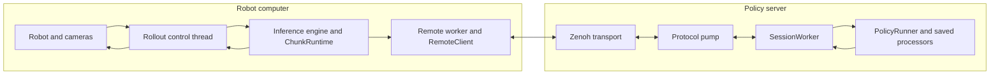
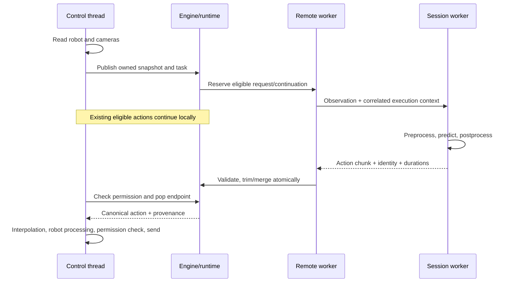
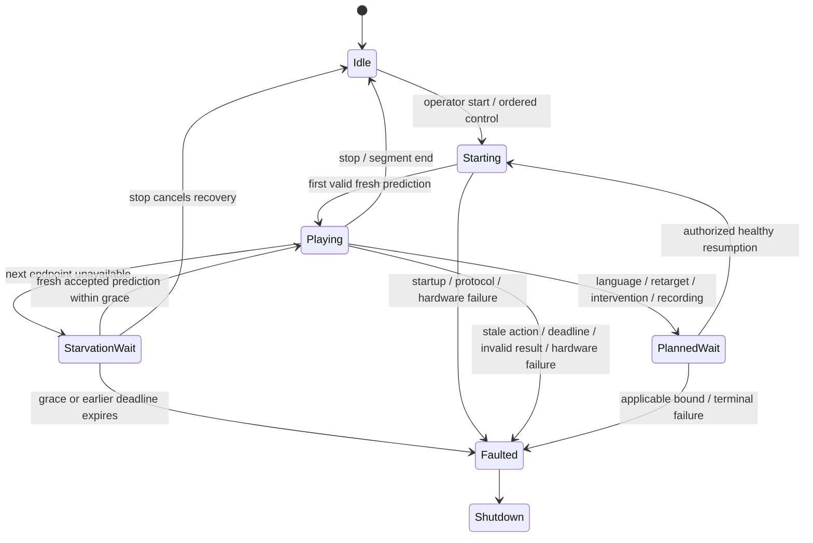

# Asynchronous inference: implementation and design reference

This is the engineering reference for asynchronous inference in LeRobot: its behavior, ownership boundaries, data contracts and design tradeoffs. The [future work](#14-future-work) section is the maintained checklist for remaining validation and potential extensions; it does not describe implemented behavior.

For installation, commands and tuning, start with the [user guide](../../../docs/source/remote_inference.mdx). For implementation details, follow the source links in each section. Software coverage, real-model execution and physical acceptance are distinct; see [validation](#13-validation-and-current-limits).

## 1. Product contract

A robot computer captures observations, dispatches motor commands, handles operator interaction and records data. A policy server loads one checkpoint and its saved processors, then predicts actions for one admitted client. Inference can overlap execution of an earlier chunk. The server may run in another process on the same host or on a reachable remote host.

The objectives are uninterrupted local control while inference runs, explicit policy/robot compatibility before motion, bounded waiting and failure, and useful operator interaction. It is not a hard-real-time controller: camera, actuator and local processing calls can still delay a control tick. Neither transport delivery nor a successful model call alone authorizes motion.

The current system supports ordinary chunks, optional alignment/blending, and guided or trained RTC when the checkpoint supports the requested mode. Language generation uses the same serialized model worker and an immediate planned local wait. It does not overlap buffered policy motion today.

One server process owns one deployment/model and admits one session. Sequential clients can acquire it after cleanup. Concurrent model sharing, batching, automatic reconnection, history-aware policy execution, model selection and public multi-tenant hosting remain outside this implementation.

### Local versus remote inference

| Backend  | Model/processor owner            | Transport | Execution                                                                             |
| -------- | -------------------------------- | --------- | ------------------------------------------------------------------------------------- |
| `sync`   | Rollout control thread           | None      | Existing synchronous policy path, including the policy's own `select_action` behavior |
| `rtc`    | Local inference worker           | None      | Asynchronous RTC through shared prediction/execution components                       |
| `remote` | Server's exclusive policy worker | Zenoh     | Chunk, aligned/blended chunk, guided RTC or trained RTC                               |

A same-host server/client pair uses the remote backend. Local RTC means the separate, transport-free backend. Sync remains a distinct path; remote support cannot be inferred solely from a successful synchronous rollout.

## 2. Ownership and package boundaries



| Package/component                                     | Responsibility                                                                                                          | Must not own                                               |
| ----------------------------------------------------- | ----------------------------------------------------------------------------------------------------------------------- | ---------------------------------------------------------- |
| [`inference`](../inference/__init__.py)               | Engine interface, configuration/local factory, local engines, immutable runtime contracts, chunk runtime and prediction | Transport routing policy or rollout strategy orchestration |
| [`remote_inference`](../remote_inference/__init__.py) | Remote engine, wire protocol/codec, compatibility/admission, client exchanges, server sessions and model ownership      | Motor dispatch or robot-specific action interpretation     |
| [`rollout`](../rollout/__init__.py)                   | Setup, strategies/controller, capture and dispatch, intervention, recording and teardown                                | Remote model loading on the robot client                   |
| [`transport.zenoh`](../transport/zenoh.py)            | Explicit connectivity, bounded pub/sub, queries and liveliness                                                          | Policy state, robot safety decisions or action eligibility |
| Policies/processors                                   | Trained input preparation, prediction and canonical output semantics                                                    | Network/session scheduling                                 |

Public cross-package symbols are explicitly exported through package APIs. Policy declarations belong to `policies`; shared execution belongs to `inference`; the remote engine and serving belong to `remote_inference`. This dependency direction avoids import cycles without dynamic initializer exports. Optional dependencies are guarded in implementation modules and checked when used. The existing transport submodule import convention remains supported.

`InferenceRobot` is a structural typing protocol: it describes the action metadata, observation capture time and hold capabilities engines consume, without importing the rollout's concrete `ThreadSafeRobot`. It is neither another hardware implementation nor a class users must inherit. Context construction has one public entry point, with separate local-model and remote-descriptor preparation; common helpers resolve robot processors, connect hardware, aggregate recording features and clean up failed setup.

### Threads and locks

The control thread captures observations and asks for the next action or interpolation step. It never waits for a model or network round trip. The remote worker performs encoding/exchanges and acceptance; local RTC instead owns a policy worker. The server's protocol pump admits bounded work to `SessionWorker`, whose one execution thread owns runtime policy/processor calls, including reset and language. Loading, warmup and the initial full reset run on the startup thread before that handoff.

The engine's coordination lock protects observations and control/hold transitions. Task/query locks order instruction changes and language intent. `ChunkRuntime` owns the atomic request/queue/generation transition; `ActionQueue` provides atomic snapshots and replacement. Retargeting and result acceptance must have one order. A worker can replace eligible future actions, but only control-thread consumption advances the commitment cursor.

Cancellation ends local interest in work. It does **not** interrupt a GPU call or free policy ownership. Ordered invalidation/reset acknowledgment establishes when the server worker has actually applied a transition.

## 3. Deployment startup and admission

The server entry point is [`lerobot_policy_server.py`](../scripts/lerobot_policy_server.py). The operator supplies the checkpoint/revision/device, canonical observation/action schemas, units/semantics, supported modes and timing limits. Connecting clients cannot choose a model to download or alter trained policy parameters.

Startup loads the policy and saved processors, validates declarations and runs warmup before advertising readiness. Warmup establishes actual prediction compatibility, including model action width. Artifact identity describes the effective serving artifact/configuration; deployment name is an address, not artifact identity. Software diagnostics contain the package version, without runtime Git inspection.

The client obtains a descriptor, selects exactly one ready instance (or an explicit `instance`), and checks protocol/capability/schema compatibility. It validates feature names, order, shapes, modality, semantics, action interval, requested mode, model/canonical layout, blending selection and optional expected artifact. Remote rollout automatically configures position hold on a supported robot. The generic driver capability defaults to false; unsupported robots fail before motion. There is no separate `hold_mode` configuration option.

Admission grants a session scoped to that server boot. An acknowledged generation-control exchange also establishes session endpoint readiness before data publication. Rollout setup requires compatibility and ownership before policy motion. Compatibility is not an equality test on the package version: the protocol, execution contract and schema are authoritative; package versions are diagnostics. No transparent mode downgrade occurs.

See [`RemoteClient.connect/admit`](../remote_inference/client.py), [`SessionWorker`](../remote_inference/server.py) and [`build_remote_rollout_context`](../rollout/remote_context.py).

## 4. One observation-to-action cycle



1. `ThreadSafeRobot.get_observation` timestamps the start of the read with the client's monotonic clock. Camera waits therefore contribute to source age. `ObservationSnapshot` copies arrays into immutable storage; recycled camera buffers cannot mutate a queued request.
2. The control thread records the task/version. Aligned snapshots also capture the action commitment cursor and execution generation before another endpoint can be popped.
3. The runtime checks active/held/fault state, pending work, playback need and snapshot eligibility. It reserves one `ChunkRequest` containing the observation, request identity, atomic continuation snapshot and local submission time.
4. The remote worker encodes and sends the request. `SessionWorker` validates ownership, generation and request context before the exclusive runner performs inference.
5. The runner prepares a batch, runs the saved preprocessing/policy/postprocessing and returns canonical actions. RTC also carries the corresponding model-space actions. Server durations aid diagnostics; they are not timestamps used to align remote clocks.
6. The client validates reply identity and payload. The runtime independently checks request/generation/task, timing, finiteness and shape before updating the queue.
7. The control thread checks permission before consuming and sending, including interpolation ticks. A queue pop commits an endpoint: a later response cannot rewrite that in-progress endpoint. Recording uses the action's instruction identity, which can differ from the newly requested task.

No new reply may revive a terminal fault or a superseded session/generation. Retained valid playback and accepted future replacement are separate from a packet arriving.

Observation copying establishes ownership across threads, not distinct copies for encoding and transmission. Local RTC also deep-copies its observation before background inference, despite having no transport. `dataclasses.replace` currently reconstructs remote snapshots when anchoring or rebinding task metadata, which copies their arrays again. This is a possible optimization after measuring cost, not an additional correctness requirement. Keep original capture/task/generation provenance and immutable ownership; do not remove a copy merely because the producer currently returns fresh buffers.

## 5. Data, policy and processor contracts

### Canonical wire values

`FeatureSpec` describes data, not a captured value: name, shape, dtype, modality, ordered components and semantic convention. A six-joint state needs agreed order/units in addition to shape `(6,)`; a front RGB frame might have shape `(480, 640, 3)` and dtype `uint8`. Images are explicitly RGB HWC; arbitrary tensors are never inferred to be images. Action names/order/units describe canonical postprocessor output before robot-side processing and interpolation.

The default policy contract requires current-observation inference and a truthful `predict_action_chunk` path. It bypasses the private per-step queues that `select_action` may maintain. Checkpoint history, temporal ensembling or executed-action feedback cannot be emulated by merely taking the latest frame. Policy-specific declarations may expose existing preparation, masking/resizing or horizon behavior; they cannot remove trained semantics to satisfy admission.

A policy's prediction length and intended ordinary execution slice are distinct. `ChunkPolicySpec` declares both, supported modes, whether the current observation suffices and whether session state is retained. `PolicyCapabilities` combines that declaration with the deployment's feature schema, action interval and language/RTC settings for admission. A server-owned plain-chunk slice may shorten execution but must fit the prediction and is unavailable for RTC deployments. Actual returned horizons must match declarations.

### Model versus canonical coordinates

[`predict_chunk`](../inference/prediction.py) shares post-preprocessing prediction between local RTC and the server runner:

- Validate finite floating `[1, prediction_steps, model_width]` output. Retain the first validated model width across subsequent calls.
- Clone model coordinates **before** postprocessing can mutate them.
- Validate canonical `[1, prediction_steps, canonical_width]` output independently. Canonical width may be smaller because the saved postprocessor crops padding.
- Plain mode returns the declared execution slice. RTC keeps its supported prediction/continuation extent.

RTC leftovers are model inputs, not canonical motor commands. Relative-action RTC must reanchor the canonical continuation against the current raw state through the corresponding relative/normalization transforms. The current relative-RTC path requires matching model/canonical widths; unsupported mappings need a separately validated adapter. Prefix padding repeats the last model target: zeros in normalized coordinates could decode to the dataset mean.

Guided RTC runs under `no_grad` with ordinary tensors, allowing the policy's local guidance calculation to enable gradients. Inference-mode tensors would break that correction path. Ordinary chunk and trained inference can use inference mode. Owners retain preprocessing and policy lifetime; the shared predictor owns neither queues nor transport.

### Stateful processors and text

Saved normalization, relative/absolute action pairing and camera preparation remain authoritative. Action processors belong to the serialized owner. Language gets an isolated processor pair, copied together so the absolute-action step points to its own relative-state anchor. Both pairs still share one serialized policy owner. Full reset clears policy and processor state; motion invalidation drops queued action continuation while preserving intended planner context.

See [`PolicyRunner`](../inference/policy_runner.py), [`PreTrainedPolicy`](../policies/pretrained.py) and the policy-specific contract tests. Conformance is checkpoint/configuration-specific; a family name, successful download or warmup is not task validation.

## 6. Playback, alignment, blending and RTC

### Append

Plain append executes the current chunk and then its accepted successor. At most one request or accepted successor is prefetched beyond current execution; the runtime does not build an unbounded chain of old-observation chunks. Prefetch avoids an inference pause, but a fast response may still wait behind old playback. This explains why append can visibly return toward a position predicted from an earlier observation.

### Alignment

Alignment uses sequence progress, not a synchronized wall clock. Let `c_obs` be the commitment cursor captured with an observation and `c_now` the cursor when its reply is accepted. The first `c_now - c_obs` predicted endpoints are no longer eligible. The runtime trims them and atomically replaces only the future queue.

The currently committed/interpolating endpoint cannot be replaced. An entirely consumed suffix is rejected without destroying an otherwise valid existing future. Acceptance-time snapshot checks prevent a stale cursor/generation from replacing newer work. Fresh advanced captures and one-request-in-flight gates prevent unlimited requests from an unchanged snapshot.

Alignment establishes which temporal positions remain usable. It does not prove the robot physically matches the predicted state at those positions, or that repeatedly replacing a policy's early trajectory improves task success.

### Blending

Optional blending applies only to aligned plain chunks and explicitly selected continuous canonical components approved by the server. For matching future positions in the overlap window:

```text
blended = q_t + b_w * (i_t - q_t)
```

`q_t` is the queued target and `i_t` the incoming target for the same future slot. `b_w` (`blend_weight`) weights the **incoming** prediction. One means replacement. `blend_steps=0` disables blending. Other coordinates take the incoming values; gripper channels must not be selected merely because they are numeric. Relative-to-absolute processing occurs before blending.

A future endpoint may be blended again before it is committed. Provenance retains a bounded summary, including the oldest contributor's capture time, count and digest. Repeated blending cannot make old data fresh. Contributors from incompatible context or beyond source-age bounds are excluded.

### RTC

Guided/trained RTC conditions prediction on an ongoing model-space continuation rather than averaging independently produced canonical chunks. Requested modes must be supported and agree with deployment RTC configuration. The delay estimate uses complete observed turnaround and available continuation; trained mode also enforces checkpoint training-delay/horizon bounds. Acceptance considers both elapsed inference steps and actual commitment progress. Persistent out-of-range local trained predictions fault rather than retry indefinitely.

RTC and ordinary aligned blending remain different execution mechanisms. A plain chunk checkpoint does not gain RTC by enabling a CLI mode, and extra interpolation does not add policy feedback.

## 7. Timing and the freshness/continuity tradeoff

Client motion eligibility deadlines and source-age checks use client monotonic time. The server treats client capture timestamps as opaque correlation data and independently bounds queue/execution work with its own monotonic clock. No clock synchronization is needed. Sequence/cursor identity handles commitment; time bounds handle lateness/freshness. Both are necessary.

| Quantity             | Meaning                                                                                                          |
| -------------------- | ---------------------------------------------------------------------------------------------------------------- |
| Action interval      | Negotiated policy interval, `1 / action_fps`                                                                     |
| Playback             | Queued endpoints × action interval; diagnostic estimates exclude the already committed endpoint                  |
| Turnaround           | Client request submission through response processing/acceptance, including encoding/network/model/decoding work |
| Source age           | Current local time minus original observation capture bound, checked through dispatch/interpolation              |
| Request deadline     | Absolute time bound for an outstanding action operation                                                          |
| Startup deadline     | Time allowed to establish motion after the applicable startup/control transition                                 |
| Starvation grace     | Fixed additional bounded waiting state after ongoing playback needs an unavailable endpoint                      |
| Server absence grace | Ownership cleanup window for an absent client; unrelated to client motion recovery                               |

For remote plain chunks, the effective request threshold is:

```text
effective_refill = max(refill_seconds, recent_max_turnaround + action_interval)
```

The first accepted turnaround supplies an initial floor until steady-state samples exist; the window then holds up to 100 steady-state turnarounds. Request when playback is at or below the threshold and other gates permit it. Aligned retargeting may bypass the playback threshold, but not freshness, ownership or pending-operation gates. Local RTC uses its own configured queue threshold with shared runtime behavior; it is not configured through remote `refill_seconds`.

Earlier requests create latency headroom while interrupting/replacing trajectories more often or allowing append results to age. Later requests allow more follow-through but less margin. Stronger blending may smooth motion while weakening task progress. Begin with useful synchronous-like follow-through and sufficient measured margin, then increase replanning only if the task benefits.

`N` policy steps at rate `f` represent `N/f` seconds. Interpolation creates finer motor commands at the corresponding faster rate; it does not extend that policy horizon. For aligned/RTC use the remaining horizon **after** consumed steps are trimmed. No timeout or refill value can make persistently insufficient compute throughput meet that horizon.

## 8. Waiting, recovery and terminal faults



This diagram describes observable states, not a single enum in the implementation. A fault latch cannot be cleared by reset or a late response.

### What a local wait commands

`ThreadSafeRobot` retains the complete finite position target **returned by the driver after a send**, including interpolation/clipping and gripper values. Waiting refreshes that target without camera reads or policy inference. Before any applied command, it falls back to the latest cached, validated measured pose. It never substitutes the unverified requested command for an invalid driver return.

Target retention may still allow the robot to settle toward that target; it does not prove instantaneous stillness. Torque behavior depends on the driver. Capability declaration is explicit, not a universal “torque on means hold” assumption. Remote admission requires supported position-only hold. Local RTC remains available on other robots but cannot use recoverable starvation waiting there.

SO/OMX, Koch, HopeJr and Rebot support this contract. OpenArm and Reachy2 declarations depend on configuration; bimanual wrappers require both children. Mobile-base velocity and G1 controller/latent commands remain excluded. See the [driver inventory](../../../docs/source/integrate_hardware.mdx#waiting-between-predictions) for exact constraints. These declarations describe command semantics, not hardware validation of every robot. Custom processors must preserve complete driver-applied targets; validation is not relaxed for transformed or teleoperated commands.

### Starvation recovery

On supported robots, `action_starvation_grace_s` defaults to one second. Zero selects immediate terminal exhaustion. Queue length zero alone is insufficient: the current committed endpoint may still be interpolating. Recovery begins only when execution actually needs another endpoint.

1. Invalidate old motion/generation once, remember an outstanding call's original absolute deadline, and start one fixed grace deadline.
2. The control thread clears interpolation, commands local retention and acknowledges it. Captures from before that acknowledgment are ineligible for resumption.
3. Drain old work and complete serialized invalidation. Remote control acknowledgment establishes that server ordering; cancelling a local exchange alone does not.
4. Request a fresh prediction from an eligible post-wait capture. Resume only if it is accepted in the healthy current generation before grace and all earlier applicable bounds expire.

Grace includes draining, invalidation and new inference. Packets, repeated observations, query upgrades and unusable results cannot extend it. The old operation deadline remains until worker invalidation proves it drained. Stop/reset revoke recovery. Deadline checks continue on control ticks even while a worker is blocked.

Starvation grace cannot override stale sources, malformed replies, known hardware faults or latched server loss. Repeated stop/start recoveries indicate a throughput/tuning problem rather than a reason to keep extending the grace.

### Other waits are intentionally distinct

Operator pause requires operator resumption. Recording save waits resume after healthy completion. Planned language work pauses immediately and uses its language/transition bounds. A query arriving during starvation cannot renew the existing starvation grace. Shared motor behavior does not remove the need to track reason, context and resumption authority.

### Terminal shutdown and observation failures

Once failure is terminal, revoke policy dispatch and run local teardown. Honor `return_to_initial_position` when trustworthy actuator feedback/control remain available, then disconnect with the driver's configured torque semantics. A brief hold before teardown does not promise indefinite powered retention. Server restart cannot resume a terminated or faulted client.

Ordinary observation errors propagate through the existing rollout failure/cleanup path without camera-versus-motor classification. Homing checks connection state and reads the full observation; a persistent camera failure can prevent it. Failed command/hold application latches a hardware failure and suppresses additional shutdown movement. Camera-independent homing belongs to a separate hardware/rollout change, outside this feature.

See [`robot_wrapper.py`](../rollout/robot_wrapper.py) and [`strategies/core.py`](../rollout/strategies/core.py). Interactive strategy failures must also produce an unsuccessful CLI outcome after cleanup, even if inference itself remained healthy.

## 9. Instructions, language, intervention and recording

Tasks carry a version, so switching away and back to identical text still changes intent. In-flight obsolete task results cannot execute. Supported in-flight retargets use a planned wait and fresh resumption; between-request changes can preserve eligible continuity. Reset clears episode state, whereas retarget/invalidation need not erase language planner memory.

VQA is an informational answer to the operator. Autosteering asks for a next subtask and applies it to subsequent action inference. Query identity, task version, generation and sequencer intent must still match when an answer finishes. Cancelling a VQA reports cancellation once without exposing its obsolete answer or declaring a still-busy worker free. A malformed/failed generated subtask leaves the previous instruction intact and stops the applicable sequencer; transport/operation failures can instead fault the execution path.

The worker waits for a local hold acknowledgment and ordered generation transition before language execution, using a fresh observation. After language work, action resumption also requires fresh input. Autosteering intervals start when a subtask is applied; at least one actual command must dispatch before another turn, even with zero interval. One queued/in-flight text operation prevents unbounded query accumulation.

Strategies use the shared dispatch helper rather than calling `get_action` and sending unconditionally. DAgger and operator interventions explicitly pause/invalidate policy continuation. Blocking recording saves likewise pause before blocking the control loop and resume only after healthy completion. Ordinary datasets retain actions/observations/task labels; inference diagnostics do not add sidecar events or model/dataset upload artifacts.

## 10. Sessions, transport and wire compatibility

### Identity and lifecycle

An envelope carries protocol version, server instance, session, execution generation and request ID. Replies also preserve observation/task/artifact identity. These fields isolate both different clients and successive intents within one client. Cached/deduplicated reply state is bounded; request IDs cannot authorize cross-session replay.

Admission is exclusive. Close/absence cleanup waits for worker-owned reset before readmission. A missing client starts the configured absence grace (10 seconds by default); restored presence can cancel cleanup while the session is still recoverable on the server side. Denied retries do not extend it. A failed runner reset leaves readiness/availability false and prevents takeover of corrupted state. The process remains available for diagnostics; restart is an operator/supervisor responsibility.

Client server-presence loss is latched. Returning liveliness does not restore that client's session. Already accepted eligible actions can drain under local freshness/deadline rules before bounded waiting/shutdown. Language waits detect loss promptly. The server's presence-restoration mechanism is therefore not a promise of robot auto-reconnection.

### Zenoh semantics

The deployment name supplies the configurable addressing namespace. Let:

```text
D = lerobot/inference/v1/deployments/<deployment>
I = D/instances/<instance>
S = I/sessions/<session>
```

| Key                                        | Mechanism / purpose                                              |
| ------------------------------------------ | ---------------------------------------------------------------- |
| `D/describe`                               | Query/reply discovery of ready serving instances                 |
| `I/open`                                   | Query/reply exclusive admission                                  |
| `S/control`                                | Query/reply worker-applied reset/invalidate/close acknowledgment |
| `S/obs` → `S/act`                          | Published observations and action/error replies                  |
| `S/language/request` → `S/language/result` | Published text requests and correlated replies                   |
| `I/alive`, `S/alive`                       | Server/client liveliness tokens                                  |

Exact spelling is defined in [`protocol.py`](../remote_inference/protocol.py), [`client.py`](../remote_inference/client.py) and [`server.py`](../remote_inference/server.py). Explicit direct peer or router-client endpoints are used, with automatic discovery paths disabled by transport configuration. Installing a router changes connectivity; it does not add model scheduling or application failover.

Pub/sub uses bounded handoffs and DROP congestion control so application threads do not wait indefinitely on publication. This is not an exactly-once delivery promise. Applications correlate replies, inspect overflow and enforce deadlines. Query collection, cancellation and cleanup are also bounded. Network-library liveness is separate from model readiness.

Raw arrays and explicit RGB records use a bounded MessagePack codec, without pickle/Python-object deserialization. It rejects malformed types/shapes, nonfinite values, duplicate map keys, oversized structures and unsupported extensions. Tensor/image storage is constrained; JPEG dimensions are checked against decoder headers before decompression. Raw images are lossless; JPEG is a configured RGB bandwidth tradeoff.

### Compatibility and deployment security

The envelope requires the exact integer protocol version 1; there is no minor-version negotiation. Execution contracts/capabilities negotiate supported layouts and merge behavior separately. Package versions aid diagnosis but do not substitute for compatibility checks. Runtime does not invoke Git. The protocol must evolve if future changes break these contracts.

Direct LAN mode is for an appropriately trusted/restricted network. Deployment names and session IDs isolate addressing; they are not authentication. Secured routed deployments use explicit authentication/encryption and deployment-scoped ACLs. Keep client/server routes through the configured router rather than accidentally permitting peer bypass. The examples are starting configurations, not evidence of every network/platform's security or reachability.

Zenoh Python support is `>=1.9.0,<1.11.0`, with lockfile baseline 1.10.1. Binding and router versions must be checked independently; the dependency range alone does not establish compatibility of a particular routed deployment.

## 11. Configuration and observability

The server YAML owns model selection and canonical schemas. Nested CLI fields override corresponding configuration values. One maintained generic YAML is provided as a starting configuration; robot, checkpoint and network settings belong to the deployment. Client configuration owns request/refill/freshness/wait limits and robot connection details, while deployment capability and mode validation constrain what it may request.

Key remote defaults, defined in [`factory.py`](../inference/factory.py), are aligned plain chunks, refill 0.5s, source age 5s, handshake/startup 10s, action timeout 5s, language timeout 60s, starvation grace 1s, raw RGB and JPEG quality 90 when selected. Blending defaults to zero steps, incoming weight 0.5 and no selected components. `chunk_merge=auto` resolves to aligned for plain chunks and append for RTC; the latter retains RTC's own continuation handling. Explicit append remains available. Clients send resolved settings; omitted optional chunk settings mean append on the wire. Explicit deployment and semantics are required, and driver hold support is checked automatically. These are starting configuration values, not latency guarantees.

The server has its own operation bounds, warmup settings and absence cleanup limit in [`configs.py`](../remote_inference/configs.py). Control acknowledgments use a separate bound covering handshake plus the larger advertised operation deadline (close is capped more tightly); they do not consume fresh motion startup time.

INFO logs summarize readiness, admission, effective settings, bounded operating summaries, actionable faults and shutdown outcome. Five-second summaries distinguish interval counters from rolling timing windows. The client reports cancelled/failed requests, waits/resumptions and invalidation ACK delay separately from completed-result turnaround; cancelled wait time does not reveal when the server finishes. The server includes errors/stale results and control waits. DEBUG adds request/capability details. Request spacing, committed endpoints, usable playback, source age and full turnaround help distinguish early stale append playback from excessively frequent aligned replacement or insufficient throughput. Diagnostic deltas compare endpoints, not measured physical motion.

Server shutdown logs identify the stop reason and active/queued work, transport closure, and worker completion or its bounded one-second stop timeout. Process shutdown does not drain queued operations or promise completed session cleanup; a still-running model call is reported as such.

Control-thread reporting uses bounded queues drained by the worker; diagnostic I/O is kept out of motor dispatch/runtime locks. Dropped diagnostics do not grant motion or alter eligibility. Logs retain correlation IDs; ordinary recording stays free of automatic inference-event sidecars.

## 12. Engineering decisions to preserve

| Decision                                        | Reason and accepted tradeoff                                                                               |
| ----------------------------------------------- | ---------------------------------------------------------------------------------------------------------- |
| Local dispatch and final eligibility gate       | Network/model progress cannot directly command hardware; synchronous local I/O still limits tick timing    |
| One pending operation and exclusive model owner | Bounds memory/state races and supports mutable policies; limits concurrency/throughput                     |
| Sequence alignment plus local time bounds       | No cross-host clock dependency, while stale/late data remains rejectable                                   |
| Fresh prediction after a wait                   | Old trajectory cannot resume a changed state; recovery must budget another full inference                  |
| Applied-target retention                        | Preserves clipped/gripping targets; requires truthful driver results and explicit robot capability         |
| Absolute deadlines and terminal latches         | Prevent indefinite renewal or resurrection by late data; transient server loss requires a new client       |
| Explicit policy/processor contract              | Preserves trained semantics; some synchronously usable checkpoints need targeted adaptation                |
| Immediate planned language wait                 | Keeps serialized state and resumption simple; buffered-motion VQA remains a later extension                |
| Shared predictor, separate owners               | Reuses coordinate/gradient validation without moving rollout or transport concerns into policies           |
| Explicit public APIs and directed dependencies  | Exposes package boundaries without lazy initializer machinery or requiring unrelated optional dependencies |

## 13. Validation and current limits

Automated tests concentrate each guarantee at its owning layer: runtime/queue tests cover timing, alignment and provenance; policy/processor tests cover preparation and coordinate semantics; worker tests cover cancellation and session ownership; rollout tests cover dispatch, recording and shutdown. Representative real transport and separate-process tests check how these boundaries compose. Keep regressions that protect observable behavior, contracts and public APIs; avoid repeating full rejection matrices through every backend, policy and robot. This focused coverage does not exhaust every configuration, diagnostic message or transition combination.

A driver capability declaration establishes the command contract, not physical load support. A policy declaration or successful warmup establishes neither useful task execution nor language quality. A transport test establishes neither adequate playback margin nor robot behavior through that topology. Validate the checkpoint, processors, robot configuration and network together before treating a deployment as suitable for its task.

Acceptance should distinguish useful action execution, target retention and fresh resumption, bounded failure/shutdown, dataset correctness, and language behavior. Local RTC and remote execution share runtime contracts but have different workers, so same-host remote execution does not validate the local RTC path. Meaningful language/subtask acceptance and representative routed/hosted robot operation remain open follow-ups. Passing software tests is not a universal support or deployment-readiness claim.

Keep this reference focused on current contracts and open work. Record logs, commands, model revisions and physical observations with the relevant test or issue; do not turn the design into an experiment journal. Close an item only for the behavior actually exercised, and update the corresponding design section when implementation changes.

## 14. Future work

### Remaining integration validation

These are the remaining steps for release readiness. Keep the implementation stable while completing them; expand a check only when it exposes a specific defect. Use one suitable checkpoint and robot configuration rather than a model/parameter matrix.

#### Recording and episode boundaries

- [ ] Run one familiar remote task while recording a small local dataset with a supported strategy. Check that recording does not unexpectedly starve playback or disrupt useful motion.
- [ ] Exercise a real blocking save/episode boundary, then resume. Observe retained arm/gripper targets and fresh, sensible continuation without replay of the pre-pause trajectory. Choose a strategy with that boundary; a nonblocking save does not exercise this behavior.
- [ ] Change the instruction once if the strategy supports it. Inspect the saved camera/state/action shapes and component order, task labels corresponding to dispatched actions, and readable video/frame alignment.
- [ ] Stop cleanly and load the finalized dataset. Verify that no inference-event sidecars or automatic diagnostic uploads were added. Uploading the dataset is not required.

One short run is sufficient if it answers these questions. Record the strategy, checkpoint, configuration, dataset path and relevant logs alongside the acceptance result. Successful motion alone does not establish dataset correctness.

#### Local RTC waiting

- [ ] Use a compatible checkpoint with `inference.type=rtc`, a supported position-hold robot and its working local configuration. This check uses no server or transport.
- [ ] Introduce one bounded prediction delay that exhausts playback while allowing old work to drain and fresh inference to finish within starvation grace and existing deadlines. Confirm a local wait followed by useful motion from a post-hold observation.
- [ ] Exercise expiry with a longer delay. Confirm one terminal fault, configured return/disconnect, and no resumption from a late result. A timeout or killed process demonstrates failure handling, not recoverable waiting.

Use a test-only delay mechanism without changing production deadlines or adding a runtime tuning flag. Delay duration depends on usable playback and inference latency; no fixed delay guarantees the intended condition. Do not mark recovery accepted unless the wait and fresh resumption actually occur. No additional robot-family matrix is required to close this check.

#### Documentation and contribution readiness

- [ ] Refresh companion learning material against this reference, including package paths, defaults, driver capability constraints, starvation recovery, terminal shutdown and recording behavior. Keep learning exports separate from the implementation contribution.
- [ ] Review the final file inventory. Keep runtime code, focused tests, public docs, this reference, the generic server YAML and router fixtures. Preserve internal review records and research artifacts separately before removing them from the contribution. No maintained document or test should depend on those artifacts.
- [ ] Update the PR description and migration guidance with the actual validation status, new public import locations, local RTC exhaustion behavior and robot support limits. Remove completed temporary checklist items here once their outcome is recorded with the PR; retain enduring design limits and deferred work.

#### Final automated checks

- [ ] Run the affected inference, transport, rollout/recording and robot-contract regressions after the last relevant implementation change.
- [ ] Run repository type checking and applicable formatting/lint checks; verify maintained documentation links.
- [ ] Confirm Fast Tests, Full CPU/GPU Tests, Quality and Docs on the exact submitted revision. Keep remote integration dependencies in Full Tests, not the Fast Tests tiers.
- [ ] Assess any skipped or unavailable check explicitly. A local pass, mock, dependency-isolation probe or earlier CI result does not replace a missing physical, real-model or final-revision check.

Repeat a physical check only when a change affects its behavior or leaves a concrete question unresolved. The remaining work does not include broad camera-versus-motor failure handling, a general hardware-cleanup redesign or exhaustive tuning sweeps.

### Follow-ups after landing

These are deployment and acceptance extensions, not additional prerequisites for the integration checklist above. Their behavior remains unvalidated until exercised with the corresponding real model and topology.

| Follow-up                                           | Scope and acceptance                                                                                                                                                                                                                                                                                                                                                                                                                                                                             |
| --------------------------------------------------- | ------------------------------------------------------------------------------------------------------------------------------------------------------------------------------------------------------------------------------------------------------------------------------------------------------------------------------------------------------------------------------------------------------------------------------------------------------------------------------------------------ |
| **Useful language and generated subtasks**          | Select a checkpoint with useful action and text behavior and its correct saved processors. Establish a synchronous baseline, then validate a VQA answer, fresh motion resumption, a generated subtask applied to actions, and cancellation/manual retarget while text is pending. Slow or failed language must obey existing bounds. Assess VQA and subtask quality separately; warmup or fake text does not establish acceptance.                                                               |
| **Routed robot operation**                          | Reuse a suitable checkpoint through a Zenoh router; validate useful task execution and bounded shutdown on router interruption. Check authentication/ACLs and binding/router compatibility, then inspect full turnaround, observation age and playback margin. Add a bounded congestion probe to assess DROP behavior; change publication policy only for a demonstrated gap without making cancellation block. Compare raw/JPEG encoding only where bandwidth warrants it.                      |
| **Additional checkpoints and integrations**         | Evaluate one policy/checkpoint or third-party robot integration at a time. Check saved processor compatibility, canonical names/order/units, actual prediction/execution horizons, repeated calls and reset before physical operation. Preserve trained conditioning; do not drop saved fields or infer compatibility from a family name. Keep action, RTC, language and robot-hold acceptance separate. Address concrete adapter/export gaps without introducing a universal adapter framework. |
| **Private remote GPUs and Hugging Face GPU Spaces** | After routed operation, verify a secured remote route and then a dedicated GPU Space serving one client. Prove actual outbound Zenoh request/reply and persistent presence before connecting hardware; HTTP reachability alone is insufficient. Account for readiness, warmup, secrets, restart/sleep and cost. Proceed to one task and interruption check only when the topology meets existing motion budgets.                                                                                 |

A candidate hosted topology is:

```text
Robot client -- authenticated/encrypted outbound Zenoh --> reachable router
GPU server   -- authenticated/encrypted outbound Zenoh --> same router
```

A router changes reachability, not model scheduling, automatic failover or the one-client capacity contract. Space networking and persistent-process feasibility must be checked on the actual platform before treating this topology as supported.

### Potential design extensions

Each extension needs a concrete workload and a separate design decision before implementation. None is implied by the current waiting, router or alignment support.

| Extension                                                          | Intended benefit and constraints                                                                                                                                                                                                                                                                                                                                                                                              |
| ------------------------------------------------------------------ | ----------------------------------------------------------------------------------------------------------------------------------------------------------------------------------------------------------------------------------------------------------------------------------------------------------------------------------------------------------------------------------------------------------------------------- |
| **Buffered motion during informational VQA**                       | Continue eligible buffered actions while serialized VQA runs, holding only when necessary. Define action eligibility, query scheduling, fresh resumption and independent deadlines first; distinguish informational answers from autosteering. Preserve stop/reset and obsolete-result rejection. Validate VQA fitting/exceeding playback and recovery/expiry; existing starvation grace alone does not enable this behavior. |
| **Measured preparation and copy optimizations**                    | Profile image preparation, device transfers and snapshot reconstruction before changing ownership or placement. Preserve saved-processor parity and capture/task/generation provenance; demonstrate an end-to-end gain rather than fewer copies alone.                                                                                                                                                                        |
| **Control budgets and operational reporting**                      | Revisit long serialized reset/invalidate waits or supervisor behavior after an unhealthy reset only when a concrete workload exposes a limitation. Preserve cleanup ordering, bounded cancellation, truthful readiness and unsuccessful CLI outcomes for terminal faults.                                                                                                                                                     |
| **Per-kind language capabilities**                                 | Consider separate VQA/subtask negotiation if actual model/processor behavior requires it. Do not infer one capability from useful output in the other.                                                                                                                                                                                                                                                                        |
| **Multiple clients sharing one loaded model**                      | Isolate policy/processor/planner state, bound per-session work, and define scheduling and latency-based admission before allowing two clients. Sharing weights does not make resets, language work or continuation state shareable.                                                                                                                                                                                           |
| **History- or feedback-aware policies**                            | Specify observation sampling, actual executed-action feedback, variable horizons and reset/cache semantics for one required policy. Latest-frame snapshots cannot reproduce synchronous history; alignment/blending makes predicted versus executed feedback especially important.                                                                                                                                            |
| **Task-based model selection**                                     | Select one compatible deployment/instance explicitly, invalidate incompatible continuation and establish the new policy state. Do not broadcast observations and race competing action outputs.                                                                                                                                                                                                                               |
| **Batching, concurrent text/action calls or recoverable sessions** | Introduce one capability at a time with explicit scheduling, protocol and state guarantees. These are broader changes than routed single-client operation; public multi-tenant serving requires further isolation and authorization design.                                                                                                                                                                                   |

The current design retains explicit deployment names, application logs and ordinary datasets. These follow-ups do not require an additional namespace, dataset telemetry artifacts, legacy async compatibility shims, indefinite waiting or an automatic tuning/control framework.
